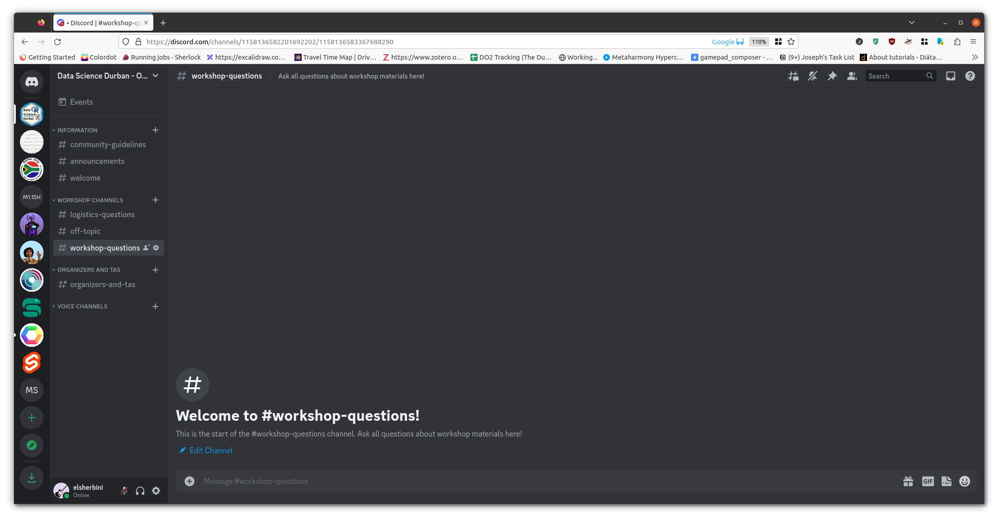

```{r}
#| echo: false
library(countdown)
```

## {data-menu-item="Workshop Goals"}

\
\

### Goals for this session {style="font-size: 2.5em; text-align: center"}

:::{.incremental style="font-size: 1.5em"}
1. Get to know your instructors and neighbors

2. Set expectations for the week

3. Get excited!

:::

## {data-menu-title="Website Link" style="text-align: center"}

\
\
\

:::{.r-fit-text}
Workshop materials are at:

[https://elsherbini.github.io/durban-data-science-for-biology/](https://elsherbini.github.io/durban-data-science-for-biology/)
:::

## Discussions: discord

Ask questions at **#workshop-questions** on [https://discord.gg/UDAsYTzZE](https://discord.gg/UDAsYTzZE).

{fig-alt="Screenshot of the discord server app that serves as the forum for the workshop." fig-align="center" width="546"}

## Stickies

:::{layout="[[4, 5, 1]]" layout-valign=center}
{fig-alt="Picture of a laptop with a red sticky note stuck to the top." width=540}

During an activity, place a [**yellow**]{style="color: Gold"}  sticky on your laptop if you're good to go and a [**pink**]{style="color: hotpink"} sticky if you want help.
:::

:::footer
Image by [Megan Duffy](https://dynamicecology.wordpress.com/2015/01/13/sticky-notes-as-a-teaching-and-lab-meeting-tool/)
:::

## Practicalities

::: r-fit-text
WiFi:

Network: KTB Free Wifi (no password needed)

Network AHRI  
Password: `@hR1W1F1!17`

Network AHRI Internet only  
Password: `AHRI twenty three!`  

Network CAPRISA-Corp Password: `corp@caprisa17`

Bathrooms are out the lobby to your left
:::

## Introductions {.your-turn}

```{r}
#| echo: false
countdown::countdown(3)
```

Take \~3 minutes to introduce yourself to your neighbors.


Please share ...

1.  Your name
2.  Where you're from and where you work
3.  Your current go-to method for analyzing data


## Your Instructors {.our-turn}

Who are we?

## Let's make this workshop work for all

:::{.incremental style="font-size: 1.2em"}

1. You belong here. This workshop is intended for a wide-audience with a focus on beginners. If you feel out of place - it's our problem, not yours! 

2. Stay committed. This week-long workshop is intended to build each day and leave you with skills you can really use. Commit to stay engaged for best results, for you and your group!

3. This is a challenging but friendly environment. We are here to learn and grow. In order to make the right environment please follow "[the 4 social rules](https://www.recurse.com/social-rules)" and [code-of-conduct](https://docs.carpentries.org/topic_folders/policies/code-of-conduct.html).

:::



## Pre-workshop survey {.your-turn}

```{r}
#| echo: false
countdown::countdown(10,  play_sound = TRUE)
```


Go to [https://forms.gle/GKtsjR8SW9NkhVkh6](https://forms.gle/GKtsjR8SW9NkhVkh6) to fill out the survey.


## The content of this workshop

:::{style="font-size: 1.2em"}
We've created 6 modules as well as an interactive activity for this workshop.  
\
There might be too much material to get through in this week!  
\
As instructors we're going to be trying to teach at the right pace to keep everyone learning all week.  
\
The materials will stay on the website forever for you to work through at your own pace.  
:::


## When Might You *Not* Need Sequencing? 

:::{.incremental style="font-size: 0.8em"}

- **Known Targets, Limited Scope**  
  - If your research question only involves confirming a *single, well-characterized* virus or a small set of variants, qPCR or targeted assays might suffice.  
- **Resource Constraints**  
  - Sequencing can be expensive and time-consuming. If budgets are tight and your question is narrow, simpler assays may be more practical.  
- **Large Cohort Screening**  
  - For massive surveillance efforts where you only care about the presence/absence of a known pathogen (e.g., routine screening for a particular strain), targeted testing like qPCR is faster and cheaper.  
- **Quick Turnaround Needed**  
  - If you need *immediate* results (hours, not days), rapid antigen or antibody tests can be more appropriate.

:::

## Question 1 — Detecting Emerging Variants of Endemic Viruses

**Without Sequencing**  
- **Limited Scope**: Diagnostic tests (e.g., qPCR) only detect known variants and specific targets.  
- **Potentially Missed Variants**: Novel or unexpected changes may escape traditional assays.  
- **Inadequate Surveillance**: Harder to link genetic variation with clinical or epidemiological outcomes.  

. . .

**With Sequencing**  
- **Identify New Mutations**: Discover novel mutations that might impact transmissibility or virulence.  
- **Track Spread**: Pinpoint where and when new variants emerge, supporting epidemiological modeling.  
- **Predict Drug Resistance**: Monitor known resistance-associated mutations


## Question 2 — Discovering Viruses in Outbreaks

**Without Sequencing**  
- **Knowledge Gaps**:  You can only use qPCR and ELISA to test for known pathogens and antigens
- **Speed of Discovery**: Cell culture based enrichment of viruses takes time and optimization

. . .

**With Sequencing**  
- **Unbiased Detection**: Metagenomic approaches allow for the identification of entirely new viruses.  
- **Rapid Characterization**: Genome assembly and annotation to quickly compare to known viruses.  
- **Public Health Preparedness**: Early detection can guide containment strategies before widespread transmission.

---



