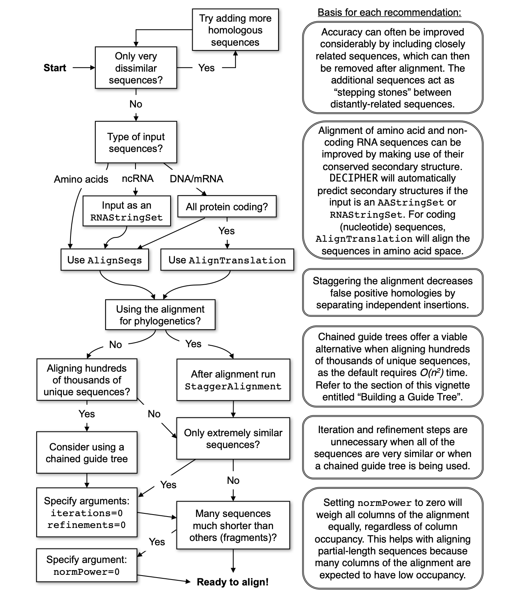

```{r setup, include=FALSE}
knitr::opts_chunk$set(echo = TRUE, message = FALSE, warning = FALSE)
```

## Background 

The tables used for this exercise are the main outputs of Hecatomb (https://github.com/shandley/hecatomb), a software aimed to increase virus discovery on complex samples (Metagenomic WGS or VLP prep WGS). 

## Dataset 
 
Primarily, we will use a file called `bigtable.tsv`. This file has the taxonomic classification of each read that was used as input to Hecatomb. It also has the alignment statistics and the number of equal reads found for each sample.

We will also use the file called `metadata.tsv`. The samples in the test dataset are samples taken from deceased Macaques from the study "SIV Infection-Mediated Changes in Gastrointestinal Bacterial Microbiome and Virome Are Associated with Immunodeficiency and Prevented by Vaccination" (https://www.sciencedirect.com/science/article/pii/S1931312816300518). The metadata contains the individuals' gender and the vaccine that was administered.

## Setting  

We are going to connect to the Rstudio server that is running on our machines
```{r eval=FALSE}
http://44.202.27.9:8787 #IMPORTANT: Change 44.202.27.9 by your IP
#Paste it in your browser
user: genomics
password:evomics2025
```

Also, we are going to connect to using ssh within the terminal. Then, we can go to workshop_materials and create a new directory called untargetedViromis. Then, go to that directory. Finally, we are going to download our dataset. 

```{.bash}
ssh genomics@serverIP #connect to the server
cd ~/workshop_materials/
mkdir untargetedViromics #create a new working directory
cd untargetedViromics
git clone https://github.com/luisalbertoc95/UV_data-Workshop-III-Bioinformatics-SA-2025.git  
mv UV_data-Workshop-III-Bioinformatics-SA-2025 uv_data #Change the name to work with a shorter one. 
```

## Analysis
 
### Step 1: Set up a new RMarkdwon/Quarto document

### Step 2: Initiate your environment

First, We are going to set our working directory for all the chunks

```{r}
#| eval: false
knitr::opts_knit$set(root.dir = "/Users/luischica/Desktop/uv_data") #IMPORTANT: change /Users/luischica/Desktop/Workshop_SA/data by ~/workshop_materials/untargetedViromics/uv_data
```

Optionally, if you are using a normal R script, you can use: **setwd(pathToYourWorkingDirectory)**

For this exercise we will use 4 packages: ggplot2, dplyr and tidyr from the tidyverse suite, but also we will need the rstatix package. 

```{r libraries}
# Check and install tidyverse if needed, then load it
if (!requireNamespace("tidyverse", quietly = TRUE)) {
  install.packages("tidyverse")
}
library(tidyverse)

# Check and install rstatix if needed, then load it
if (!requireNamespace("rstatix", quietly = TRUE)) {
  install.packages("rstatix")
}
library(rstatix)

# Check and install DECIPHER if needed, then load it
if (!requireNamespace("DECIPHER", quietly = TRUE)) {
  if (!requireNamespace("BiocManager", quietly = TRUE)) {
    install.packages("BiocManager")
  }
  BiocManager::install("DECIPHER")
}
library(DECIPHER)

```
 
### Step 3: Set the location and load our input files   
 
```{r}
#| eval: true
#| echo: false
#| warnings: false
data <- read.delim(here::here('datasets/bigtable.tsv'),header=T,sep='\t')
meta <- read.csv(here::here('datasets/metadata.tsv'),header=T,sep='\t')
``` 

```{r}
#| eval: false
#| echo: true
data <- read.delim('bigtable.tsv',header=T,sep='\t')
meta <- read.csv('metadata.tsv',header=T,sep='\t')
```

Inspect the dataframes

```{r}
head(data)
```

```{r}
head(meta)
```

### Step 4: Merging our metadata with our data table  

The merge function with perform an inner join by default, or you can specify outer, and left- and right-outer. This shouldn't matter if you have metadata for all of your samples. 

```{r}
dataMeta <-  merge(data, meta, by='sampleID')
```

### Step 5: Preliminary bigtable plots  

First, we will plot the alignment length against identity, and facet by viral family. We show the different alignment types by color, and we can scale the point size by the cluster number. The alpha=0.1 will help us to set it to 10% opacity and the points will overlap a lot at this scale.

Before making our plot, we will filter our dataMeta in order to remove all non viral taxonomic annotation. The function filter() will take all the hits to the word Viruses in our Kingdom column
```{r}
viruses <- dataMeta %>% 
    filter(kingdom=="Viruses")
```

Now we can make our first plot

```{r}
ggplot(viruses) + 
    geom_point(
        aes(x=alnlen,y=pident,color=alnType,size=count),
        alpha=0.1) + 
    facet_wrap(~family)
```

We can immediately see that a handful of viral families make up a majority of the viral hits. You can use these plots to help guide filtering strategies. We can divide the alignments into 'quadrants' by adding alignment length and percent identity thresholds, for instance alignment length of 150 and percent identity of 75.

We can also add some threshold lines to divide our plot into quadrants. This quadrants will be useful to see how much can we trust in each alignment. 

```{r}
ggplot(viruses) +
    geom_point(
        aes(x=alnlen,y=pident,color=alnType,size=count),
        alpha=0.1) +
    facet_wrap(~family) +
    geom_vline(xintercept=150,colour='red',linetype='longdash') +
    geom_hline(yintercept=75,colour='red',linetype='longdash')
```

We can see that for Adenoviridae and Parvoviridae the majority of hits occupy the top two quadrants, and we can be reasonably confident about these alignments. For Podoviridae and Circoviridae, the majority of hits occupy the bottom two quadrants. This could indicate that the viruses are only distantly related to the reference genomes in these families.

**Task: plot the Bacterial hits faceted by phylum** 

### Step 6: Filtering Strategies  

Hecatomb is not intended to be a black box of predetermined filtering cutoffs that returns an immutable table of hits. Instead, it delivers as much information as possible to empower the user to decide which hits they want to keep and which hits to purge. Let's take our raw viral hits data frame viruses and filter them to only keep the ones we are confident about.

The e-value is one of the most common metrics to use for filtering alignments. Let's see what hits would be removed if we used a fairly stringent cutoff of 1e-20. We will create a new data set that contains only the hits remaining after applying the p-value threshold. 

We are going to see two strategies for filtering our table. In the first strategy, we will add an additional column to our data set. This column will have 2 possible values: "filter" and "pass". whether  a read is tagged as filter or pass will depend of the the threshold added in the function ifelse()

```{r}
virusesFiltered <- viruses %>% 
    mutate(filter=ifelse(evalue<1e-20,'pass','filter'))
```

We can plot our new table 

```{r}
ggplot(virusesFiltered) +
    geom_point(
        aes(x=alnlen,y=pident,color=filter),
        alpha=0.2) +
    facet_wrap(~family)
```
The red sequences are destined to be removed, while the blue sequences will be kept. Some viral families will be removed altogether, which is probably a good thing if they only have low quality hits.

The second strategy, is a more straightforward method. We only need to use the function filter() and the desired e-value threshold. No additional column will be added.

```{r}
virusesFiltered <- viruses %>% 
    filter(evalue<1e-20)
```

Going back to the quadrant concept, you might only want to keep sequences above a certain length and percent identity:

```{r}
virusesFiltered = virusesFiltered %>% 
    filter(alnlen>150 & pident>75)
```

Now, our filtered table has an alignment filter, an identity % filter and our previous p-value filter.

There are many alignment metrics included in the bigtable for you to choose from.

**Task: Filter your raw viral hits to only keep protein hits with an evalue < 1e-10**

### Step 7: Analyse taxon counts  

A) Make Per family plots 
First, we will sum the normalized count of each read to a family level using the columns sampleID and family 

```{r}
viralFamCounts <- virusesFiltered %>% 
  group_by(family) %>% 
  summarise(normCount=sum(normCount)) %>% 
  arrange(desc(normCount))

viralFamCounts$family <- factor(viralFamCounts$family,levels=viralFamCounts$family)

head(viralFamCounts)
```

After having our new dataframe with the counts per Family, we can create our abundance plot.

```{r}
ggplot(viralFamCounts) +
  geom_bar(aes(x=family,y=normCount),stat='identity') +
  coord_flip()  
```
 
B) Discriminate our family plots by sample ID

The previous plot are a good way to understand the overall abundance of each family in all our samples. However, with that plot is impossible to differentiate between    samples and therefore, between different treatments. We can sum our normalized counts in a similar way we did before. Now we are going to add the variable "sampleID" to the function `group_by()`

```{r}
viralFamCounts <- virusesFiltered %>% 
  group_by(sampleID,family) %>% 
  summarise(normCount=sum(normCount)) %>% 
  arrange(desc(normCount))

head(viralFamCounts)
```

and then, make the new plot, filling by family 

```{r}
ggplot(viralFamCounts) +
  geom_bar(aes(x=sampleID,y=normCount, fill =family ),stat='identity') +
  coord_flip()  
```

**Task: Make a stacked bar chart of the viral families for the Male and Female monkeys**

C) Visualizing groups
We have a few viral families that are very prominent in our samples. For the purposes of the tutorial we have a completely made up sample group category called           MacGuffinGroup. Let's see if there is a difference in viral loads according to our MacGuffinGroup groups. Collect sample counts for Microviridae. Include the metadata    group in group_by() so you can use it in the plot. 

For our first plot we are going to focus exclusively in Microviridae family 
  
```{r}
podoCounts <- virusesFiltered %>% 
    group_by(family,sampleID,MacGuffinGroup) %>% 
    filter(family=='Podoviridae') %>% 
    summarise(n = sum(normCount))
```
  
Then, we can plot using jitter plots, box plots or violin plots 
  
```{r}
ggplot(podoCounts) +
    geom_jitter(aes(x=MacGuffinGroup,y=n),width = 0.1) +
    theme_bw()
```
  
### Step 8: Statistical tests  
  
In Step 6, we compared the viral counts between the two sample groups for Podoviridae, and it appeared as though group B had more viral sequence hits on average than group A. We can compare the normalized counts for these two groups to see if they're significantly different.

A) Student's T-test

Let's check out the data frame we made earlier that we'll be using for the test

```{r}
head(podoCounts)
```

We will use the base-r function t.test(), which takes two vectors. One vector has the group A counts and the other has the group B counts. We can use the filter() and pull() functions within the t.test() function. The function pull will take the column n, which has our abundance values.

```{r}
t.test(
    podoCounts %>% 
        filter(MacGuffinGroup=='A') %>% 
        pull(n),
    podoCounts %>% 
        filter(MacGuffinGroup=='B') %>% 
        pull(n),
    alternative='two.sided',
    paired=F,
    var.equal=T)  
```
  
B) Wilcoxon test 

The Wilcoxon test is analogue to the t-test, however is used when our values do not follow a normal distribution. The syntax for this test is very similar to the t-test
  
```{r}
wilcox.test(
    podoCounts %>% 
        filter(MacGuffinGroup=='A') %>% 
        pull(n),
    podoCounts %>% 
        filter(MacGuffinGroup=='B') %>% 
        pull(n),
    alternative='t',
    paired=F)
```
 
In some cases, the viral loads have minor importance for answering a research question, instead we might be just interested in comparing the presence or absence of viruses. For   this you could use a Fisher's exact test. To perform this test you need to assign a presence '1' or absence '0' for each viral family/genus/etc for each sample. 

First we are going to apply and even more stringent filter to be sure about the alignments
```{r}
virusesStringent <- viruses %>% 
    filter(evalue<1e-30,alnlen>150,pident>75,alnType=='aa') 
```

Then we will assign anything with any hits as 'present' for that an specific viral family (It can be done for all of them). For this example we are going to use Myoviridae. 

Our chunk has two lines. The first one will extract the counts for Myoviridae and the second will merge our new table with our metadata file

```{r}
myovirPresAbs <- virusesStringent %>% 
    filter(family=='Myoviridae') %>%
    group_by(sampleID) %>% 
    summarise(n=sum(normCount)) %>%
    mutate(present=ifelse(n>0,1,0))

myovirPresAbs <- merge(myovirPresAbs,meta,by='sampleID',all=T)

```

If we visualise our "myovirPresAbs" table, we will see some values missing or NA. Those are the samples in which no presence of Myoviridae was found. We can convert the NAs to zeros. 

```{r}
myovirPresAbs[is.na(myovirPresAbs)] = 0
```

To do the Fisher's exact test we need to specify a 2x2 grid; The first column will be the number with Myoviridae for each group. The second column will be the numbers without for each group.

```{r}
# matrix rows
mtxGroupA = c(
    myovirPresAbs %>% 
        filter(MacGuffinGroup=='A',present==1) %>% 
        summarise(n=n()) %>% 
        pull(n),
    myovirPresAbs %>% 
        filter(MacGuffinGroup=='A',present==0) %>% 
        summarise(n=n()) %>% 
        pull(n))
mtxGroupB = c(
    myovirPresAbs %>% 
        filter(MacGuffinGroup=='B',present==1) %>% 
        summarise(n=n()) %>% 
        pull(n),
    myovirPresAbs %>% 
        filter(MacGuffinGroup=='B',present==0) %>% 
        summarise(n=n()) %>% 
        pull(n))

# create the 2x2 matrix
myovirFishMtx = matrix(c(mtxGroupA,mtxGroupB),nrow = 2)

# this bit is not necessary, but lets add row and col names to illustrate the matrix layout
colnames(myovirFishMtx) = c('GroupA','GroupB')
row.names(myovirFishMtx) = c('present','absent')

# view
myovirFishMtx
```

We can run our t-test using our new matrix as input 

```{r}
fisher.test(myovirFishMtx)
```

### Step 9: Contig based analysis  

Contig analysis is a very important approach when identifying viruses from a metagenomic or VLP prep sample. Because of the length of the contigs, new genomic features can be identified and used for generating a taxonomic classification, functional analysis and more. 

A) Fist, we will load our taxonomy table generated from hecatomb. This table relates every contig with their best hit in the data base. 

For the purpose of this exercise we will filter our table for contigs classified at family level as Caudovirales. and with a sequence length between 2000 and 3000 base pairs. 
 
```{r}
#| eval: false
#| echo: true
contig_data <- read.delim('MMseqsTax.txt',header=T,sep='\t')

caudovirales_data <- contig_data %>%
  filter(Order == "Caudovirales" & qlen > 2000 & qlen < 3000) %>%
  select(contigID) 
```

```{r}
#| eval: true
#| echo: false

contig_data <- read.delim(here::here('datasets/MMseqsTax.txt'),header=T,sep='\t')

caudovirales_data <- contig_data %>%
  filter(Order == "Caudovirales" & qlen > 2000 & qlen < 3000) %>%
  select(contigID) 

```
 
B) We will load our fasta file generated after the assembly using the package Biostrings, included in the package DECIPHER. We can also use the package [] for selecting our target contigs from the fasta file 

```{r}
#| echo: true
#| eval: false
contigs <- readDNAStringSet("assembly.fasta", format="fasta")

caudo_contigs <- contigs[caudovirales_data$contigID] 
```

```{r}
#| eval: true
#| echo: false
contigs <- readDNAStringSet(here::here("datasets/assembly.fasta"), format="fasta")

caudo_contigs <- contigs[caudovirales_data$contigID] 
```

C) We can use our set of contigs to make a multiple sequence alignment (MSA) with the final purpose of generating a phylogeny tree. 

The steps to make our MSA are going to be based on the decision diagram from the DEIPHER package 
  

Steps: 

A) Create the multiple sequences alignement 
B) Remove ambiguous regions from the alignment 
c) Create the phylogenetic tree
D) Plot the dendrogram 

```{r}
#| cache: true
#A
aln_contig <- AlignSeqs(caudo_contigs)
#B
stagger_aln_contig<- StaggerAlignment(aln_contig)
BrowseSeqs(stagger_aln_contig, highlight=1)
#C
tree <- TreeLine(stagger_aln_contig, reconstruct=TRUE, maxTime=0.05)
#D
plot(dendrapply(tree,
         function(x) {
                 s <- attr(x, "probability") 
                 if (!is.null(s) && !is.na(s)) {
                         s <- formatC(as.numeric(s), digits=2, format="f")
                         attr(x, "edgetext") <- paste(s, "\n")
                 }
                 attr(x, "edgePar") <- list(p.col=NA, p.lwd=1e-5, t.col="#CC55AA")
                 if (is.leaf(x))
                   
attr(x, "nodePar") <- list(lab.font=3, pch=NA)
x 
}),
horiz=TRUE,yaxt='n')
```
