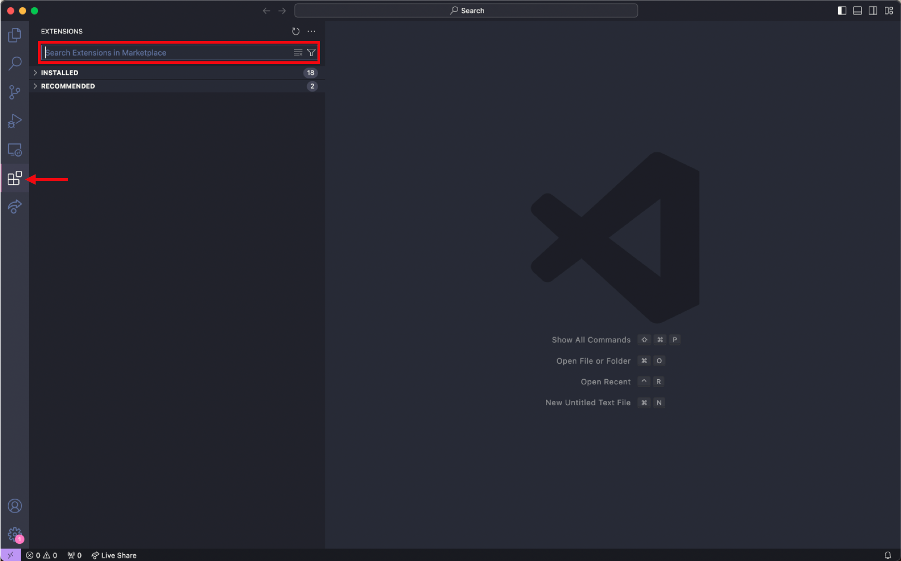
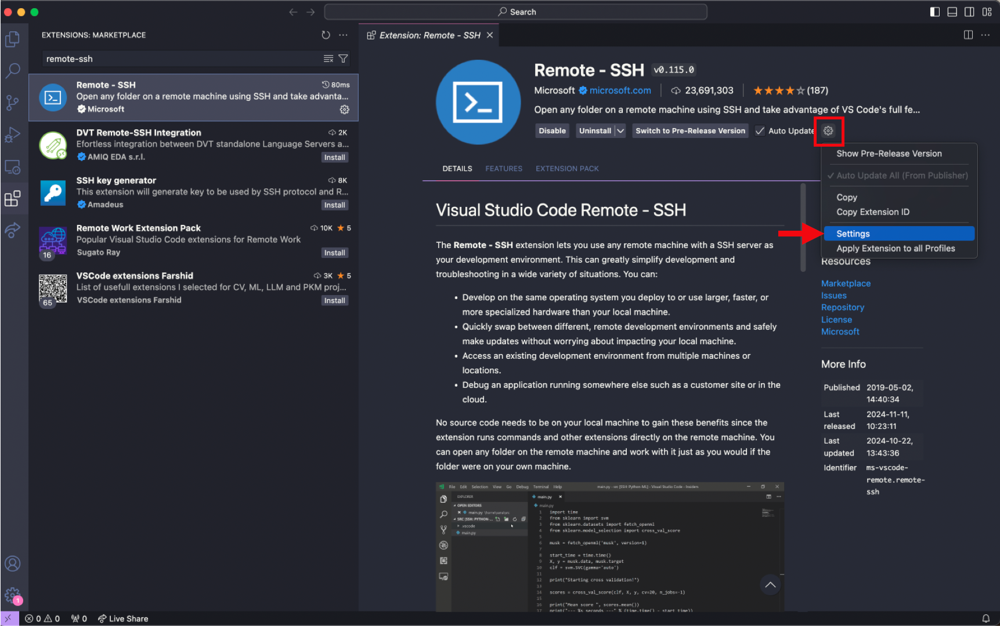
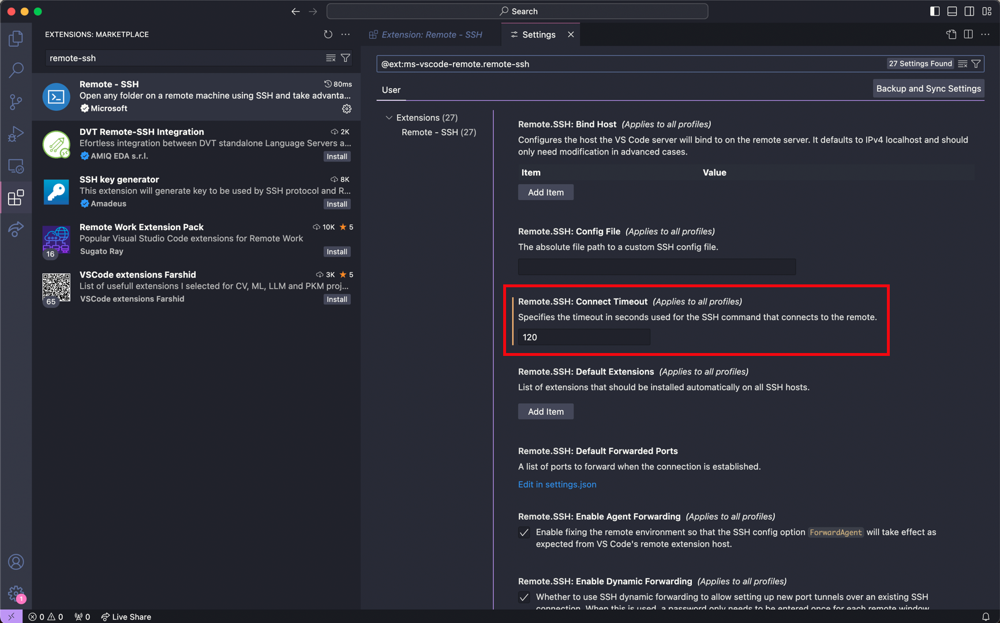
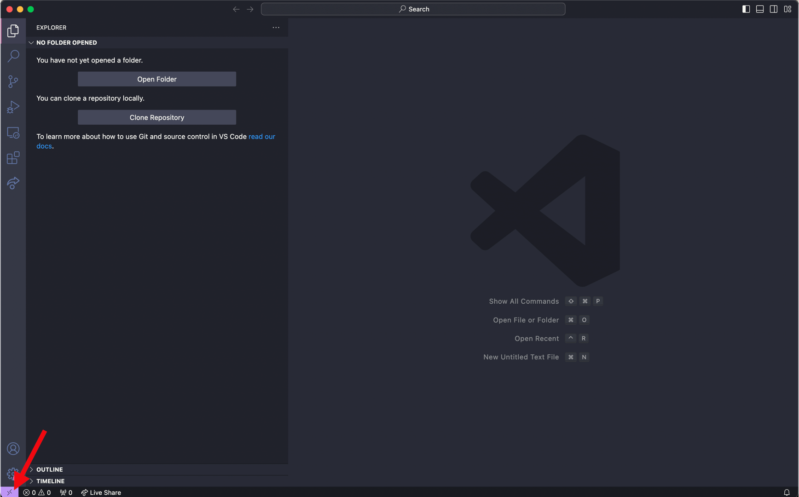

> Say goodbye to the workshop and reflect on your new-found superpowers

## Bioinformatics is a journey

This week we spent a lot of times building the foundations of bioinformatics. Specifically, we interacted a lot with the UNIX shell and installed and ran bioinformatic programs interactively. However, in your work it will be really useful to switch from running things interactively to running things with scripts and pipelines. In this section we will talk about how to use VSCode, a text editor, to connect to remote servers and edit files directly there, and to use its terminal emulator in combination with the text editor to be efficient. We will also talk about `Snakemake`, a tool for making pipelines as an alternative to shell scripting.

### VSCode

VSCode is a code text editor application that provides an easy-to-use interface for viewing and writing code/scripts. This section will detail how to 1) install VSCode as an application on your computer, 2) install VSCode extensions and 3) setup launching VSCode as an interface to view and edit your files on the O2 cluster.

#### Install VSCode application
To install VSCode on your computer, use [this link](https://code.visualstudio.com/download).


#### Install VSCode extensions
VSCode has a number of extensions that allow each user to customize their own coding experience. We recommend the installation of three extensions:

-   `Rainbow CSV` - identifies "," as the separator in CSV files, highlights each column with a different color

-   `VSCode-pdf` - view PDF files directly within the VSCode interface

-   `Remote-SSH` - allows users to login and access their own HPC cluster and view their files through the VSCode interface (see next section)


To install extensions:

1. Navigate to the toolbar on the far left of the VSCode interface and click on the icon that resembles four squares. 
2. Use the search bar that has the caption "Search Extensions in Marketplace" to find extensions that you like and install each of them individually.
3. An additional step for `Remote-SSH` installation involves changing the connect timeout setting. As O2 login requires Duo authentication, there is often a slight delay and more time is needed to complete the authentication and login properly. To adjust this, please follow steps 4-6. 

4. Navigate to the extension page for `Remote-SSH` (on the toolbar on the far left, select the icon with four squares, then input remote-ssh into the search bar) {width="90%"}\

5.  Select the gear button and press Settings {width="90%"}\

6.  Input 120 seconds for the `Remote.SSH: Connect Timeout` parameter {width="90%"}\

#### Setup remote access with VSCode

While logging into O2 on the terminal only provides a command-line interface and linux commands are needed to modify files, the main advantage of accessing O2 through VSCode is it allows users to easily view and edit their files in an interactive manner within the VSCode application.

After installation of VSCode and the Remote-SSH extension, establish a SSH connection to O2 through VSCode:

1.  Press the bottom left purple icon to 'Open a Remote Window'. This will prompt a few options to be displayed at the top near the search bar {width="90%"}

2.  Select 'Add New SSH Host' and then input the following and enter

```{python}
##| eval: false
<user_name>@<server address>
```

3.  Select `<path to config>/.ssh/config` as the SSH configuration file to update
4.  Input password for login
5.  Login complete (Note: login may take longer at the first instance because VSCode will download its own server.)

After setup, directly click the bottom left purple icon each time and input login credentials to launch O2 on VSCode each time. 

#### Additional steps to not need pasword

After setting up VSCode, Remote-SSH extension and establishing a connection to O2 login node through VSCode, follow these steps to launch VSCode on a remote server.

1.  Generate SSH key on your own computer's terminal with the following command. When prompted for file name, press enter to use the default file name. Enter a passphrase to protect your SSH keys.

```{python}
##| eval: false
## input this line into your computer's terminal
ssh-keygen -t rsa

## sample output (See O2 documentation for reference)
Generating public/private rsa key pair.
Enter file in which to save the key (/USERHOME/.ssh/id_rsa):
Enter passphrase (empty for no passphrase):
Enter same passphrase again:
Your identification has been saved in /USERHOME/.ssh/id_rsa.
Your public key has been saved in /USERHOME/.ssh/id_rsa.pub.
```

2.  Copy your computer's SSH public key onto the O2 SSH authorized_keys file, which allows your computer and O2 to recognize each other

- Linux or Mac:
```{python}
##| eval: false
## input this line into your computer's terminal
ssh-copy-id -i $HOME/.ssh/id_rsa.pub <user_name>@<server address>
## input O2 password and complete Duo authentication
```

- Windows:
```{python}
##| eval: false
## input this line into your computer's terminal
Get-Content "$env:USERPROFILE\.ssh\id_rsa.pub" | ssh <user_name>@<server address> "mkdir -p ~/.ssh && cat >> ~/.ssh/authorized_keys"
## input O2 password and complete Duo authentication
```


### Snakemake


We could (and should!) do a whole workshop on using Snakemake for bioinformatics pipelines.

For now, take a look at their excellent documentation here: [https://snakemake.readthedocs.io/en/stable/index.html](https://snakemake.readthedocs.io/en/stable/index.html)

And consider that AI tools are quite good at snakemake.

Here are the files we created during the live demo of Snakemake:


```{.bash filename=Snakefile}

rule target:
    input: "results/iqtree_tree.treefile"

rule combine_reference:
    input: 
        query_genomes = "input/sequences_20250228_9489868.fasta",
        reference_genome = "input/hxb2.fasta"
    output:
        "temp/combined_genomes.fasta"
    shell:
        "cat {input.query_genomes} {input.reference_genome} > {output}"

rule align:
    input:
        "temp/combined_genomes.fasta"
    output:
        "temp/aligned.fasta"
    conda:
        "envs/mafft.yaml" 
    shell:
        "mafft {input} > {output}"


rule build_tree:
    input:
        "temp/aligned.fasta"
    output:
        "results/iqtree_tree.treefile"  # IQ-TREE output file
    conda:
        "envs/iqtree.yaml"  # Path to the IQ-TREE Conda environment file
    shell:
        "iqtree2 -s {input} -m MFP -nt 4"
```


```{.bash filename=envs/iqtree.yaml}
name: iqtree_env
channels:
  - bioconda
  - conda-forge
  - defaults
dependencies:
  - iqtree
```


```{.bash filename=envs/mafft.yaml}
name: mafft_env
channels:
  - bioconda
  - conda-forge
  - defaults
dependencies:
  - mafft
```

### AI tools in 2025

[https://chatgpt.com/](https://chatgpt.com/) - Quite good but costs money to use the more powerful models.  

[https://chat.deepseek.com/](https://chat.deepseek.com/) - Same performance as chatGPT's o1 model, but for free as of today.  

[https://www.phind.com/](https://www.phind.com/) - This is an interesting one to watch, especially if you plan to use AI to help do the tinking part of your research, not just the coding part. Provides sources, and tries to synthesize more stuff together. Performs a lot better if you pay a subscription.

