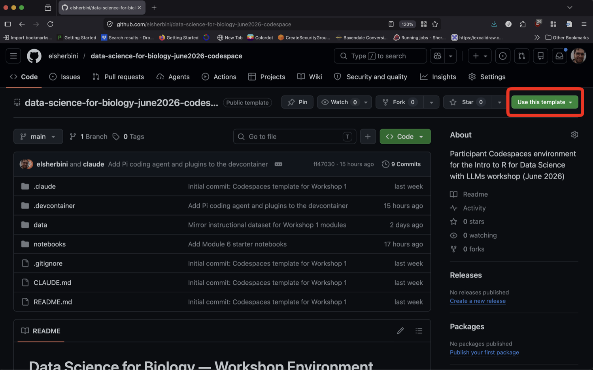
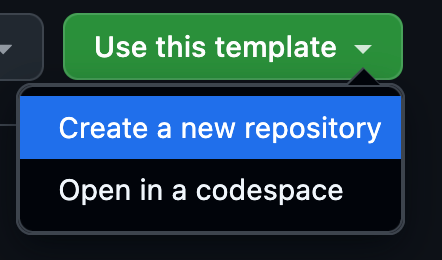
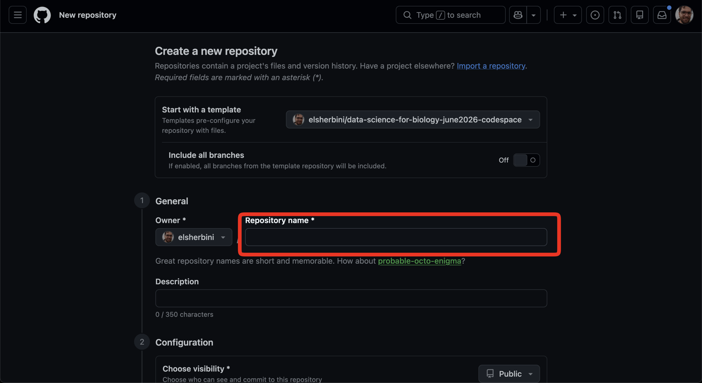
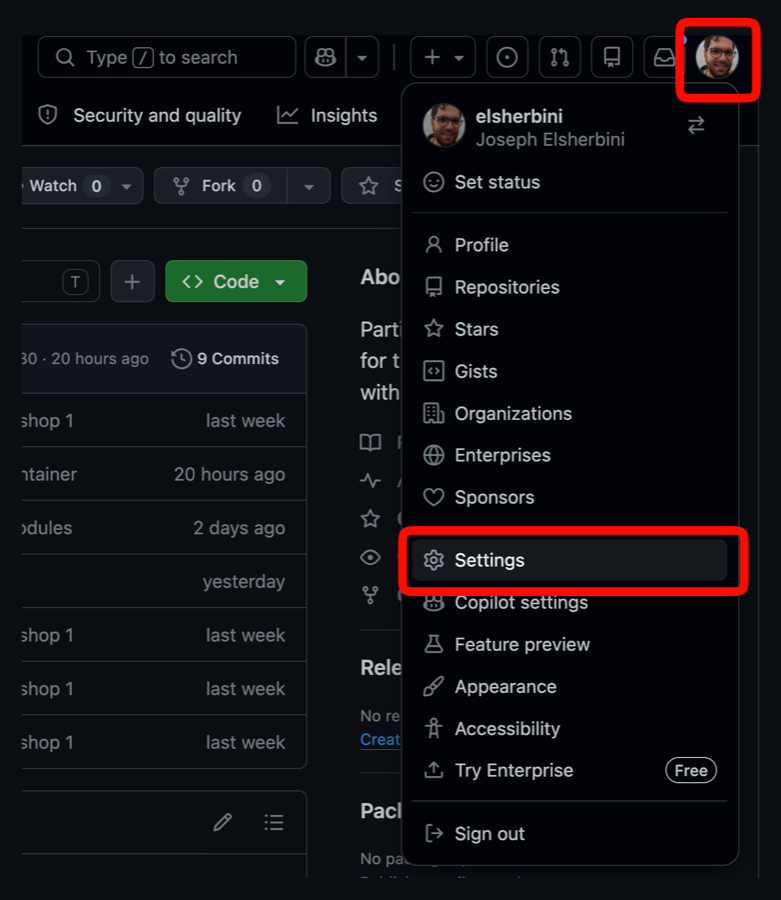
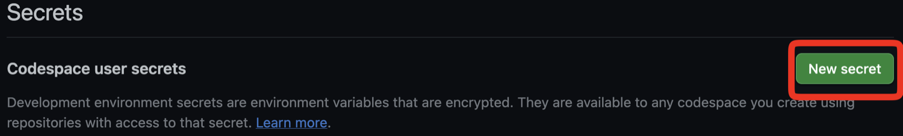
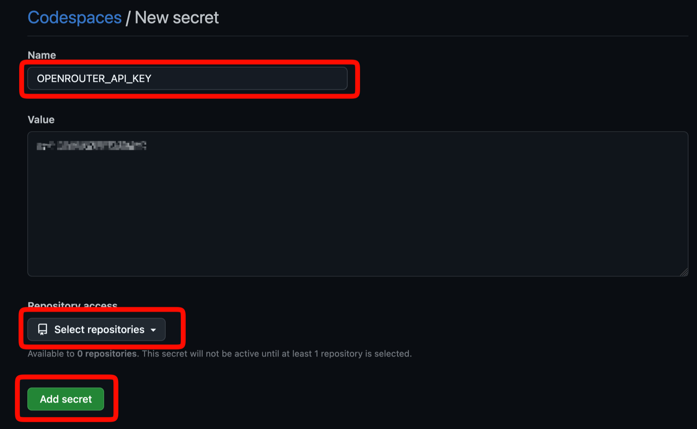
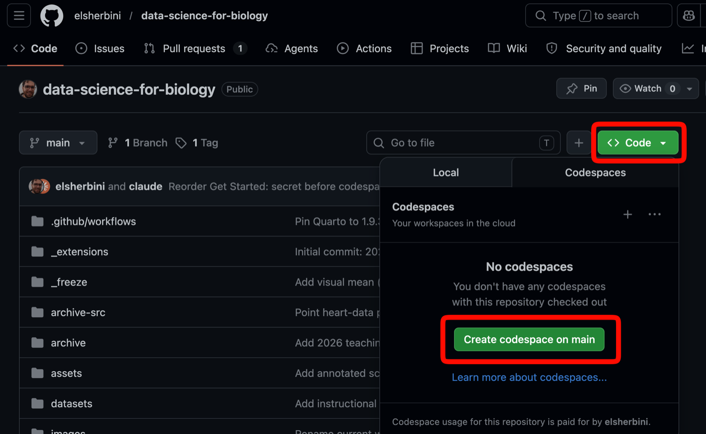
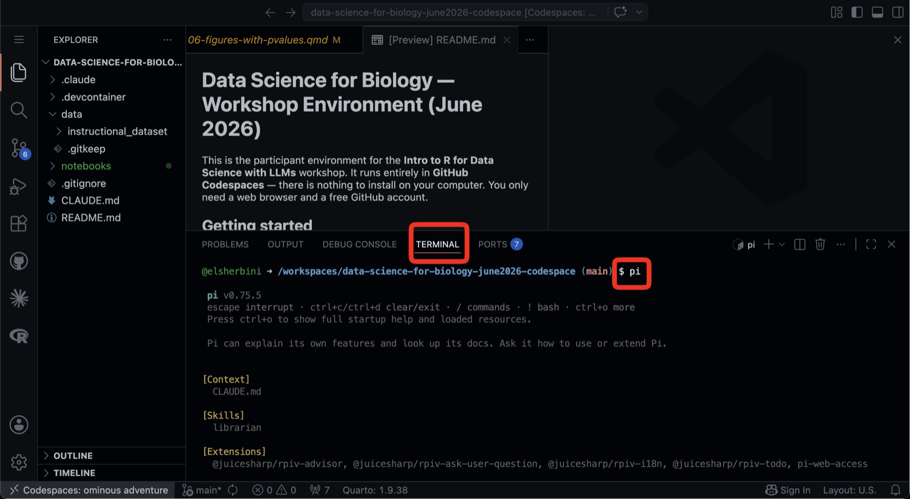

## What you'll do

Claim an OpenRouter API key from our Discord bot, make your own copy of the workshop environment, add the key as a Codespaces secret, then launch a codespace.

You only need a web browser, a GitHub account, and a Discord account.

## Step 1: Join the workshop Discord

Open the [workshop Discord invite](https://discord.gg/zSBTQ9ctt) and accept it.

Then ask a TA or instructor (in Discord or in person) to give you the **Participant** role. The bot only hands out keys to people who have it.

## Step 2: Claim your key with `/claim`

In any channel, type `/claim` and press Enter. The bot replies in the channel, but the message is visible only to you.

The reply contains your OpenRouter API key and your daily budget. **Copy the key now** — you'll paste it into GitHub in step 8.

Useful later: `/key` shows your key again, `/usage` shows today's spend.

## Step 3: Open the template

Open the [participant environment repo](https://github.com/elsherbini/data-science-for-biology-june2026-codespace) and click the green **"Use this template"** button.

{width=900 fig-align="center" fig-alt="GitHub repo page with the 'Use this template' button highlighted"}

## Step 4: Create a new repository

In the dropdown, choose **"Create a new repository"**.

{width=400 fig-align="center" fig-alt="Use this template dropdown with 'Create a new repository' highlighted"}

## Step 5: Name your repository

Give it a name (for example, `workshop-2026`) and click the green **"Create repository"** button.

{width=900 fig-align="center" fig-alt="New repository form with the Repository name field highlighted"}

## Step 6: Open Codespaces settings

Click your profile photo (top right) → **Settings**, then navigate to **Codespaces** in the left sidebar.

Direct link: <https://github.com/settings/codespaces>

{width=380 fig-align="center" fig-alt="GitHub profile dropdown with Settings highlighted"}

## Step 7: Click "New secret"

Scroll to **"Codespace user secrets"** and click **"New secret"**.

{width=1200 fig-align="center" fig-alt="Codespace user secrets section with the New secret button highlighted"}

## Step 8: Fill in and save the secret

- **Name**: `OPENROUTER_API_KEY` (exact spelling)
- **Value**: paste the key the Discord bot gave you in step 2
- **Repository access**: select the repo you created in step 5
- Click **"Add secret"**

{width=750 fig-align="center" fig-alt="New secret form with Name, Repository access, and Add secret highlighted"}

## Step 9: Launch a codespace

Go back to your new repo. Click **"Code"** → **"Codespaces"** tab → **"Create codespace on main"**.

First build takes **~10 minutes or more** (installing R, Quarto, packages, Pi).

{width=800 fig-align="center" fig-alt="Repository page with the Code button and Create codespace on main button highlighted in the Codespaces tab"}

## Step 10: Open a notebook

Once the codespace finishes building:

- Use the file explorer (left side) to find a `.qmd` notebook
- Open it to start working — edit text and code right in the browser

## Step 11: Meet Pi

Open the integrated terminal (**Terminal → New Terminal**), then run `pi`.

Ask in plain language — Pi can read your notebook, explain code, and help you edit. (We will introduce Claude Code later in the workshop.)

{width=800 fig-align="center" fig-alt="Codespace with the integrated terminal open and the pi command typed at the prompt"}

## You're ready

Head into the workshop materials.

If you get stuck, ask an instructor or a teaching assistant.
