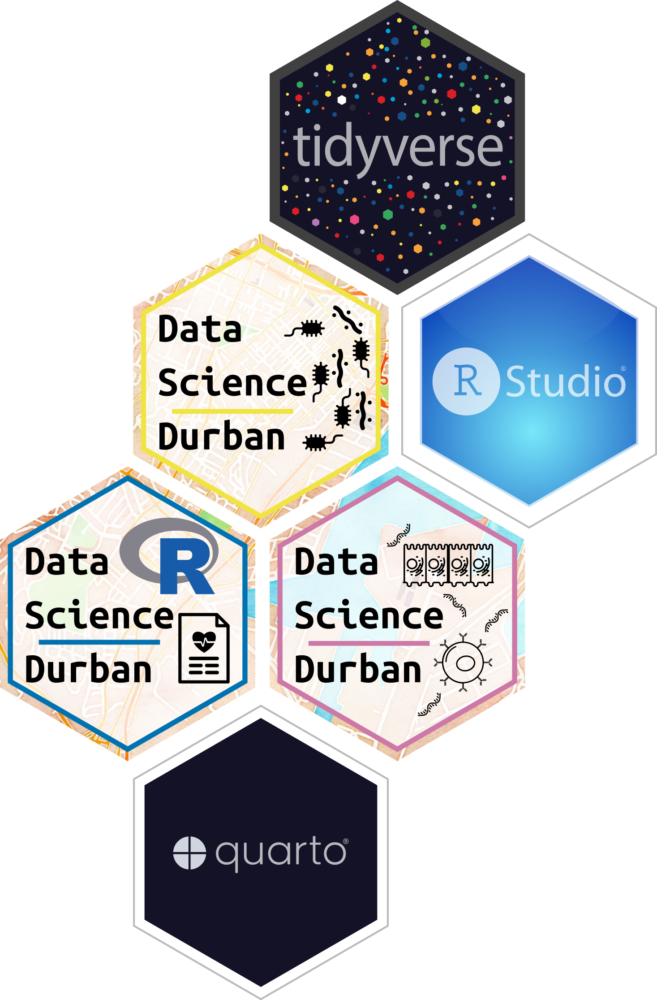

::: {.grid}

::: {.g-col-12}

# Data Science for Biology Workshop Series
:::

:::{.g-col-8}

A hands-on workshop series introducing data science workflows for biology
researchers.

**Who is it for?**

Researchers who want to build a foundation of data analysis and
bioinformatics skills. No prior programming experience is required.

**What you'll do**

Work through reproducible data analysis in Quarto notebooks, using a coding
assistant to learn as you go.

:::

::: {.g-col-4 .text-start}

{width=50%}

:::

:::

## Getting started

New here? Head to the [Get Started](getting-started.qmd) page to open the
workshop environment and begin.

## Past workshops

Materials from previous workshops are archived on the
[Past Workshops](past-workshops.qmd) page.
