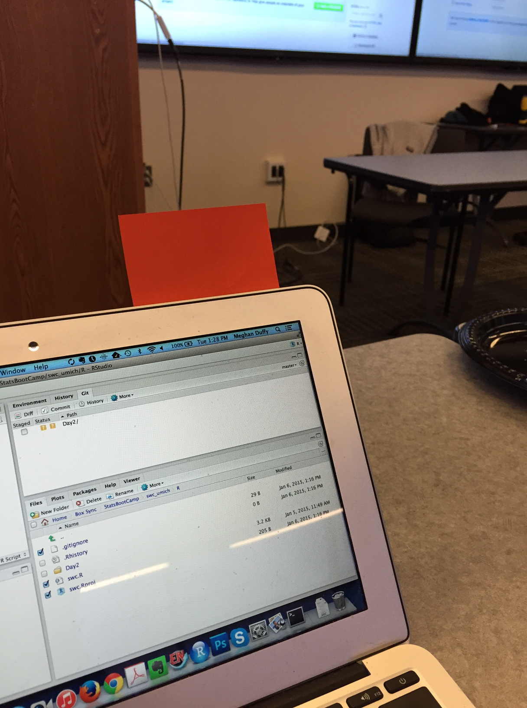
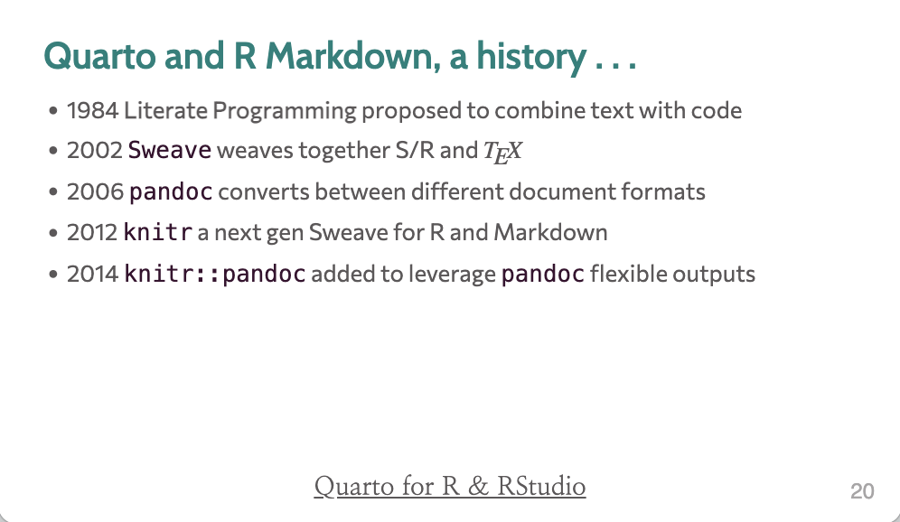
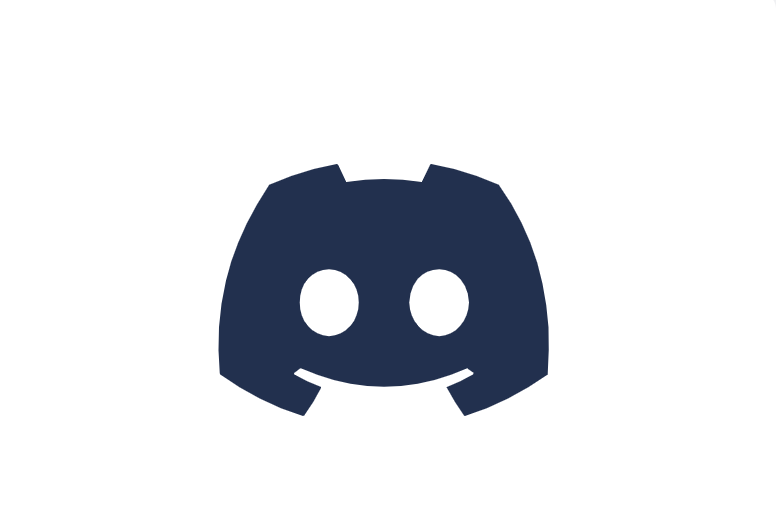
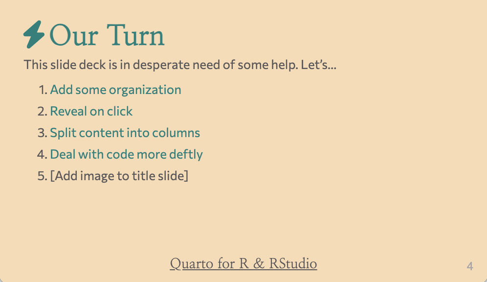
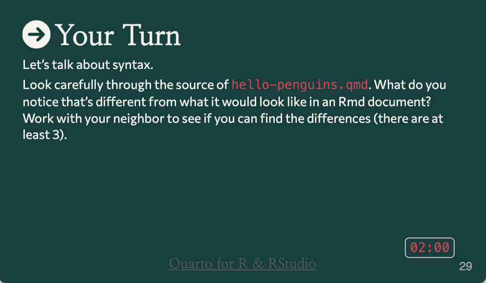

```{r}
#| echo: false
library(countdown)
```


## {data-menu-item="Workshop Goals"}

\
\

### Goals for this session {style="font-size: 2.5em; text-align: center"}

:::{.incremental style="font-size: 1.5em"}
1. Get to know your instructors and neighbors

2. Set expectations for the week

3. See how we'll work with an AI coding assistant this year

4. Get excited!

:::

## {data-menu-title="Website Link" style="text-align: center"}

\
\
\

:::{.r-fit-text}
Workshop materials are at:

[https://elsherbini.github.io/data-science-for-biology/](https://elsherbini.github.io/data-science-for-biology/)
:::

## Discussions: discord

Ask questions in the **#workshop-questions** channel.

Join the Discord server: `TODO: paste this year's Discord invite link`

{fig-alt="Screenshot of the discord server app that serves as the forum for the workshop." fig-align="center" width="546"}

## Stickies

:::{layout="[[4, 5, 1]]" layout-valign=center}
{fig-alt="Picture of a laptop with a red sticky note stuck to the top." width=540}

During an activity, place a [**yellow**]{style="color: Gold"}  sticky on your laptop if you're good to go and a [**pink**]{style="color: hotpink"} sticky if you want help.
:::

:::footer
Image by [Megan Duffy](https://dynamicecology.wordpress.com/2015/01/13/sticky-notes-as-a-teaching-and-lab-meeting-tool/)
:::

## Practicalities
:::{.r-fit-text}

WiFi:

`TODO: WiFi network name(s) and password(s) for this year's venue`

Bathrooms: `TODO: directions to the bathrooms`

:::


## Introductions {.your-turn}

```{r}
#| echo: false
countdown::countdown(3)
```

Take \~3 minutes to introduce yourself to your neighbors.


Please share ...

1.  Your name
2.  Where you're from and where you work
3.  Your current go-to method for analyzing data


## Your Instructors {.our-turn}

Who are we?

## Let's make this workshop work for all

:::{.incremental style="font-size: 1.2em"}

1. You belong here. This workshop is intended for a wide-audience with a focus on beginners. If you feel out of place - it's our problem, not yours! 

2. Stay committed. This week-long workshop is intended to build each day and leave you with skills you can really use. Commit to stay engaged for best results, for you and your group!

3. This is a challenging but friendly environment. We are here to learn and grow. In order to make the right environment please follow "[the 4 social rules](https://www.recurse.com/social-rules)" and [code-of-conduct](https://docs.carpentries.org/topic_folders/policies/code-of-conduct.html).

:::

## Flow of the Workshop

:::{.r-stretch layout="[2, 2]" style="text-align: center"}
{width=540 .drop .fragment}

{width=540 .drop .fragment}

{width=540 .drop .fragment}

{width=540 .drop .fragment}
:::

## The premise of the workshop

We've created a true-to-life "medium dimensional" dataset that we'll use for all instruction 

- about 40 participants split across two treatment arms
- three time points (before treatment, after treatment, and longer follow-up)
- several measurements per time-point including cytokine concentrations and flow cytometry data  (more from Salina and Suuba next!)

We've also created group datasets so you can practice applying what you've learned on new data.  

## What's different this year

Last year this workshop was R, a textbook, and a lot of Google searches.

This year you write code with an AI coding assistant in the loop.

You describe what you want in plain language, the assistant proposes some code, and you read it and run it.

## Why this helps when you're new

You spend less time stuck on a missing comma or a misspelled function name.

That leaves more time for the actual question: what are you asking of the data, and does the answer make sense?

You still have to read and understand the code. The assistant proposes; it does not decide.

## Cheap models and strong models

Different models cost different amounts of money and are good at different things.

Through OpenRouter you can switch between them mid-task.

Part of this week is learning when a cheap model handles the job and when a stronger one is worth paying for. You each have about \$30 of OpenRouter credit to spend over the week.

## What a good week looks like

By Friday, you can:

- open a dataset in R and ask questions of it
- get code from the assistant and run it
- look at the result and judge whether it's actually right

## The content of this workshop

:::{style="font-size: 1.1em"}
The modules for Workshop 1:

- Module 0 -- Welcome to the Workshop
- Module 1 -- Introduction to Agentic Coding
- Module 2 -- Intro to R, Quarto, and VSCode
- Module 3 -- Intro to data wrangling and visualization with the tidyverse
- Module 4 -- More data wrangling and visualization
- Module 5 -- Modelling and Uncertainty
- Module 6 -- gtsummary and ggpubr for hypothesis testing
- A group project

This is probably more material than one week fits. We'll teach at a pace that keeps everyone learning, and the materials stay on the website afterward so you can work through the rest at your own pace.
:::


