```{r}
#| echo: false
library(countdown)
library(tidyverse)
library(here)
table_01 <- read_csv(here("datasets/instructional_dataset/01_participant_metadata_UKZN_workshop_2023.csv"))
table_02 <- read_csv(here("datasets/instructional_dataset/02_visit_clinical_measurements_UKZN_workshop_2023.csv"))
```

## {data-menu-item="Workshop Goals"}

\
\

### Goals for this session {style="font-size: 2.5em; text-align: center"}

:::{.incremental style="font-size: 1.5em"}
1. Answer the question "Why R?"

2. Find your way around VS Code.

3. Use Quarto to make notebook reports.

4. Begin interacting with data in R.
:::

---

## What is R?

R is a general purpose programming language that's really well suited to statistics, manipulating tabular data, and plotting.


---

## Why R?

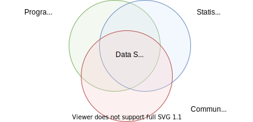{fig-alt="Venn diagram showing overlaps of programming, statistics, and communication yielding data science" width=100%}


## Why R?


- R is completely free and open source
- Using R connects you with a community around the whole world
- R has a huge amount of packages - code someone else wrote so you don't have to!

::::: {.columns style='display: flex !important; height: 40%;'}

::: {.column width="10%" style='display: flex; justify-content: center; align-items: center;'}

{fig-alt="R logo"}
:::

::: {.column width="10%" style='display: flex; justify-content: center; align-items: center;'}

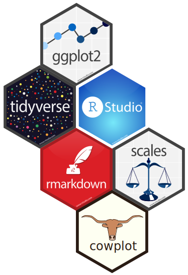{fig-alt="hexagonal stickers representing different packages availale in R"}
:::
::::
---


# A tour of VS Code

## You are already running VS Code {data-menu-title="VS Code in the browser"}

Your Codespace is VS Code running in a browser tab. It behaves the same as the desktop app you might have used before.

R, Quarto, and the editor extensions are already installed. There is nothing to download and nothing to set up -- open the Codespace and start working.

## The window layout {data-menu-title="VS Code layout"}

A VS Code window has a few parts you will use all day:

- The **Explorer** on the left lists the files in your project. Click a file to open it.
- The **editor** in the middle is where you read and write files. Open files show up as tabs across the top.
- The **panel** along the bottom holds the terminal and other output. You can show or hide it.
- The **Activity Bar** on the far left switches the side view between the Explorer, search, source control, and extensions.

## The integrated terminal {data-menu-title="Integrated terminal"}

The terminal is a command line built into the window. You type commands here, and this is where Pi runs.

Open it from the menu: **Terminal -> New Terminal**, or with the keyboard shortcut <kbd>Ctrl</kbd>+<kbd>`</kbd> (the backtick key).

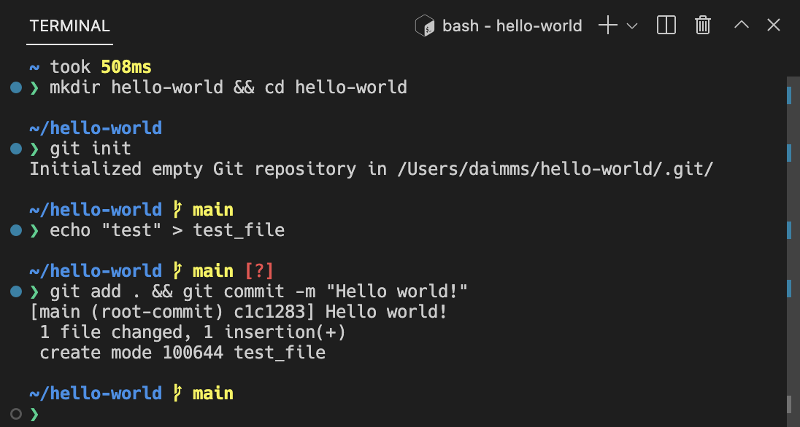{fig-alt="The VS Code window with the integrated terminal open in a panel along the bottom." width="70%"}

::: footer
Screenshot from the [VS Code terminal documentation](https://code.visualstudio.com/docs/terminal/basics).
:::

## Several terminals at once {data-menu-title="Terminal tabs"}

You can keep more than one terminal open. Each gets a tab in the panel, and you can split the panel to see two side by side.

This is handy when Pi is running in one terminal and you want another for your own commands.

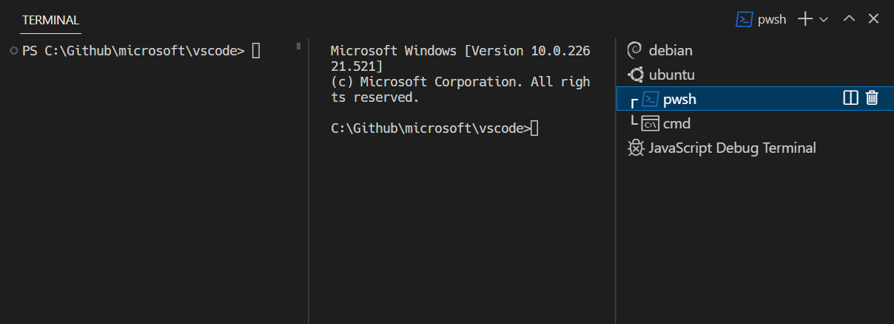{fig-alt="The terminal panel showing several terminal tabs listed on the right side." width="75%"}

::: footer
Screenshot from the [VS Code terminal documentation](https://code.visualstudio.com/docs/terminal/basics).
:::

## Opening and editing a `.qmd` {data-menu-title="Editing a .qmd"}

A Quarto document has the `.qmd` extension. It is a plain-text file that mixes writing, R code, and formatting.

- `.R` files hold pure R code -- useful for scripts, but no narrative.
- `.qmd` files weave narrative, code, and output into one document -- so a future reader (including future-you) can follow your reasoning alongside the code.

Open a `.qmd` from the Explorer and it appears in the editor. You can edit the plain-text source directly, or switch to the visual editor for a word-processor-style view. The two are the same file -- changes in one show up in the other.

## Render and Preview {data-menu-title="Render and Preview"}

The **Preview** button at the top right of an open `.qmd` renders the document and opens the result next to your source.

When the preview is open, Quarto re-renders each time you save, so the rendered output stays in step with the file you are editing.

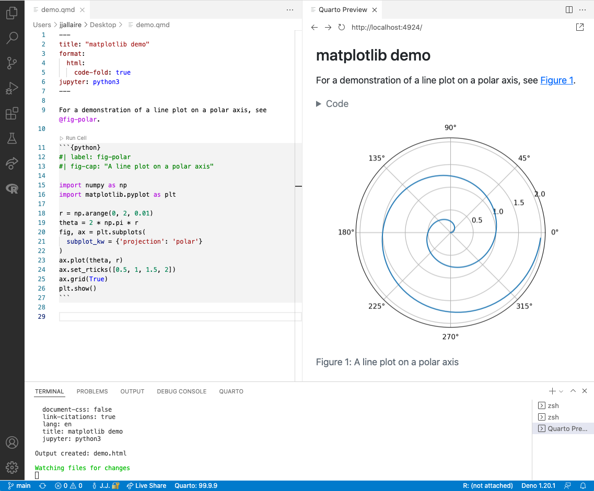{fig-alt="VS Code showing a Quarto document source on the left and the rendered HTML preview on the right." width="55%"}

::: footer
Screenshot from the [Quarto VS Code documentation](https://quarto.org/docs/tools/vscode/).
:::

## Running code cells {data-menu-title="Running code cells"}

A code cell has a **Run Cell** link just above it. Click it to run that cell's R code; the output appears inline, right under the cell.

You can run cells one at a time as you build up an analysis, without rendering the whole document.

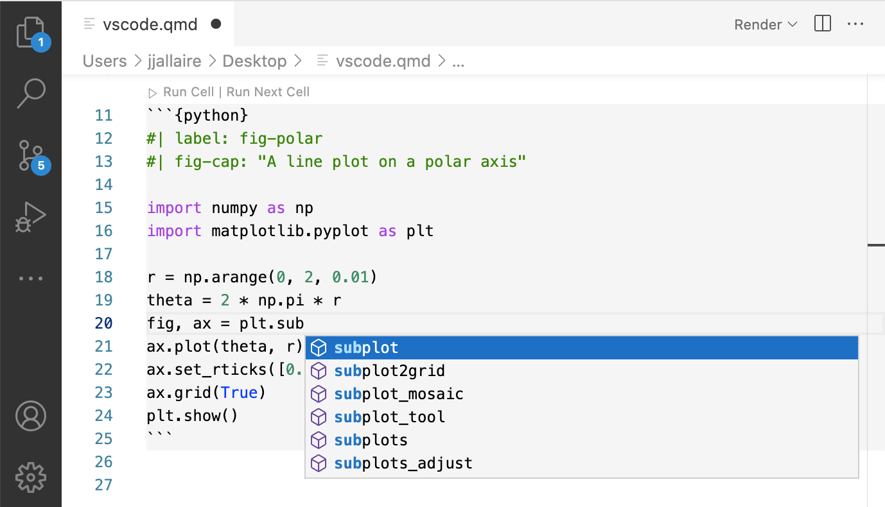{fig-alt="A Quarto code cell in VS Code with a Run Cell link above it and the output shown inline below." width="60%"}

::: footer
Screenshot from the [Quarto VS Code documentation](https://quarto.org/docs/tools/vscode/).
:::

## The document outline {data-menu-title="Document outline"}

A long document is easier to navigate with the **outline**, which lists the document's headings.

Click a heading in the outline to jump straight to that section.

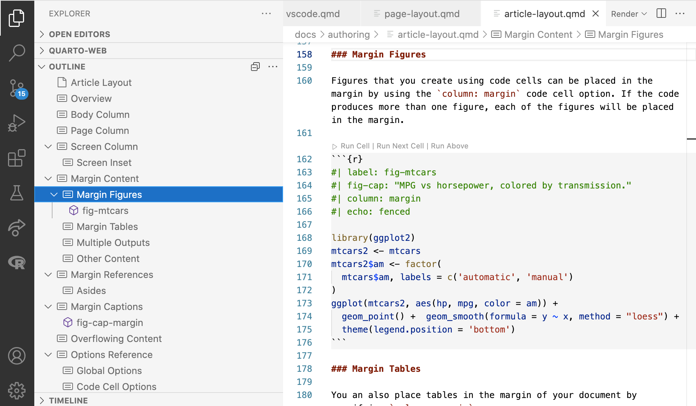{fig-alt="The VS Code outline view listing the section headings of a Quarto document." width="35%"}

::: footer
Screenshot from the [Quarto VS Code documentation](https://quarto.org/docs/tools/vscode/).
:::




# The workshop dataset {.center}

## The study

A randomized trial of a hypothetical anti-inflammatory drug aimed at lowering HIV-acquisition risk by reducing genital inflammation.

- **44 participants**: 23 placebo, 21 treatment
- **3 visits per participant**: baseline, week 1, week 7
- All participants are female

At each visit, samples flow into five tables: `00_sample_ids`, `01_participant_metadata`, `02_visit_clinical_measurements`, `03_elisa_cytokines`, `04_flow_cytometry`.

::: footer
A fictitious dataset built to look like a real trial. See the [dataset page](../../../datasets.qmd) for full descriptions.
:::

## Clinical measures (`02_visit_clinical_measurements`)

The low-dimensional measurements -- one number per participant per visit:

- **`nugent_score`** (0-10): Gram-stain score for bacterial vaginosis. 0-3 normal, 4-6 intermediate, 7-10 BV.
- **`crp_blood`**: C-reactive protein -- general systemic inflammation marker.
- **`ph`**: vaginal pH. Low (~3.8-4.5) is the healthy lactobacillus-dominated state; higher suggests dysbiosis.

```{r}
#| echo: false
table_02 |> head(3) |> knitr::kable()
```

## Inflammation panels (`03_elisa_cytokines`, `04_flow_cytometry`)

The higher-dimensional measurements:

- **Cytokines** (10 of them: IL-1α/β, IL-6, IL-8, IL-10, TNFα, IP-10, MIG, IFN-γ, MIP-3α) -- signaling proteins immune cells use to talk to each other. Higher concentration usually means more inflammation.
- **Flow cytometry** -- counts cells by which proteins they display. We'll touch this lightly -- see the [dataset page](../../../datasets.qmd) for the gating hierarchy.


# Let's start programming

## What is programming?

Programming is giving the computer instructions using text. The tricky part is learning how to speak to a computer.

:::{layout="[0.25,0.25,0.25]"}
:::{#column1 .fragment}
1. Computers are incredibly literal

```{r}
#| echo: fenced
"a" == "A"
```
:::
:::{#column2 .fragment}
2. Computers care about punctuation

```{r error=TRUE}
#| echo: fenced

max(c(1,2,3,4))
```
:::
:::{#column3 .fragment}
3. Computers only know what you tell them

```{r error=TRUE}
#| echo: fenced
# how old will I be in 10 years?
my_age + 10

```
:::
:::

[Most bugs happen because of one of these things.]{style="color: red;font-size: 1.2em" .fragment}


## What is programming?

So why bother at all? Because if you can tell a computer how to do it once, it is reproducible!

[Find a mistake? Fix the code, then rerun.]{style="color: green;font-size: 1.2em" .fragment}

[Repeat the same analysis on new data -- swap the file and rerun.]{style="color: green;font-size: 1.2em" .fragment}

[Share your code with others so they can start where you left off.]{style="color: green;font-size: 1.2em" .fragment}


## Let's use R for math {.your-turn}

```{r}
#| echo: false
countdown::countdown(4)
```

In the console, try typing some commands:

You don't have to finish all of them -- get a feel for how R responds.

```{r}
#| echo: true
#| eval: false

# arithmetic
3 + 5 + 10
10 * (5 + 1)
3**2 # what does the ** operator do in R?
# check inequalities and equalities
4 >= 1 # what does this mean?
5 + 4 == 9
# make some errors
"3" + 5 # why is this an error?
my_age + 5  # why is this an error?

# write a math expression to calculate what percentage
# of your life has been in post-secondary school/training
# (university, training programs, masters, PhD)
```


## Say hello to the text-editor

When you write code in the console, it is gone.

It is better to work inside quarto notebooks in order to be able to save and share your code and results.

# What can you do with Quarto?

## Many formats, one source

::: {layout-ncol="2"}
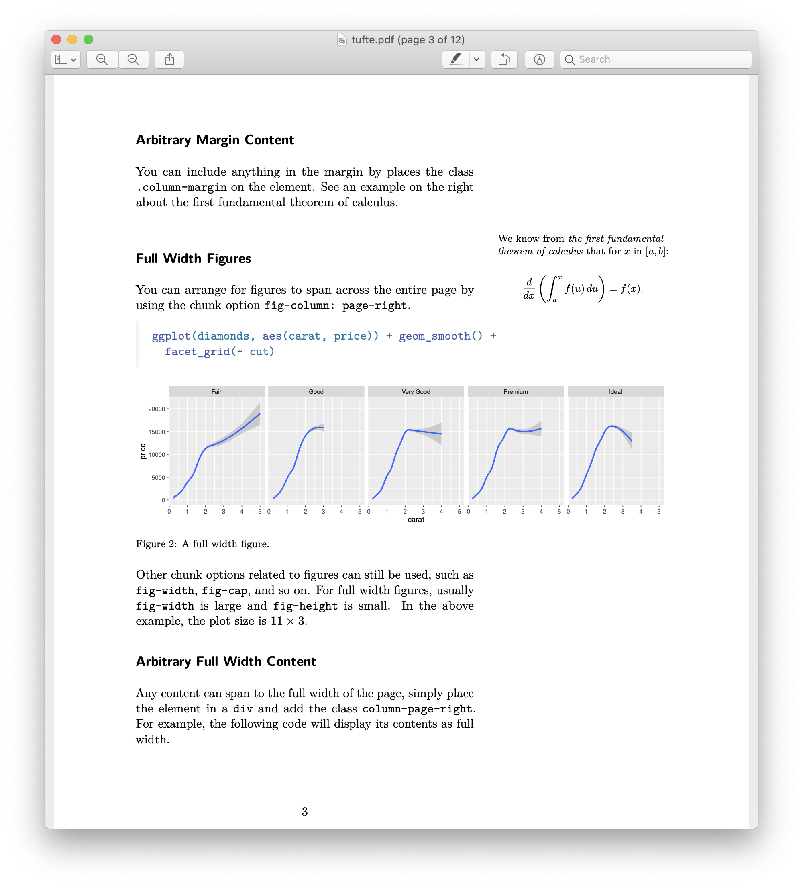{fig-alt="Example Quarto-rendered PDF article"}

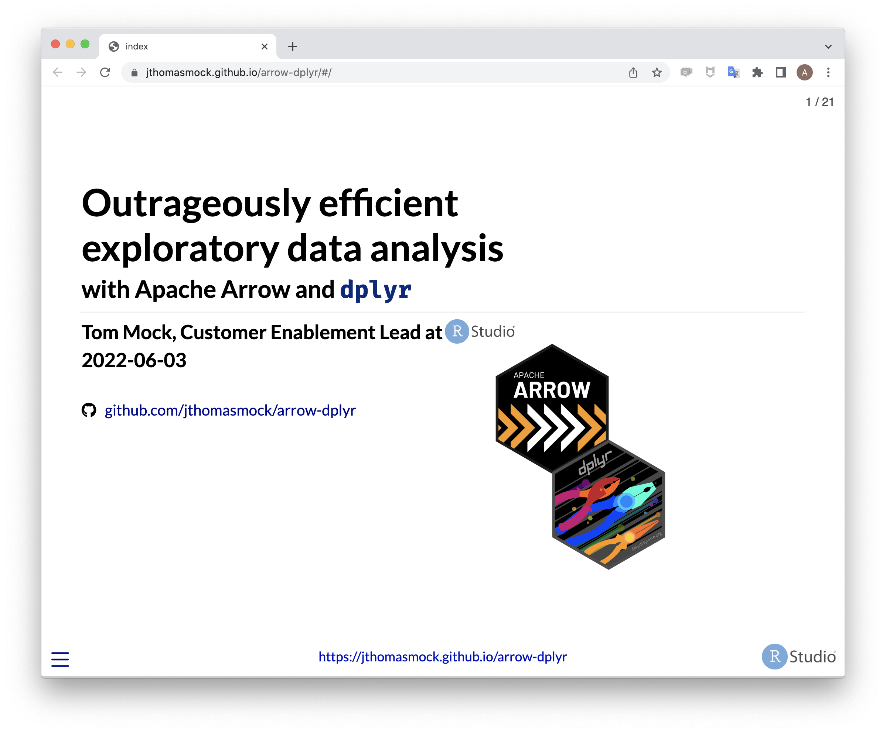{fig-alt="Example Quarto-rendered slide deck"}

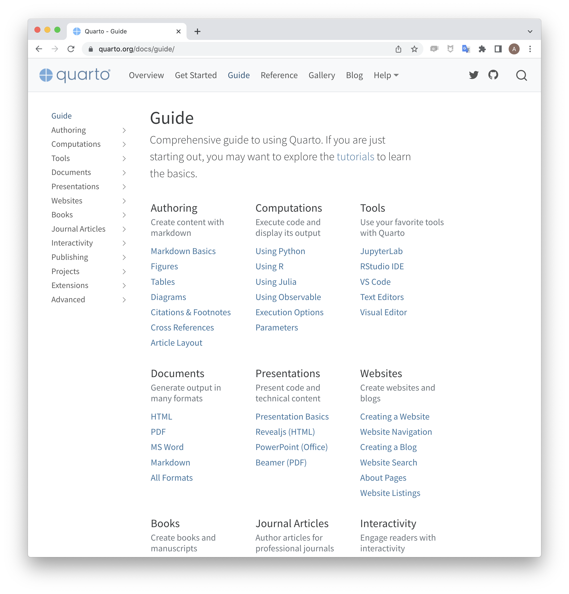{fig-alt="Example Quarto-rendered website"}

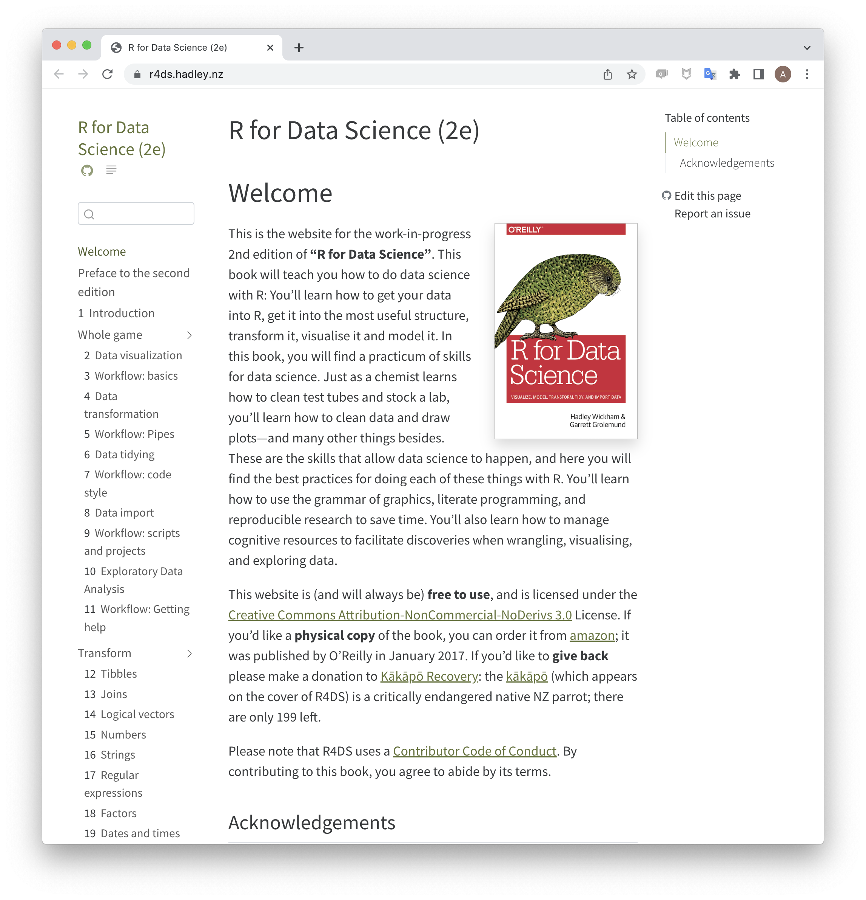{fig-alt="Example Quarto-rendered book"}
:::

All from the same `.qmd` source -- change the format in the YAML.

## Quarto Render

**Quarto works inside VS Code**

   Click {fig-alt="small icon of render arrow" width="100"} (the Preview button) at the top of a `.qmd` open in VS Code.

Render input file to various document formats.

::: {layout="[[1, 1, 1, 1]]" style="font-size: .7em; text-align: center"}

### Input

-   `*.qmd`
-   `*.ipynb`
-   `*.md`
-   `*.Rmd`

### Format

-   `html`
-   `pdf`
-   `revealjs` (like these slides!)
-   `docx`
-   `ppt`
-   and many more!

\

\
:::

# Anatomy of a Document

1. Code Cells
2. Text
3. Metadata


# Code Chunks


## Let's explore the survey data {.our-turn}


## Quarto's Code Chunk {.your-turn}

::: columns
::: {.column width=25%}
:::

::: {.column width=50%}
    ```{{r}}
    #| echo: false
    rnorm(3)
    ```
:::

::: {.column width=25%}
:::
:::


[**This is a Quarto Code Chunk.**]{style="color: green;font-size: 1.2em"}

Make a new code chunk in three ways:

1. Type it out
2. Use the **Insert Code Cell** command from the command palette
3. click in your document and hit the key combination `Ctrl+Alt+i`

Write a math expression in a chunk and press the Run Cell link at the top of the chunk.

## Execution Options

Control how the code is executed with options.
Options are denoted with the "hash-pipe" `#|`

::: {style="font-size: .8em"}
| Option    | Description                                                                                                                                                                                       |
|------------|------------------------------------------------------------|
| `eval`    | Evaluate the code chunk (if `false`, just echos the code into the output).                                                                                                                        |
| `echo`    | Include the source code in output                                                                                                                                                                 |
| `output`  | Include the results of executing the code in the output (`true`, `false`, or `asis` to indicate that the output is raw markdown and should not have any of Quarto's standard enclosing markdown). |
| `warning` | Include warnings in the output.                                                                                                                                                                   |
| `error`   | Include errors in the output.                                                                                                                                                                     |
| `include` | Catch all for preventing any output (code or results) from being included (e.g. `include: false` suppresses all output from the code block).                                                      |
:::

## Example: Figures from Code {auto-animate=true}

:::columns
:::{.column width=54%}
````markdown
```{{r}}
#| fig-width: 5
#| fig-height: 3

library(tidyverse)
library(here)

table_02 <- read_csv(here(
  "datasets/instructional_dataset/02_visit_clinical_measurements_UKZN_workshop_2023.csv"))

ggplot(table_02,
       aes(x = ph, y = nugent_score, col = arm)) +
  geom_point()
```
````
:::
:::{.column width=46% .fragment}
```{r}
#| echo: false
#| fig-width: 5
#| fig-height: 3
library(tidyverse)
library(here)
table_02 <- read_csv(here(
  "datasets/instructional_dataset/02_visit_clinical_measurements_UKZN_workshop_2023.csv"),
  show_col_types = FALSE)
ggplot(table_02,
       aes(x = ph, y = nugent_score, col = arm)) +
  geom_point() +
  theme_grey(base_size = 18)
```
:::
:::


# Text

[The Basics of Markdown]{style="font-family: 'Nanum Myeongjo', serif; font-size:1.7em"}

##  {data-menu-title="Markdown is for writing"}

::: {style="font-size: 4em; text-align: center; color: green"}

:::

-   Markdown is designed to be easy to write and easy to read:

    > A Markdown-formatted document should be publishable as-is, as plain text, without looking like it's been marked up with tags or formatting instructions.\
    > -John Gruber

. . .

- Quarto uses extended version of **Pandoc markdown**.
- Pandoc classifies markdown in terms of [Inline]{.inline-el} and [Block]{.block-el} elements.


## [Inline Elements:]{.inline-el} Text Formatting

::: columns
::: {.column width="65%"}
#### Markdown

```{.markdown}
Markdown allows you to format text
with *emphasis* and **strong emphasis**.
You can also add superscripts^2^,
subscripts~2~, and display code
`verbatim`. Little known fact: you can
also ~~strikethrough~~ text and present
it in [small caps]{.smallcaps}.
```
:::

::: {.column width="35%" .fragment}
#### Output

Markdown allows you to format text with *emphasis* and **strong emphasis**. You can also add superscripts^2^, subscripts~2~, and display code `verbatim`. Little known fact: you can also ~~strikethrough~~ text and present it in [small caps]{.smallcaps}.
:::
:::

::: footer
^[Either the `*` or `_` can be used for emphasis and strong.]
:::


## [Inline Elements:]{.inline-el} Links and Images

#### Markdown

```markdown
You can embed [links with names](https://quarto.org/), direct urls
like <https://quarto.org/>, and links to
[other places](#inline-elements-text-formatting) in the document.
The syntax is similar for embedding an inline image:
.
```

\

:::{.fragment}
#### Output

You can embed [links with names](https://quarto.org/), direct urls like <https://quarto.org/>, and links to [other places](#inline-elements-text-formatting) in the document. The syntax is similar for embedding an inline image: {fig-alt="small icon of render arrow" width="100"}.
:::

## Markdown can do so much more

To learn about footnotes, Math, tables, and diagrams, check out the [quarto documentation on markdown](https://quarto.org/docs/authoring/markdown-basics.html)


::: columns
::: {.column width="50%" .fragment}
#### Markdown

```markdown
A short note.^[Fits inline.]

|        |  1   |  2   |
|--------|------|------|
| **A**  | 0    | 0    |
: example table {#tbl-1}

$$
f(x)={\sqrt{\frac{\tau}{2\pi}}}
      e^{-\tau (x-\mu )^{2}/2}
$$

```
:::

::: {.column width="50%" .fragment}
#### Output

A short note.^[Fits inline.]

|        |  1   |  2   |
|--------|------|------|
| **A**  | 0    | 0    |
: example table {#tbl-1}

$$
f(x)=\sqrt{\frac{\tau}{2\pi}}
    e^{-\tau (x-\mu )^{2}/2}
$$
:::
:::


## [Metadata:]{.meta-el} YAML

"Yet Another Markup Language" or "YAML Ain't Markup Language" is used to provide document level metadata ...

:::columns

:::{.column width=10%}
:::

:::{.column width=50%}
[... in key-value pairs,]

[... that can nest,]

[... are fussy about indentation,]

[... and are kept between `---`.]

:::

:::{.column width=40% .fragment}

\

``` yaml
---
format:
  title: "Intro to R"
  author: "Yours Truly"
  html:
    toc: true
    code-fold: true
---
```
:::

:::

[There are many options for [front matter](https://quarto.org/docs/authoring/front-matter.html) and [configuring rendering](https://quarto.org/docs/reference/formats/html.html).]{.fragment}

# R fundamentals, by way of our data

## Read the data

The dataset lives in `csv` files (comma-separated values). Read one in with `read_csv()`:

```{r}
#| echo: true
#| message: false
table_02 <- read_csv(here(
  "datasets/instructional_dataset/02_visit_clinical_measurements_UKZN_workshop_2023.csv"))
```

`<-` assigns the result to a name. After this line, `table_02` *is* the data.

## This is a tibble

```{r}
#| echo: true
table_02
```

A tibble (R's word for "data frame") is rectangular: rows are observations, columns are variables.

## Columns are vectors

Pull one column out with `$`:

```{r}
#| echo: true
table_02$nugent_score
```

That's a **vector** -- a sequence of values, all the same type.

- `nugent_score`: numeric
- `arm`: character (`"placebo"`, `"treatment"`)
- `time_point`: character (later we'll make it a factor for ordering)

## Functions

A function takes inputs and gives back a value:

```{r}
#| echo: true
mean(table_02$crp_blood, na.rm = TRUE)
```

- `table_02$crp_blood` is the **positional** argument -- the data.
- `na.rm = TRUE` is a **named** argument -- tells `mean` to skip missing values.

Most R verbs are functions called on a column or a tibble.

## Assignment and naming

```r
nugent_mean <- mean(table_02$nugent_score, na.rm = TRUE)
```

- Use `<-` to assign (R people prefer it; `=` also works).
- Names: lowercase with `_` separators. No leading numbers, no special characters.
- Good: `nugent_mean`, `cytokine_panel`, `n_participants`
- Avoid: `mean.nugent` (dots are fine in R but confuse other languages), `1st_table`, `mean nugent`

## Getting help

Type `?function_name` in the console to open the help page. For example:

```r
?mean
?read_csv
```

Or ask **Pi** (the coding agent from Module 1). Pi is good at explaining what a function does and suggesting how to call it. Treat its answers as a starting point -- check them against the help page or run them and see, since Pi can hallucinate functions and arguments.

## Exercise {.your-turn}

That's enough slides for now -- time to try for yourself. Go to [the module](index.html) and work through the worksheet.

```{r}
countdown::countdown(30)
```
