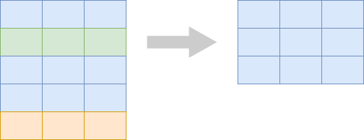
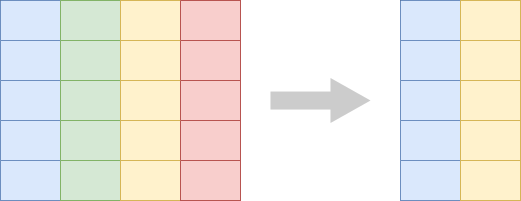
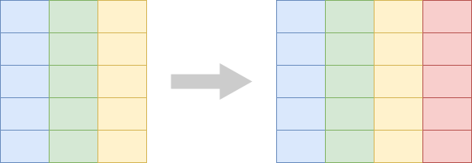
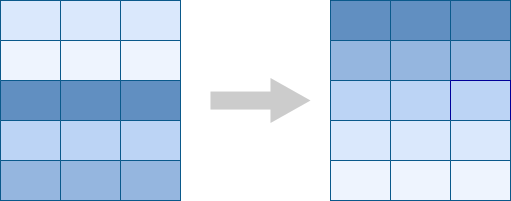

```{r setup, include=FALSE}
library(tidyverse)
library(countdown)
library(here)

table_01 <- read_csv(here("datasets/instructional_dataset/01_participant_metadata_UKZN_workshop_2023.csv"))
table_02 <- read_csv(here("datasets/instructional_dataset/02_visit_clinical_measurements_UKZN_workshop_2023.csv"))
```

## Goals for this module

By the end of this module you can:

- look at a table and say what one row represents
- pick rows with `filter()` and columns with `select()`
- derive new columns with `mutate()`
- sort rows with `arrange()`
- count categories with `count()`
- recognise verbs that keep what a row represents the same vs verbs that change it
- read and write a basic ggplot: data, mapping, geom

## The pipe `|>`

`|>` is pronounced "and then".

`table_02 |> head()` reads as "take `table_02`, and then call `head()` on it."

R 4.1 added `|>` to base R. We use it everywhere in this module.

One quirk: the right-hand side needs parentheses. Write `head()`, not `head`.

## The pipe in action {auto-animate=true}

```{r}
head(table_02)
```

## The pipe in action {auto-animate=true}

```{r}
table_02 |> head()
```

## The pipe in action {auto-animate=true}

```{r}
table_02 |>
  head() |>
  nrow()
```

## What does a row represent?

```{r}
table_02
```

132 rows. Each row is one participant at one visit (44 participants × 3 visits).

The whole wrangling half asks the same question: as we work on this table, does a row keep meaning the same?

## `filter()` picks rows {auto-animate=true}



## `filter()` picks rows {auto-animate=true}

```{r}
table_02 |>
  filter(arm == "placebo")
```

Same kind of row (a participant-visit). Fewer of them.

## `filter()` with logical operators

```{r}
table_02 |> filter(ph < 4)
```

```{r}
table_02 |> filter(arm == "placebo", time_point == "early")
```

Also useful: `&`, `|`, `%in%`, `is.na()`.

## `select()` picks columns {auto-animate=true}



## `select()` picks columns {auto-animate=true}

```{r}
table_02 |>
  select(pid, arm, ph, nugent_score)
```

Same rows, fewer columns. Use `-column` to drop a column. Use `new = old` to rename inside `select()`.

## `mutate()` adds derived columns {auto-animate=true}



## `mutate()` adds derived columns {auto-animate=true}

```{r}
table_02 |>
  mutate(crp_blood_ugul = crp_blood / 1000)
```

Same rows, one more column.

## `mutate()` with `if_else()`

```{r}
table_02 |>
  mutate(high_ph = if_else(ph >= 4.5, "yes", "no")) |>
  select(pid, time_point, ph, high_ph) |>
  head()
```

`if_else(condition, value_if_true, value_if_false)`. The new column has one value per row.

## `arrange()` sorts rows {auto-animate=true}



## `arrange()` sorts rows {auto-animate=true}

```{r}
table_02 |> arrange(ph)
```

```{r}
table_02 |> arrange(desc(ph))
```

Same rows, reordered. The table's meaning is unchanged.

## A growing pipeline {auto-animate=true}

```{r}
table_02 |>
  filter(time_point == "early")
```

## A growing pipeline {auto-animate=true}

```{r}
table_02 |>
  filter(time_point == "early") |>
  select(pid, arm, ph, nugent_score, crp_blood)
```

## A growing pipeline {auto-animate=true}

```{r}
table_02 |>
  filter(time_point == "early") |>
  select(pid, arm, ph, nugent_score, crp_blood) |>
  mutate(high_ph = if_else(ph >= 4.5, "yes", "no"))
```

## A growing pipeline {auto-animate=true}

```{r}
table_02 |>
  filter(time_point == "early") |>
  select(pid, arm, ph, nugent_score, crp_blood) |>
  mutate(high_ph = if_else(ph >= 4.5, "yes", "no")) |>
  arrange(desc(ph))
```

## `count()` — the bridge to Module 4

```{r}
table_01 |> count(smoker)
```

`table_01` has 44 rows, one per participant. `count(smoker)` returns 2 rows.

A row is no longer a participant. It is a smoker-category.

This is the first verb that changes what a row represents. Module 4 is mostly verbs like this.

## `count()` on multiple columns

```{r}
table_01 |> count(arm, smoker)
```

Each row is one arm × smoker combination.

## Exercise 1 {.your-turn}

Open `notebooks/03-wrangling.qmd` in your Codespace.

Group A: agentic. Group B: manual.

```{r}
countdown::countdown(30)
```

# Visualization {.center}

## From rows to marks

In the wrangling half, every row of the table meant something specific (a participant, a participant-visit).

In a plot, every row of the data becomes a mark — a point, a bar, a box.

The plotting half asks: what is each mark, and how is each mark connected to a row?

## What plot answers your question?

- compare a number across groups → boxplot
- relate two numbers → scatter
- compare counts across categories → bar

Pick the plot to fit the question.

## Every plot has three pieces

- *geom* — the kind of mark and the rule for drawing it (`geom_point` draws round dots; `geom_boxplot` draws a five-number summary box)
- *mark* — what you see on the plot. Marks are produced by the geom.
- *mapping* — the link from a data column to a property of the mark, written in `aes()`

## What "aesthetic" means in ggplot

In ggplot, an *aesthetic* is a visual property of a mark — x position, y position, color, fill, shape, size.

It is not a style choice. `aes()` is short for *aesthetic mapping* and connects a data column to one of these properties.

## Aesthetic mappings with `aes()`

`aes(x = ph, y = nugent_score)` says: each mark's x position comes from the row's `ph`; its y position comes from the row's `nugent_score`.

The same column can be shown on different aesthetics — `aes(y = ph)` or `aes(color = ph)`.

## Variable type matches aesthetic

Continuous variables (`ph`, `crp_blood`) suit continuous aesthetics: y position, color gradient.

Categorical variables (`arm`, `smoker`) suit categorical aesthetics: grouping x, fill, shape.

## Your first ggplot

```{r}
ggplot(table_02, aes(x = ph, y = nugent_score)) +
  geom_point()
```

Each row of `table_02` becomes one point.

## Same mapping, swap geoms

```{r}
ggplot(table_02, aes(x = ph, y = nugent_score)) +
  geom_jitter()
```

`geom_jitter()` adds a small random offset — useful for integer-valued `nugent_score`.

Same x, same y, different mark.

## A third aesthetic via color

```{r}
ggplot(table_02, aes(x = ph, y = nugent_score, color = arm)) +
  geom_jitter()
```

Each mark's position comes from `ph` and `nugent_score`; its color comes from `arm`.

## Different geoms answer different questions

```{r}
ggplot(table_02, aes(x = arm, y = ph)) +
  geom_boxplot()
```

Same data. Now x is categorical (`arm`).

The mark is a box that summarises many rows. The row-to-mark ratio is not 1:1 — this geom summarises.

## `color` vs `fill`

```{r}
ggplot(table_02, aes(x = arm, y = ph)) +
  geom_boxplot(color = "navyblue", fill = "lightblue")
```

`color` is the outline. `fill` is the inside.

## Mapping vs parameter

```{r}
ggplot(table_02, aes(x = arm, y = ph, fill = arm)) +
  geom_boxplot()
```

```{r}
ggplot(table_02, aes(x = arm, y = ph)) +
  geom_boxplot(fill = "navyblue")
```

Inside `aes()` — the fill varies with the data.
Outside `aes()` — the fill is one fixed value.

The single most common beginner mistake.

## Bar plot from pre-counted data

```{r}
table_01 |>
  count(arm) |>
  ggplot(aes(x = arm, y = n)) +
  geom_col()
```

`count()` returns one row per category. `geom_col()` draws one bar per row. The row-to-mark ratio is 1:1 again.

We use `geom_col` instead of `geom_bar` so the count → bar mapping is explicit.

## Axis order is meaning

```{r}
table_01 |>
  count(arm) |>
  ggplot(aes(x = fct_reorder(arm, n), y = n)) +
  geom_col() +
  labs(x = "arm")
```

`fct_reorder(arm, n)` orders the `arm` levels by `n`. The alphabetical default is rarely what you want.

## Labels

```{r}
ggplot(table_02, aes(x = arm, y = ph, fill = arm)) +
  geom_boxplot() +
  labs(
    x = "Treatment arm",
    y = "Vaginal pH",
    fill = "Arm"
  )
```

Every published plot needs them.

## Facets

```{r}
ggplot(table_02, aes(x = arm, y = ph, fill = arm)) +
  geom_boxplot() +
  facet_wrap(~ time_point) +
  labs(x = "Treatment arm", y = "Vaginal pH", fill = "Arm")
```

`facet_wrap(~ column)` splits the plot across panels.

Each row in the data still becomes one mark, placed in its `time_point` panel.

## Exercise 2 {.your-turn}

Open `notebooks/03-visualization.qmd` in your Codespace.

The modes flip: whoever was agentic in Exercise 1 is manual now, and vice versa.

```{r}
countdown::countdown(30)
```
