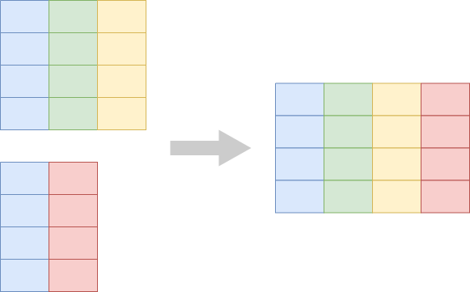
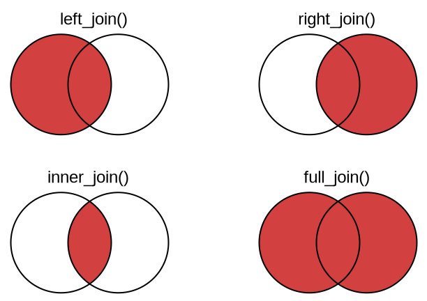
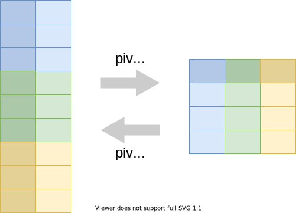

```{r setup, include=FALSE}
library(tidyverse)
library(countdown)
library(here)
library(ggbeeswarm)

table_01 <- read_csv(here("datasets/instructional_dataset/01_participant_metadata_UKZN_workshop_2023.csv"))
table_02 <- read_csv(here("datasets/instructional_dataset/02_visit_clinical_measurements_UKZN_workshop_2023.csv"))
```

## Goals for this module

By the end of this module you can:

- name what a row represents *before and after* every verb in a pipeline
- collapse a table to one row per group with `group_by` + `summarise`
- attach data from another table with `left_join`
- filter by membership in another table with `semi_join`
- reshape between long and wide with `pivot_longer` and `pivot_wider`
- pick the right plot for a distribution (histogram, boxplot, quasirandom, violin)
- layer raw observations under a computed summary in one figure

## Module 3 preserved row meaning. Module 4 changes it.

Module 3's verbs all kept "what a row represents" the same: `filter` drops rows but each remaining row still means the same thing; `mutate` adds columns; `arrange` reorders.

Module 4's verbs change it. Or sometimes don't. You have to know which.

The whole module asks one question on every slide: **what does a row represent now?**

## The through-line: `table_02`

```{r}
table_02
```

132 rows. *Row = participant-visit* (44 participants × 3 visits).

We will transform this same table through the next 18 slides. Watch what each verb does to the row count, and to what a row represents.

## `group_by` is a state change, not a shape change

```{r}
table_02 |> group_by(pid)
```

Same 132 rows. *Row meaning unchanged.* What changed is that subsequent verbs now act *per group*.

## `summarise` collapses each group to one row

```{r}
table_02 |>
  group_by(pid) |>
  summarise(
    mean_ph = mean(ph),
    mean_nugent = mean(nugent_score)
  )
```

132 → 44 rows. *Row = participant.* Visits collapsed.

## Different grouping, different row meaning

```{r}
table_02 |>
  group_by(arm, time_point) |>
  summarise(mean_ph = mean(ph))
```

132 → 6 rows. *Row = arm-timepoint.* Same starting data, different grouping, different row meaning.

## You picked what a row means

The verb didn't decide.

When you wrote `group_by(pid)`, the row collapsed to a participant.

When you wrote `group_by(arm, time_point)`, it collapsed to an arm-timepoint cell.

The grouping is the design choice that decides what a row will mean after `summarise`.

## Quick check {.your-turn}

What does each row represent, and how many rows, after:

```r
table_01 |>
  group_by(smoker) |>
  summarise(n = n(), mean_age = mean(age))
```

Predict before the reveal.

```{r}
countdown::countdown(1, top = 0)
```

## `group_by` + `mutate` — same rows, derived by group

```{r}
table_02 |>
  group_by(arm) |>
  mutate(rank_ph_within_arm = rank(ph)) |>
  select(pid, arm, ph, rank_ph_within_arm) |>
  head()
```

Still 132 rows, *row = participant-visit.* The new column is computed within each arm. `group_by` doesn't always collapse; the verb after it decides.

## `left_join` — the mutating join

`left_join` adds columns from a second table by matching on a key. *Same row meaning, same row count* (when the join is well-formed).



## `left_join` — demo

```{r}
per_person <- table_02 |>
  group_by(pid) |>
  summarise(mean_ph = mean(ph), mean_nugent = mean(nugent_score))

per_person |> left_join(table_01, by = "pid")
```

44 rows in, 44 rows out. *Row = participant* (unchanged). New columns: `arm`, `smoker`, `age`, `education`, `sex`.

## `semi_join` — the filtering join

`semi_join` keeps rows in the left table that have a match in the right table. *No new columns.* Same row meaning, fewer rows.



## `semi_join` — demo

```{r}
smokers <- table_01 |> filter(smoker == "smoker")

per_person |> semi_join(smokers, by = "pid")
```

*Row = participant* (unchanged). Rows that aren't smokers are dropped.

## Watch out — many-to-many joins multiply rows

If both sides have duplicate keys, the join multiplies rows:

```{r}
left <- tibble(id = c(1, 1, 2), x = c("a", "b", "c"))
right <- tibble(id = c(1, 1, 2), y = c("p", "q", "r"))
left |> left_join(right, by = "id")
```

3 + 3 = ... 5 rows. A well-formed join from a tidy left table should *not* change your row count. If it does, your key isn't unique somewhere.

## Quick check {.your-turn}

What does each row represent, and how many rows, after:

```r
table_02 |>
  left_join(table_01, by = c("pid", "arm"))
```

(Hint: `arm` appears in both tables. Does that change anything?)

```{r}
countdown::countdown(1, top = 0)
```

## `pivot_longer` — from wide to long

Each measurement column becomes a row.



## `pivot_longer` — demo

```{r}
table_02 |>
  pivot_longer(
    cols = c(ph, nugent_score, crp_blood),
    names_to = "measurement",
    values_to = "value"
  )
```

132 → 396 rows. *Row = participant-visit-measurement.* Useful for faceted plots — we'll use this in Exercise 2.

## `pivot_wider` — from long to wide

The inverse: one row per entity with the previously-long values spread out as columns.


## `pivot_wider` — demo

```{r}
arm_timepoint <- table_02 |>
  group_by(arm, time_point) |>
  summarise(mean_ph = mean(ph))

arm_timepoint |>
  pivot_wider(
    names_from = time_point,
    values_from = mean_ph
  )
```

6 → 2 rows. *Row = arm.* Three new columns, one per visit. Useful for table-style display.

## Exercise 1 {.your-turn}

Open `notebooks/04-wrangling.qmd` in your Codespace.

<br>

Group A: agentic. Group B: manual.

<br>

```{r}
countdown::countdown(30)
```
