```{r}
#| label: setup-libraries-data
#| echo: false
#| warning: false
#| message: false

library(countdown)
library(here)
library(MASS)
library(lme4)
library(lmerTest)
library(patchwork)
library(tidyverse)
source(here("materials/1-workshop1/5-modeling/helpers.R"))
theme_set(theme_classic(base_size = 18))
set.seed(202606)

ids <- read_csv(here("datasets/instructional_dataset/00_sample_ids_UKZN_workshop_2023.csv"))
cytokines_all <- read_csv(here("datasets/instructional_dataset/03_elisa_cytokines_UKZN_workshop_2023.csv")) |>
    left_join(ids)
cytokines <- cytokines_all |> filter(cytokine == "IL-1a")
flow_all <- read_csv(here("datasets/instructional_dataset/04_flow_cytometry_UKZN_workshop_2023.csv"))
```

## {data-menu-title="Website Link" style="text-align: center"}

\
\
\

:::{.r-fit-text}
Workshop materials are at:

[https://elsherbini.github.io/durban-data-science-for-biology/](https://elsherbini.github.io/durban-data-science-for-biology/)
:::

## {data-menu-item="Goals"}

### Goals for this session {style="font-size: 2em; text-align: center"}

:::{.incremental style="font-size: 1.1em"}

1. Distinguish between the "large" and "small" worlds of modeling.

2. Compare biostatistical models and explain when they apply.

3. Use R to estimate models and know how to explain the output.

4. Diagnose and address model failures.
:::

# Part 1: What is a Model?

## Let's start with a picture

- The plots below show IL-1a concentration from our workshop luminex dataset.

- Notice the variation across people and a possible treatment effect at the post-treatment visit.

```{r}
#| label: plot-il1
#| echo: false
#| fig-width: 8
#| fig-height: 4.5
p1 <- ggplot(cytokines) +
    geom_line(aes(time_point, log(conc), group = pid, col = arm)) +
    scale_y_continuous(expand = c(0, 0)) +
    scale_x_discrete(expand = c(0, 0)) +
    labs(x = "Timepoint", y = "log(concentration)")

p2 <- ggplot(cytokines) +
    geom_histogram(aes(log(conc), fill = arm), bins = 10, position = "identity", alpha = 0.6) +
    facet_wrap(~ time_point) +
    labs(y = "count", x = "log(concentration)")

(p1 / p2) +
    plot_layout(guides = "collect")
```

## Discussion {.your-turn}

Imagine running the study again, keeping the recruitment and experimental protocols as similar as possible. Make two lists:

::: incremental
- Aspects of the plots that you think *will still be true* in the new experiment.
- Aspects of the plots that you think *will change*.
:::

```{r}
#| label: plot-copy
p1 / p2
```

```{r}
#| label: discussion-compare
#| echo: false
countdown::countdown(5)
```

## A statistical model

> A statistical model is a simplified description of how the data were generated, the "data story."

- Model parameters let us answer scientific questions, like how a treatment affects outcomes.

- We observe just one realization of the data generating process -- things could have turned out differently if we ran the study again.

## Large vs. small worlds

::: {.columns}
::: {.column width="50%"}
**Large world**

- Where the data were actually gathered
- Complex, influenced by factors we never observed
- Hard to carry out controlled interventions
:::
::: {.column width="50%"}
**Small world**

- Inside the statistical model
- Logically consistent with precisely stated assumptions
- Allows hypothetical interventions and quantifies uncertainty
:::
:::

There will always be a gap between the two worlds. That gap is itself a source of uncertainty not captured by the model.

## Large Worlds

A dataset is like a photograph of a biological system, but it develops slowly
and is more error prone.

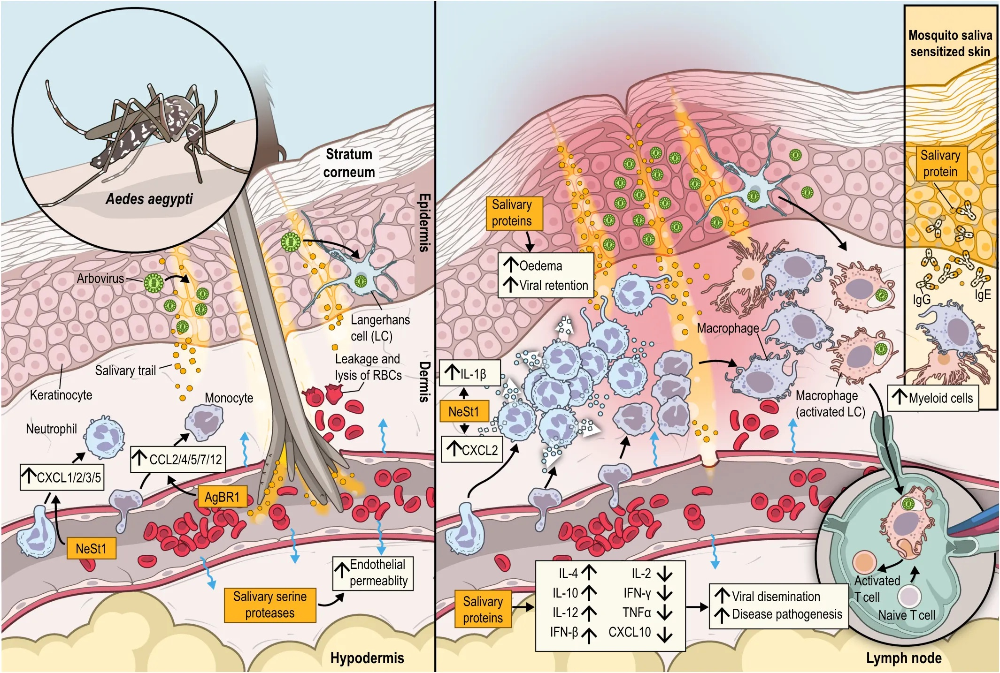

## Large Worlds

A dataset is like a photograph of a biological system, but the snapshot takes longer to generate and is more error prone.

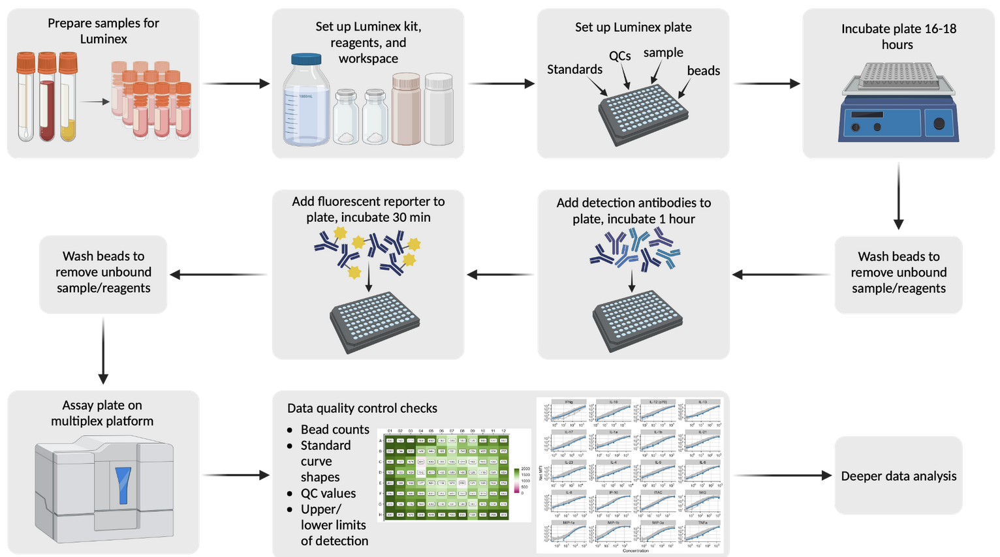

## Large Worlds

A dataset is like a photograph of a biological system, but the snapshot takes longer to generate and is more error prone.

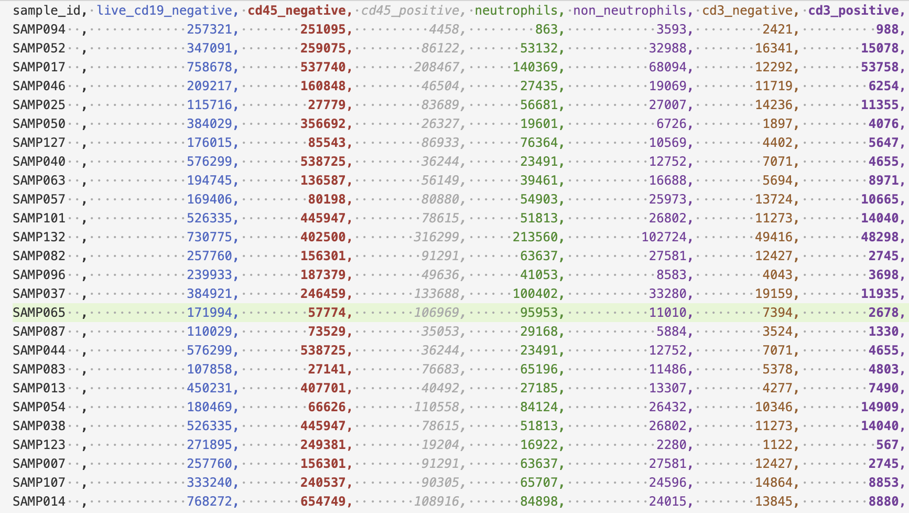

## Small Worlds

- The small-world model summarizes what would stay true if the experiment were repeated.

- It encodes a _data generating process_ that lets us simulate new data with the experiment's key features, without memorizing every sample.

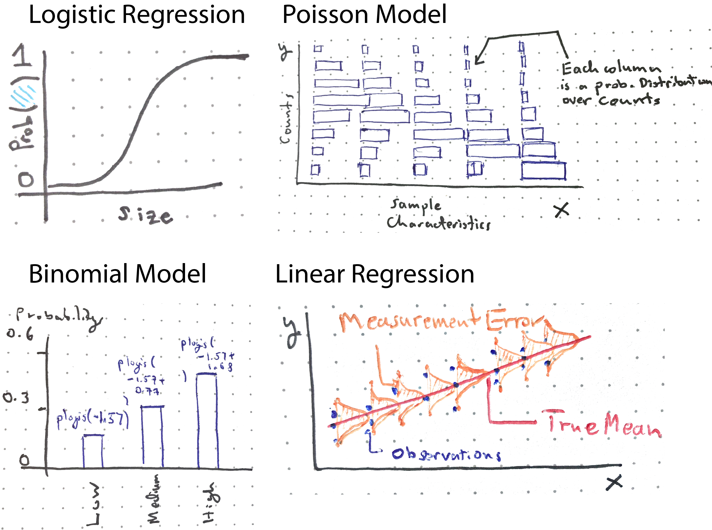

## Modeling Checklist

::: {.incremental style="font-size: 0.95em"}
1. **Biological Question.** What real-world questions do you want to answer?

2. **Plot the Data.** What does the outcome look like? Do you notice relationships with other variables?

3. **Working Assumptions.** Make a small-world story for how the data were generated. This is the initial statistical model.

4. **Model Checks.** Use simulation and diagnostics to check whether the model captures patterns we see in the real data.

5. **Revised Models.** Revise until the model provides a good match. Use this to answer the original question.
:::

# Part 2: A Tour through the Model Zoo

## Why a zoo?

Each type of statistical model is designed for a different kind of data or biological question.

Knowing different model "species" lets you adapt to whatever data or questions
you encounter.

::: {style="font-size: 0.9em"}
_Today's tour:_

- **Bernoulli / Binomial** — binary outcomes
- **Poisson** — count outcomes
- **Linear regression** — continuous outcomes
- **Variations** — multiple predictors, mixed effects, interactions
:::

## Bernoulli and Binomial Models

These models apply when outcomes fall into **two groups**.

- Heads vs. tails
- Infected vs. not infected
- Responder vs. non-responder
- CD3- cell vs. not CD3- cell

::: {.fragment}
The **Bernoulli** is for *individual outcomes*, the **Binomial** applies to their *totals*
:::

## Bernoulli and Binomial Models

The raw data come from two classes, and we want their relative probabilities.

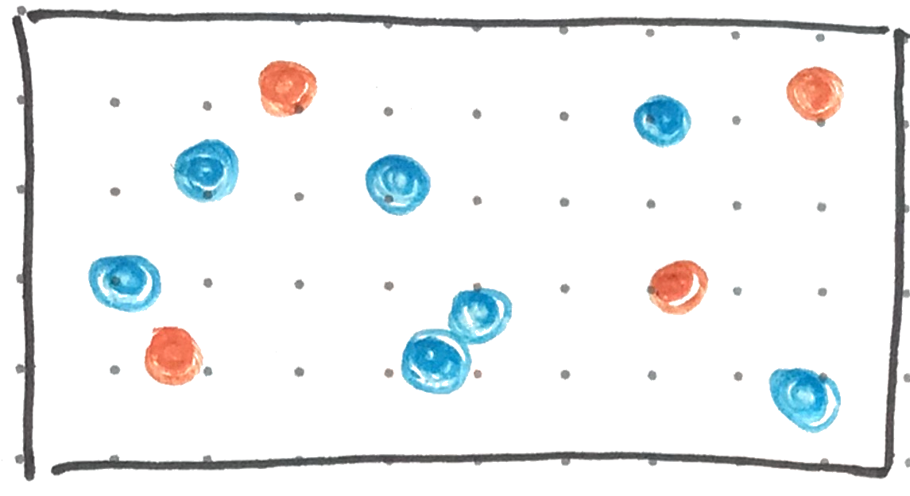

## Bernoulli and Binomial Models

The raw data come from two classes, and we want their relative probabilities.

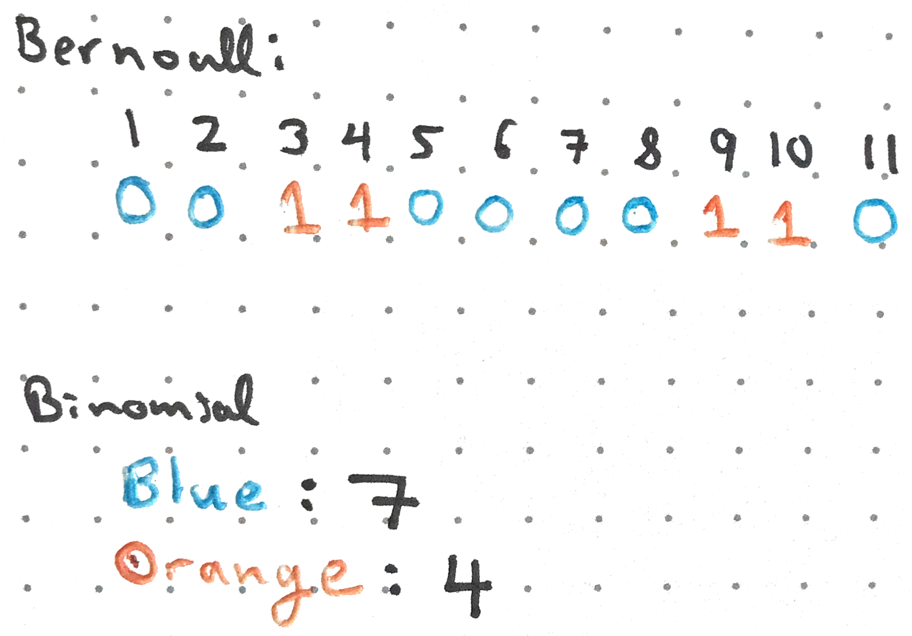

## Model Covariates

The outcome probabilities can depend on sample-level covariates.

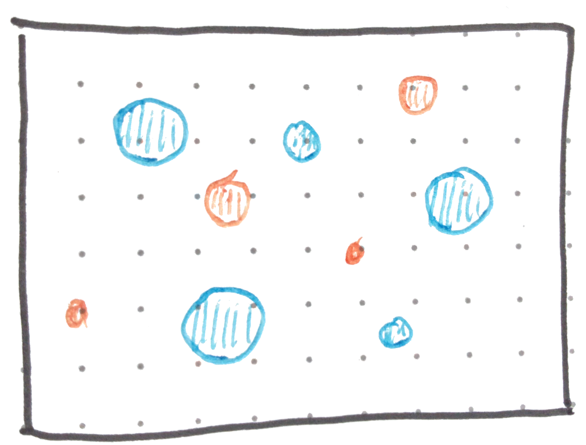

## Model Covariates

The outcome probabilities can depend on sample-level covariates.

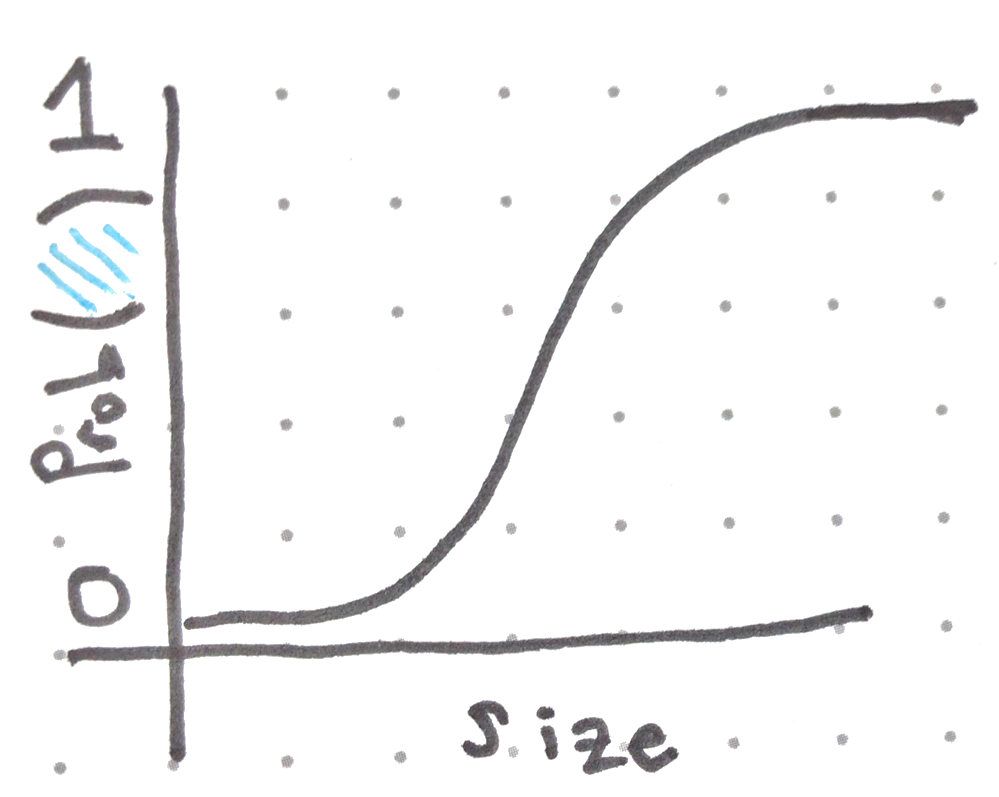

## Small-world

- The small-world model summarizes the relationship between covariates and response using this curve.

- The data generating process not only samples the correct frequencies but maintains the covariate-response relationship.


## Example data story

- **Response $y$**: Who does (1) or doesn't (0) get infected during an outbreak?

- **Covariates $x$**: Some people have larger social networks than others.

- **Story**: More social contact → higher probability of infection.

```{r}
#| label: load-bernoulli-data
#| echo: false
infections <- read_csv("https://huggingface.co/datasets/krisrs1128/durban_workshop_data/resolve/main/infections.csv") |>
    mutate(infected = ifelse(infected == "infected", 1, 0))
```

```{r}
#| label: plot-bernoulli
#| echo: false
#| fig-width: 8
#| fig-height: 5.5
#| out-width: 120%
ggplot(infections) +
    geom_jitter(aes(social_contact, infected, col = factor(infected)), height = 0.05, size = 2) +
    geom_line(aes(social_contact, prob_infection), linewidth = 1, col = "#232323") +
    scale_x_continuous(expand = c(0, 0)) +
    theme(legend.position = "bottom") +
    labs(y = "Infection Probability", x = "Level of Social Contact", col = "Infection Status")
```

## Infection data

- Each row corresponds to a person
- The outcome takes one of two values

```{r}
#| label: tbl-infections-sample
#| echo: true
infections |>
    select(sample_id, social_contact, infected)
```

## Fitting with `glm`

The `glm` function has three arguments:

::: incremental
- `formula`: written `y ~ x`, this relates outcome `y` to **covariates** `x`
- `family`: the type of model (depends on the data type of the outcome)
- `data`: a data.frame containing the columns named in `formula`
:::

## Bernoulli fit

```{r}
#| label: fit-bernoulli-glm
#| echo: true
fit <- glm(infected ~ social_contact, family = binomial(), data = infections)
summary(fit)
```

\
We wrote `family = binomial()`, but since `infected` is 0/1, the code knows to run a Bernoulli model.

## Interpreting the fit

- The estimates are on the **log-odds scale**, which isn't directly interpretable.

- `plogis()` converts them to the **probability scale**:

- This model is often called logistic regression, after the inverse logistic function (`plogis`).

## Interpreting the fit

At social contact level `x`, the infection probability `≈ plogis(-2.37 + 3.09x)`

- `x = 0` $\implies$ `plogis(-2.37) ≈ 0.085`
- `x = 0.5` $\implies$ `plogis(-2.37 + 0.5 × 3.09) ≈ 0.24`
- `x = 1` $\implies$ `plogis(-2.37 + 1 × 3.09) ≈ 0.50`

```{r}
#| label: summary-bernoulli-fit
#| echo: true
summary(fit)
```

## Interpreting the fit

- The **intercept** parameter controls the height of the curve at 0.
- The **slope** parameter controls the rate of its increase as a function of $x$.

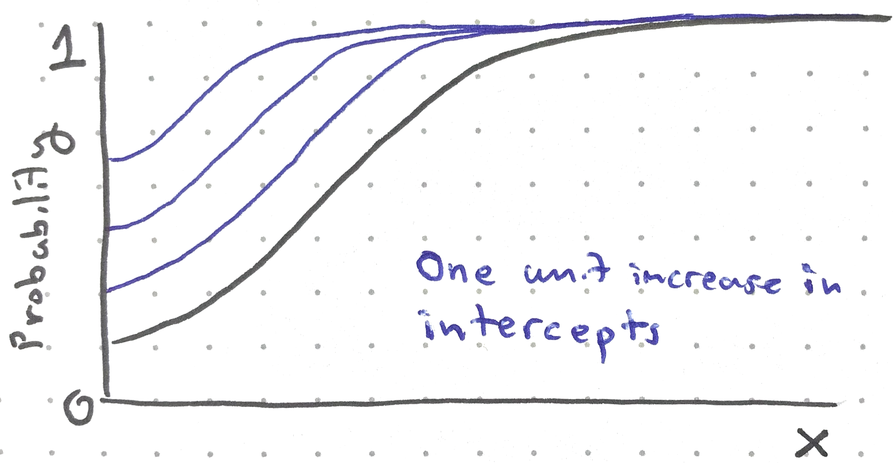

## Interpreting the fit

- The **intercept** parameter controls the height of the curve at 0.
- The **slope** parameter controls the rate of its increase as a function of $x$.

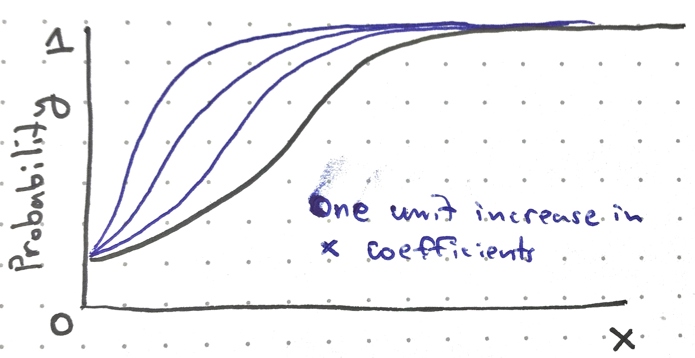

## Interpreting the fit

- `x = 0` $\implies$ `plogis(-2.37) ≈ 0.085`
- `x = 0.5` $\implies$ `plogis(-2.37 + 0.5 * 3.09) ≈ 0.30`
- `x = 1` $\implies$ `plogis(-2.37 + 1 * 3.09) ≈ 0.67`

```{r}
#| label: plot-bernoulli-overlay
#| fig-width: 8
#| fig-height: 5.5
#| echo: false
#|
infections$predicted_prob <- plogis(predict(fit))
ggplot(infections) +
    geom_jitter(aes(social_contact, infected, col = factor(infected)), height = 0.05, size = 2) +
    geom_line(aes(social_contact, prob_infection), linewidth = 1, col = "#bbb6b6") +
    geom_line(aes(social_contact, predicted_prob), linewidth = 1, col = "#414ca1") +
    scale_x_continuous(expand = c(0, 0)) +
    theme(legend.position = "bottom") +
    labs(y = "Infection Probability", x = "Level of Social Contact", col = "Infection Status")
```

## Aggregated (Binomial) data

If we only see **totals within categories**, then we can use a Binomial model.

\

```{r}
#| label: load-infection-totals
#| echo: false
infections_totals <- read_csv("https://huggingface.co/datasets/krisrs1128/durban_workshop_data/resolve/main/infections_props.csv") |>
    mutate(
        social_level = recode(
            social_level,
            "(0.0129,0.337]" = "low",
            "(0.337,0.661]" = "medium",
            "(0.661,0.985]" = "high"
        ),
        social_level = factor(social_level, levels = c("low", "medium", "high"))
    )
```

```{r}
#| label: tbl-infection-totals
#| echo: true
infections_totals
```

## Aggregated (Binomial) data

```{r}
#| label: plot-infection-totals
#| echo: false
#| fig-width: 8
#| fig-height: 5.5
infections_totals |>
    select(-total) |>
    pivot_longer(-social_level) |>
    ggplot() +
    geom_col(aes(social_level, value, fill = name), position = "dodge") +
    scale_y_continuous(expand = c(0, 0, 0.1, 0)) +
    labs(x = "Level of Social Contact", y = "Count", fill = "Infection Status")
```

## Fitting the Binomial

For group-level counts, the formula's left-hand side becomes a proportion, and we add `weights` to reflect group totals.

```{r}
#| label: fit-binomial-glm
#| echo: true
fit <- glm(infected / total ~ social_level, family = binomial(),
           weights = total, data = infections_totals)
summary(fit)
```

## Interpreting the fit

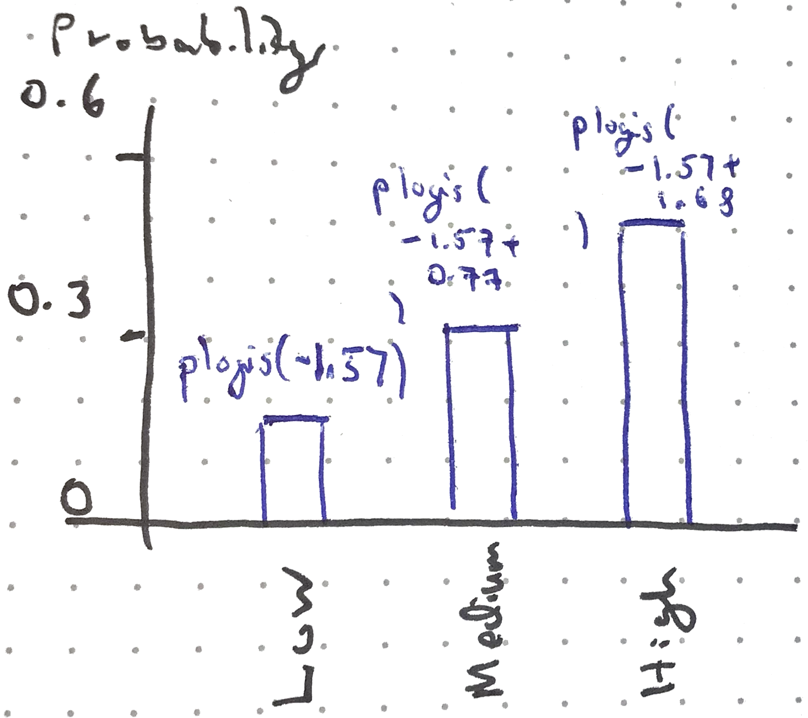

## Poisson Models

These models apply to **count data**.

The Poisson arises as the "number of occurrences of an event that happens rarely
but has many opportunities to happen" [@wiki_poisson_distribution]. The number
of raindrops landing on a small window during a heavy storm would be Poisson
distributed.

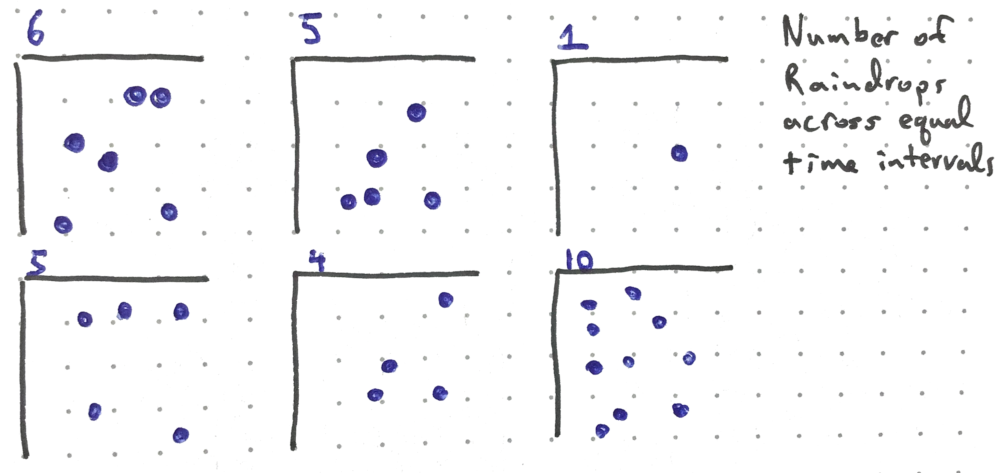

## Poisson Models

These models apply to **count data**.

The Poisson arises as the "number of occurrences of an event that happens rarely
but has many opportunities to happen" [@wiki_poisson_distribution]. The number
of raindrops landing on a small window during a heavy storm would be Poisson
distributed.

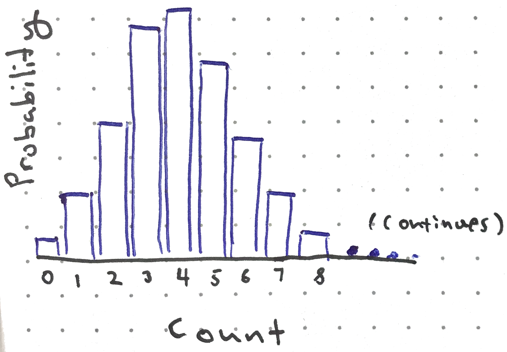

## Poisson Models

Counts can depend on sample characteristics. The rain may have been falling harder earlier in the night.

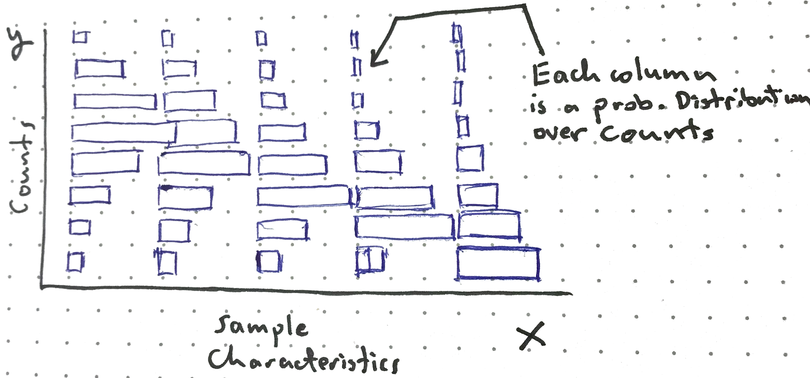

## Poisson Models

Many biological counts have this flavor:

- Transcript counts
    - Any one transcript has a small chance of binding to cDNA, but there are many transcripts
    - The number of transcripts of a gene might depend on drug treatment
- Mutation count along a genome segment
    - Any one base pair has a small chance of being mutated, but there are many base pairs overall
    - The number of mutations depends on selection pressure
- Infection count within a county
    - Any one person has a small chance of being infected, but the population is large
    - The infection rates decrease further from the epicenter

## Outbreak counts vs. distance

Let's fit a model for the infection count example.

```{r}
#| label: load-outbreak-data
#| echo: false
outbreak <- read_csv("https://huggingface.co/datasets/krisrs1128/durban_workshop_data/resolve/main/outbreak.csv")
```

```{r}
#| label: plot-outbreak-mean-count
#| echo: false
#| fig-width: 8
#| fig-height: 4
ggplot(outbreak, aes(epicenter_distance)) +
    geom_line(aes(y = mean), col = "#414ca1", linewidth = 1) +
    geom_point(aes(y = infected), size = 2) +
    labs(x = "Epicenter Distance", y = "Infection Count")
```

## Outbreak counts vs. distance

Counts can depend on sample characteristics, like more infections in counties closer to the outbreak epicenter.

```{r}
#| label: tbl-outbreak-sample
#| echo: true
outbreak |>
    select(sample_id, epicenter_distance, infected)
```

## Fitting the Poisson

```{r}
#| label: fit-poisson-glm
#| echo: true
fit <- glm(infected ~ epicenter_distance, family = poisson(), data = outbreak)
summary(fit)
```

The output is on the **log scale**, so exponentiate before interpreting.

## Interpreting the fit

At distance `x`, the average count is `≈ exp(2.4 - 0.5x)`

- `x = 0` $\implies$ `exp(2.4) ≈ 11.0`
- `x = 0.5` $\implies$ `exp(2.4 − 0.5 * 3.9) ≈ 1.6`

```{r}
#| label: summary-poisson-fit
summary(fit)
```

## Interpreting the fit

At distance `x`, the average count is `≈ exp(2.4 - 0.5x)`

- `x = 0` $\implies$ `exp(2.4) ≈ 11.0`
- `x = 0.5` $\implies$ `exp(2.4 − 0.5 × 3.9) ≈ 1.6`

```{r}
#| label: plot-outbreak-overlay
outbreak$predicted_mean <- predict(fit, type = "response")
ggplot(outbreak, aes(epicenter_distance)) +
    geom_point(aes(y = infected), size = 2) +
    geom_line(aes(y = mean), col = "#bbb6b6", linewidth = 1) +
    geom_line(aes(y = predicted_mean), col = "#414ca1", linewidth = 1) +
    labs(x = "Epicenter Distance", y = "Infection Count")
```

## Linear Regression Models

Linear regression applies when the response is **continuous**. For example:

- Temperature
- Antibody titre
- Leaf width

The model assumes random Gaussian error around a mean value that depends on the covariates.

## Gaussian Assumption

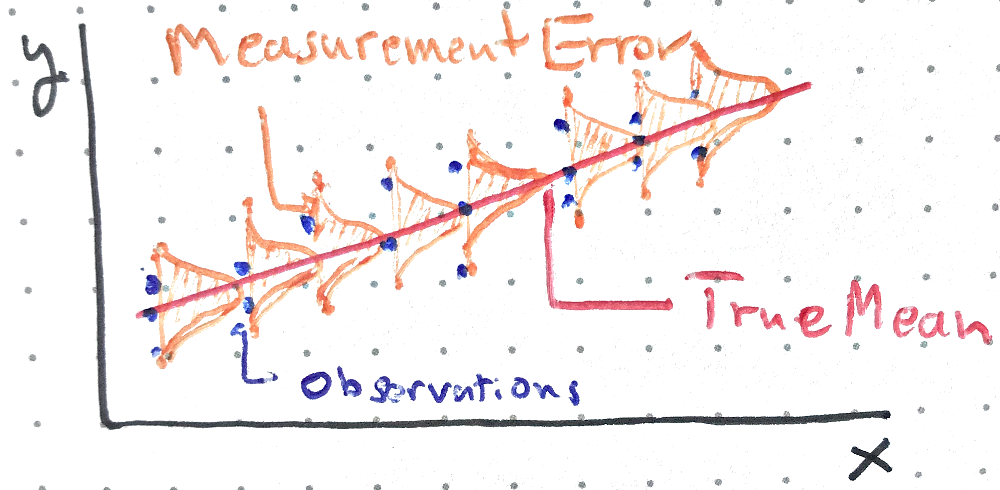

## Antibody titre vs age

```{r}
#| label: load-antibody-data
#| echo: false
antibody <- read_csv("https://huggingface.co/datasets/krisrs1128/durban_workshop_data/resolve/main/antibody.csv")
```

```{r}
#| label: plot-antibody-age
#| echo: false
#| fig-width: 8
#| fig-height: 4
ggplot(antibody) +
    geom_line(aes(age, mean), col = "#d53636", linewidth = 1.5) +
    geom_point(aes(age, antibody), size = 2) +
    labs(x = "Age", y = "Antibody Titre")
```

## Fitting with `lm`

Same inputs as `glm`, but no `family`.

```{r}
#| label: fit-antibody-lm
#| echo: true
fit <- lm(antibody ~ age, data = antibody)
summary(fit)
```

Predicted titre at age `x` is `19.6 + 0.058x`

E.g. at age 10 the prediction is `≈ 19.6 + 0.58 = 20.18`

## Why Gaussian errors?

The **Central Limit Theorem**: the average of many small, independent effects tends toward a Gaussian distribution.

We implicitly assume many small, independent factors other than age that perturb the observed antibody measurement.

[picture of gsn errors around regression line]

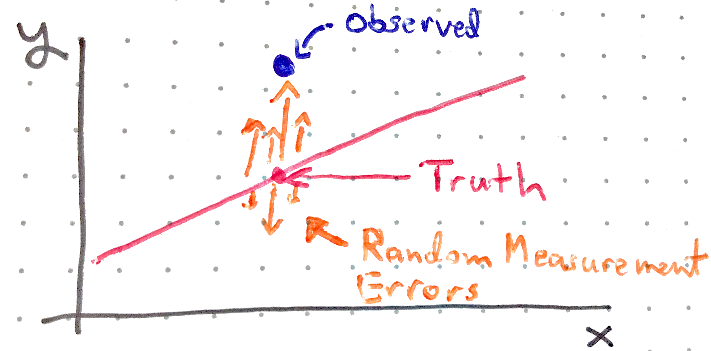

## Why Gaussian errors?

<iframe src="https://seeing-theory.brown.edu/probability-distributions/index.html#section3" height="800" width="2000" style="border: 1px solid #2e3846;"></iframe>

## Categorical covariates

Linear regression can be used with covariates that are categorical. It is not
limited to drawing straight lines through scatterplots.

```{r}
#| label: gsn-categories
antibody_grouped <- antibody |>
    mutate(age_group = cut(age, c(0, 30, 60, 100)))
ggplot(antibody_grouped) +
    geom_boxplot(aes(age_group, antibody)) +
    labs(x = "Age Group", y = "Antibody Titre")
```

## Categorical covariates

The estimates are on the same scale as the response, so we can interpret the
results without using `plogis` or `exp` like we needed before.

```{r}
fit <- lm(antibody ~ age_group, data = antibody_grouped)
summary(fit)
```

## Discussion {.your-turn}

_Recommend a model for each of the following questions. What plot would you use to validate your choice? What would be the response and covariate variables?_

- Does the proportion of Lactobacillus in a 16S sequencing dataset change between treatment and control groups in an RCT?
- We have counts of gene transcripts over time from a bulk RNA-sequencing experiment. Is its expression systematically changing?
- Study participants have been grouped into low and high inflammation groups. We want to see whether abundance of a given microbe-produced metabolite is associated with inflammation group.

```{r}
#| label: discussion-compare
#| echo: false
countdown::countdown(5)
```

# Variations: Multiple Predictors, Mixed Effects, Interactions

## Multiple predictors

Formulas can have multiple covariates: `y ~ x1 + x2`

Each estimate is the effect of a variable **with all others held fixed**.

```{r}
#| label: fit-multiple-predictors
#| echo: true
fit <- lm(antibody ~ age + blood_pressure, data = antibody)
summary(fit)
```


::: {style="font-size: 0.9em"}
*Fixing blood pressure, average antibody level increases by 0.058 units per year of age.*
:::

## Multiple Predictors

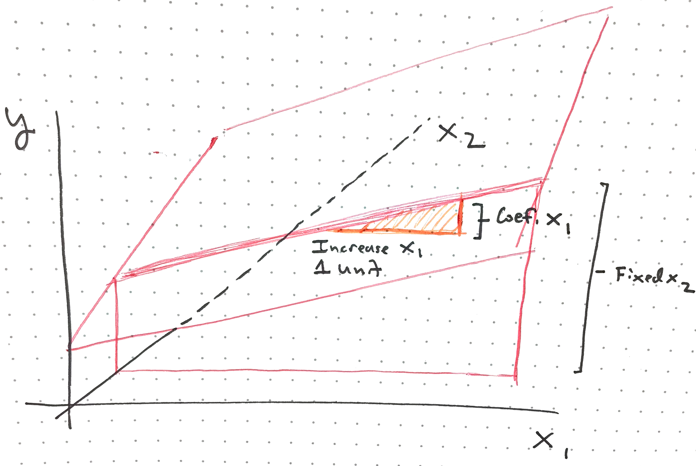

## Multiple Predictors

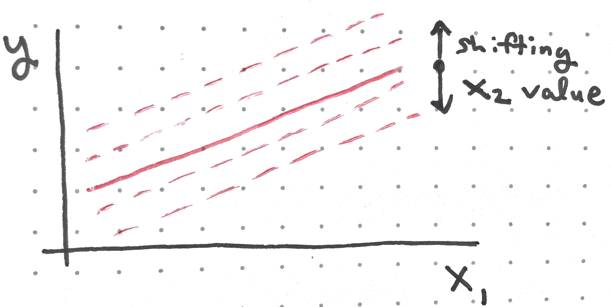

## Mixed effects

- Baseline effects often **vary across contexts**.

- In the Bernoulli example, the way infection probability increases with social
contact may vary across counties due to unmeasured factors, like population
density.

## County-varying baselines

```{r}
#| label: load-mixed-effects-data
#| echo: false
mixed_effect_data <- read_csv("https://huggingface.co/datasets/krisrs1128/durban_workshop_data/resolve/main/mixed_effect_data.csv") |>
    mutate(infected = ifelse(infected == "infected", 1, 0))
```

```{r}
#| label: plot-county-baselines
#| echo: false
#| fig-width: 9
#| fig-height: 4.2
ggplot(mixed_effect_data) +
    geom_jitter(aes(social_contact, infected, col = factor(infected)), height = 0.05, size = 1.4) +
    geom_line(aes(social_contact, prob_infection), linewidth = 0.8, col = "#232323") +
    facet_wrap(~ reorder(county, prob_infection), nrow = 2) +
    scale_y_continuous(expand = c(0, 0)) +
    scale_x_continuous(expand = c(0, 0)) +
    labs(y = "Probability of Infection") +
    theme(legend.position = "none")
```

## Random effects

- We could add county as an ordinary covariate — but with many counties, this becomes unwieldy.
- A better approach is to use a **random effect**
- We imagine county effects as draws from a shared distribution.

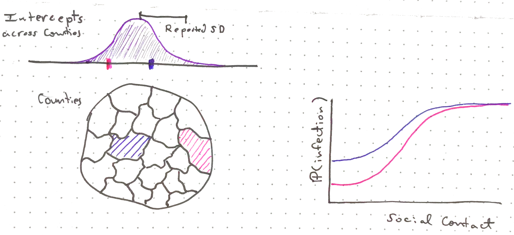


## Random effects

- We estimate the **overall variation across counties**, not each one separately.
- This is statistically easier, so it yields higher power.
- Because they include both fixed and random effects, these are called **mixed effects** models.


## Fitting with `glmer`

Replace `glm` with `glmer` and add `(1 | county)` to the formula.

```{r}
#| label: fit-glmer-county-random-intercept
#| echo: true
fit <- glmer(infected ~ social_contact + (1 | county),
             family = binomial(), data = mixed_effect_data)
summary(fit)
```

## Interpreting the random effect

The `SD` says the intercept varies by roughly 0.71 across counties, at any level
of social contact. Therefore, even at social contact = 0, the infection
probabilities below would both be typical:

```{r}
#| label: calc-random-effect-prob-range
#| echo: true
plogis(-2.28 - 2 * 0.71)
plogis(-2.28 + 2 * 0.71)
```

## Interactions

Sometimes the effect of a variable on the response **depends on the value of
other variables**. This is called an interaction.

```{r}
#| label: load-interaction-data
#| echo: false
interaction_data <- read_csv("https://huggingface.co/datasets/krisrs1128/durban_workshop_data/resolve/main/interaction_data.csv")
```

```{r}
#| label: plot-interaction-pattern
#| echo: false
#| fig-width: 7
#| fig-height: 4
ggplot(interaction_data) +
    geom_line(aes(age, mean, col = group), linewidth = 1.5) +
    geom_point(aes(age, antibody, col = group), size = 2) +
    labs(x = "Age", y = "Titre")
```

## Interaction syntax

Use `y ~ x1 + x1 : x2` — meaning the `x1` effect depends on the level of `x2`.

```{r}
#| label: fit-interaction-lm
#| echo: true
fit <- lm(antibody ~ age + age : group, data = interaction_data)
summary(fit)
```


::: {style="font-size: 0.9em"}
- Healthy group: titre rises by **0.062** per year of age
- Disease group: titre rises by **0.062 - 0.002** per year (sum the two rows)
:::

## Variations recap

- Although we introduced these with Bernoulli and linear regression examples, they apply to any of the models we've seen.

- They are the key tools we can use when **revising a model's working assumptions** to improve its fit.

## Discussion {.your-turn}

Think through the first three parts of the modeling checklist for a
dataset that you are interested in from your own work or study.

1. **Biological Question**. What real-world questions do you want to answer?

2. **Plot the Data.** Did you ever plot the data? If so, what patterns did you see? If not, what plots could you make?

3. **Working Assumptions.** Make a small-world story about your data. What model type, response $y$, and covariates $x$ could you use?

```{r}
#| label: discussion-compare
#| echo: false
countdown::countdown(5)
```

# Part 3: Case Studies

## Case Study: Longitudinal Cytokines

**Biological Question**

> Does treatment with the anti-inflammatory drug change cytokine concentrations post-treatment (week 1), and if so does the effect persist into the long run (week 7)?

## Plot the data

```{r}
#| label: load-cytokines-all
#| echo: false
#| fig-height: 5
#| fig-width: 12
ggplot(cytokines) +
    geom_line(aes(time_point, log(conc), group = pid, col = arm)) +
    scale_y_continuous(expand = c(0, 0)) +
    scale_x_discrete(expand = c(0, 0)) +
    theme(axis.text.x = element_text(angle = 90)) +
    facet_wrap(~ reorder(cytokine, -conc), nrow = 2)
```

There seems to be a strong treatment effect at one week that weakens by
week 7. We'll focus on **IL-1a**, the cytokine with the fewest measurements
below the detection limit.

## Working assumptions

::: incremental
- Luminex gives a **continuous** readout → linear regression
- Many small, unrelated factors perturb the measurement → **Gaussian error**
- Errors are likely multiplicative, not additive → model **log-concentration**
:::

## A first model

```{r}
#| label: fit-il1-main-effect
#| echo: true
cytokines <- cytokines |> filter(cytokine == "IL-1a")
fit <- lm(log(conc) ~ arm, data = cytokines)
summary(fit)
```

The treatment effect is significant, but we should interpret a model only after
checking its fidelity.

## Check by simulation

The `simulate` function lets you simulate new response values. By default each
simulated output matches the corresponding training sample.

```{r}
#| label: simulate-intro
#| echo: true
simulate(fit)
```

## Check by simulation

The `simulate_cytokines` helper function runs `simulate` and reshapes the data
for plotting.

```{r}
#| label: sim-check-main-effect
#| echo: true
#| fig-height: 3.5
#| fig-width: 9
sim_data <- simulate_cytokine(fit)
plot_cytokine(sim_data)
```

## What went wrong?

::: incremental
- ✅ Overall concentrations are in the correct range
- ✅ Control group has larger concentrations than treatment
- ❌ In the real data, **most blue curves decrease at week 1**
- ❌ In the simulation, about **half the curves increase**
:::

## Revising the model

- We gave the model **no temporal information**. We could fix this with the formula: `log(conc) ~ arm + time_point`.

   - This data story isn't reasonable either
   - We don't expect IL-1a concentration to change just because the clock reads week 1 or 7.

We want the **treatment effect itself to depend on the week**, a type of interaction: `log(conc) ~ arm + arm : time_point`.

## Fitted interaction model

```{r}
#| label: fit-il1-interaction-model
#| echo: true
fit <- lm(log(conc) ~ arm + arm : time_point, data = cytokines)
summary(fit)
```

## Interpreting the coefficients

Expected log-concentrations:

::: {style="font-size: 0.9em"}
- Placebo at baseline: 4.66
- Treatment at baseline: 4.66 − 0.29
- Placebo at week 1: 4.66 − 0.48
- Treatment at week 1: 4.66 − 2.34
- ...
:::


The large negative coefficient for `armtreatment:time_pointweek_1` captures our earlier observation that the treatment effect is strongest at week 1.

## Simulate updated model

```{r}
#| label: sim-check-interaction-model
#| echo: false
#| fig-height: 3.5
#| fig-width: 9
sim_data <- simulate_cytokine(fit)
plot_cytokine(sim_data)
```

## Mixed-effects version

The model treats each sample as independent, but measurements from the same participant are dependent.

- Dependence reduces the effective sample size.
- We can add a participant-level random effect to introduce dependence.

```{r}
#| label: fit-il1-mixed-effects
#| echo: true
fit <- lmer(log(conc) ~ arm + arm : time_point + (1 | pid), data = cytokines)
```

## Simulate updated model

```{r}
#| label: sim-check-mixed-effects
#| echo: false
#| fig-height: 3.5
#| fig-width: 9
sim_data <- simulate_cytokine(fit)
plot_cytokine(sim_data)
```

## Model results

```{r}
#| label: summary-il1-mixed-effects
#| echo: true
summary(fit)
```

## Interpretation

- Visually, the model doesn't seem much better.
- Participant variation (SD **0.15**) is small vs. measurement error (**0.81**).
- But it's the safer model in practice. By accounting for within-participant dependence, we're being honest about the effective sample size.

# Wrapping Up

## What we did today

::: {.incremental style="font-size: 0.95em"}
1. Models as **data stories** — small world vs. large world.
2. A **modeling checklist** to guide our work: question → plot → assumptions → checks → revise.
3. A tour through the **model zoo**: Bernoulli, Binomial, Poisson, Linear.
4. **Variations** for complex data: multiple predictors, mixed effects, interactions.
5. **Case study** illustrating the checklist
:::

## Exercise 2 {.your-turn}

Open `notebooks/05-modeling.qmd` in your Codespace.

<br>

The modes flip: whoever was agentic in Exercise 1 is manual now, and vice versa.

<br>

```{r}
countdown::countdown(30)
```
