```{=html}
<style>
  :root {
    --ink: #16202a;
    --muted: #5d6b7a;
    --faint: #8190a2;
    --line: #dbe4ec;
    --panel: #ffffff;
    --soft: #f6f8fb;
    --wash: #eef8f5;
    --teal: #0f766e;
    --blue: #2563eb;
    --rose: #be123c;
    --amber: #b45309;
    --green: #15803d;
    --violet: #7c3aed;
    --slate: #475569;
    --shadow: 0 18px 44px rgba(22, 32, 42, 0.08);
    --shadow-soft: 0 10px 24px rgba(22, 32, 42, 0.07);
  }

  .quarto-title-block {
    display: none;
  }

  .package-sheet {
    color: var(--ink);
    background:
      linear-gradient(180deg, #f4faf8 0, #f8fbfd 260px, #ffffff 700px),
      #ffffff;
    min-height: 100vh;
    padding: 22px 40px 48px;
    font-family: ui-sans-serif, -apple-system, BlinkMacSystemFont, "Segoe UI", sans-serif;
  }

  .sheet-shell {
    max-width: 1240px;
    margin: 0 auto;
  }

  .sheet-hero {
    display: block;
    padding: 10px 0 18px;
  }

  .sheet-hero h1 {
    margin: 0;
    font-size: 3.9rem;
    line-height: 1;
    letter-spacing: 0;
    max-width: 760px;
  }

  .sheet-hero p {
    margin: 12px 0 0;
    color: var(--muted);
    font-size: 1rem;
    line-height: 1.5;
    max-width: 760px;
  }

  .hero-stats {
    display: grid;
    grid-template-columns: repeat(3, minmax(0, 1fr));
    gap: 10px;
    max-width: 620px;
    margin: 18px 0 0;
  }

  .hero-stat {
    border-left: 3px solid var(--stat-color);
    background: rgba(255, 255, 255, 0.72);
    padding: 8px 12px;
    box-shadow: inset 0 0 0 1px rgba(219, 228, 236, 0.72);
  }

  .hero-stat strong {
    display: block;
    font-size: 1.3rem;
    line-height: 1;
  }

  .hero-stat span {
    display: block;
    color: var(--muted);
    font-size: 0.82rem;
    line-height: 1.3;
    margin-top: 5px;
  }

  .control-row {
    display: grid;
    grid-template-columns: minmax(260px, 1fr) auto;
    gap: 12px;
    align-items: center;
    margin: 4px 0 16px;
    padding: 10px;
    position: sticky;
    top: 0;
    z-index: 4;
    background: rgba(255, 255, 255, 0.88);
    border: 1px solid rgba(219, 228, 236, 0.82);
    border-radius: 8px;
    box-shadow: var(--shadow-soft);
    backdrop-filter: blur(14px);
  }

  .search-wrap {
    position: relative;
  }

  .search-icon {
    position: absolute;
    left: 14px;
    top: 50%;
    width: 18px;
    height: 18px;
    transform: translateY(-50%);
    color: var(--faint);
    pointer-events: none;
  }

  .package-search {
    width: 100%;
    border: 1px solid var(--line);
    border-radius: 8px;
    padding: 13px 14px 13px 42px;
    color: var(--ink);
    background: #ffffff;
    font-size: 1rem;
  }

  .package-search:focus {
    outline: 3px solid rgba(37, 99, 235, 0.18);
    border-color: var(--blue);
  }

  .count-pill {
    border: 1px solid var(--line);
    border-radius: 8px;
    padding: 12px 14px;
    color: var(--muted);
    background: #ffffff;
    font-size: 0.9rem;
    white-space: nowrap;
  }

  .filter-controls {
    display: flex;
    flex-wrap: wrap;
    justify-content: flex-end;
    gap: 10px;
    align-items: center;
  }

  .scope-tabs {
    display: inline-grid;
    grid-template-columns: repeat(3, minmax(0, 1fr));
    gap: 4px;
    padding: 4px;
    border: 1px solid var(--line);
    border-radius: 8px;
    background: #f6f8fb;
  }

  .scope-tabs button {
    border: 0;
    border-radius: 6px;
    padding: 8px 10px;
    color: var(--muted);
    background: transparent;
    font-size: 0.86rem;
    font-weight: 700;
    cursor: pointer;
    white-space: nowrap;
  }

  .scope-tabs button[aria-pressed="true"] {
    color: var(--ink);
    background: #ffffff;
    box-shadow: 0 5px 14px rgba(22, 32, 42, 0.08);
  }

  .scope-tabs button:focus-visible,
  .package-select:focus-visible {
    outline: 3px solid rgba(37, 99, 235, 0.18);
  }

  .select-wrap {
    display: inline-flex;
    align-items: center;
    gap: 7px;
    padding: 4px 4px 4px 10px;
    border: 1px solid var(--line);
    border-radius: 8px;
    background: #ffffff;
  }

  .select-wrap span {
    color: var(--muted);
    font-size: 0.82rem;
    font-weight: 700;
  }

  .package-select {
    min-height: 34px;
    border: 0;
    color: var(--ink);
    background: transparent;
    font-size: 0.9rem;
    font-weight: 700;
  }

  .package-badges {
    display: grid;
    grid-template-columns: 1fr;
    gap: 18px;
    margin: 0 0 22px;
  }

  .package-group {
    display: grid;
    gap: 10px;
  }

  .package-group-head {
    display: flex;
    justify-content: space-between;
    gap: 12px;
    align-items: end;
    padding: 0 2px;
  }

  .package-group-head h2 {
    margin: 0;
    color: var(--ink);
    font-size: 1.05rem;
    line-height: 1.2;
  }

  .package-group-head span {
    color: var(--muted);
    font-size: 0.84rem;
    white-space: nowrap;
  }

  .package-group-grid {
    display: grid;
    grid-template-columns: repeat(auto-fit, minmax(190px, 1fr));
    gap: 12px;
  }

  .pkg-badge {
    display: grid;
    gap: 12px;
    min-height: 108px;
    border: 1px solid var(--line);
    border-radius: 8px;
    padding: 14px;
    color: var(--ink);
    background:
      linear-gradient(180deg, #ffffff 0%, color-mix(in srgb, var(--badge-color) 5%, #ffffff) 100%);
    cursor: pointer;
    text-align: left;
    transition: border-color 160ms ease, box-shadow 160ms ease, transform 160ms ease, background 160ms ease;
  }

  .pkg-badge:hover,
  .pkg-badge:focus-visible {
    border-color: var(--badge-color);
    box-shadow: 0 10px 24px rgba(23, 33, 43, 0.10);
    transform: translateY(-1px);
    outline: none;
  }

  .pkg-badge[aria-selected="true"] {
    border-color: var(--badge-color);
    background:
      linear-gradient(180deg, color-mix(in srgb, var(--badge-color) 12%, #ffffff), #ffffff);
    box-shadow: 0 16px 30px rgba(22, 32, 42, 0.12);
  }

  .badge-main {
    display: flex;
    gap: 10px;
    align-items: center;
    min-width: 0;
  }

  .badge-copy {
    display: grid;
    gap: 3px;
    min-width: 0;
  }

  .badge-name {
    color: var(--ink);
    font-weight: 800;
    font-size: 1rem;
    line-height: 1.1;
    word-break: break-word;
  }

  .badge-category,
  .badge-modules,
  .badge-task {
    color: var(--muted);
    font-size: 0.8rem;
    line-height: 1.25;
  }

  .badge-modules {
    display: flex;
    justify-content: space-between;
    gap: 8px;
    align-self: end;
    border-top: 1px solid color-mix(in srgb, var(--badge-color) 18%, #ffffff);
    padding-top: 10px;
  }

  .badge-task {
    color: color-mix(in srgb, var(--badge-color) 72%, var(--ink));
    font-weight: 700;
  }

  .logo-mark {
    display: inline-flex;
    align-items: center;
    justify-content: center;
    width: 38px;
    height: 38px;
    border-radius: 8px;
    border: 1px solid color-mix(in srgb, var(--badge-color) 28%, white);
    background: #ffffff;
    overflow: hidden;
    flex: 0 0 auto;
  }

  .logo-mark img {
    width: 100%;
    height: 100%;
    object-fit: contain;
    display: block;
  }

  .logo-fallback {
    background: color-mix(in srgb, var(--badge-color) 16%, white);
    color: var(--badge-color);
    font-weight: 800;
    font-size: 0.86rem;
    letter-spacing: 0;
  }

  .detail-title-row {
    display: flex;
    align-items: center;
    gap: 16px;
    min-width: 0;
  }

  .logo-detail {
    width: 86px;
    height: 86px;
    border-radius: 16px;
    padding: 6px;
    background: rgba(255, 255, 255, 0.82);
    box-shadow: 0 10px 24px rgba(22, 32, 42, 0.10);
  }

  .logo-detail.logo-fallback {
    font-size: 1.25rem;
  }

  .detail-grid {
    display: grid;
    grid-template-columns: minmax(0, 1fr);
    gap: 22px;
    align-items: start;
  }

  .detail-panel,
  .module-panel {
    background: var(--panel);
    border: 1px solid var(--line);
    border-radius: 8px;
    box-shadow: var(--shadow);
    grid-column: 1 / -1 !important;
  }

  .detail-panel {
    overflow: hidden;
  }

  .detail-header {
    display: grid;
    grid-template-columns: minmax(0, 1fr);
    gap: 16px;
    align-items: start;
    padding: 24px;
    border-bottom: 1px solid var(--line);
    background:
      linear-gradient(90deg, color-mix(in srgb, var(--active-color) 12%, white), #ffffff 78%);
    border-top: 4px solid var(--active-color);
  }

  .detail-kicker {
    color: var(--muted);
    font-size: 0.82rem;
    font-weight: 700;
    letter-spacing: 0;
    margin: 0 0 6px;
  }

  .detail-header h2 {
    margin: 0;
    font-size: 3.2rem;
    line-height: 0.98;
    letter-spacing: 0;
  }

  .detail-role {
    margin: 12px 0 0;
    color: var(--muted);
    max-width: 880px;
    line-height: 1.5;
  }

  .module-tags,
  .function-tags,
  .detail-meta {
    display: flex;
    flex-wrap: wrap;
    gap: 8px;
    margin: 12px 0 0;
  }

  .module-tag,
  .function-tag,
  .detail-meta span {
    display: inline-flex;
    align-items: center;
    border-radius: 999px;
    padding: 6px 9px;
    font-size: 0.82rem;
    line-height: 1.2;
  }

  .module-tag {
    color: #1f2937;
    background: #eef2f7;
  }

  .function-tag {
    color: #0f172a;
    background: color-mix(in srgb, var(--active-color) 10%, white);
    border: 1px solid color-mix(in srgb, var(--active-color) 30%, white);
    font-family: ui-monospace, SFMono-Regular, Menlo, Monaco, Consolas, "Liberation Mono", monospace;
  }

  .detail-meta span {
    color: #1f2937;
    background: #ffffff;
    border: 1px solid color-mix(in srgb, var(--active-color) 24%, #ffffff);
  }

  .detail-meta .unofficial-chip {
    color: #6b3f00;
    background: #fff8ed;
    border-color: #f2d6a7;
  }

  .detail-header > .function-tags {
    max-width: 100%;
    margin-top: 2px;
    padding-top: 14px;
    border-top: 1px solid color-mix(in srgb, var(--active-color) 18%, #ffffff);
  }

  .detail-body {
    display: grid;
    gap: 0;
    padding: 8px 24px 24px;
  }

  .info-row {
    display: grid;
    grid-template-columns: 160px minmax(0, 1fr);
    gap: 16px;
    align-items: start;
    padding: 18px 0;
    border-bottom: 1px solid #edf1f5;
  }

  .info-row:last-child {
    border-bottom: 0;
    padding-bottom: 0;
  }

  .info-row h3 {
    margin: 0;
    font-size: 0.94rem;
    letter-spacing: 0;
    color: var(--ink);
  }

  .info-row p {
    margin: 0;
    line-height: 1.55;
    color: var(--muted);
  }

  .example-code {
    margin: 0;
    max-width: 100%;
    overflow-x: auto;
    color: #0f172a;
    background: #f5f8fb;
    border: 1px solid #e1e8f0;
    border-radius: 8px;
    padding: 12px;
    line-height: 1.45;
  }

  .example-code code {
    white-space: pre;
  }

  .code-list {
    margin: 0;
    padding: 0;
    list-style: none;
    display: grid;
    gap: 10px;
  }

  .code-list li {
    display: grid;
    grid-template-columns: minmax(160px, 0.38fr) minmax(0, 1fr);
    gap: 12px;
    align-items: start;
    padding: 10px;
    background: #fafbfd;
    border: 1px solid #edf1f5;
    border-radius: 8px;
  }

  .code-list code {
    display: inline-block;
    width: fit-content;
    max-width: 100%;
    white-space: normal;
    word-break: break-word;
    color: #0f172a;
    background: #f3f6f9;
    border: 1px solid #e2e8f0;
    border-radius: 6px;
    padding: 3px 6px;
  }

  .code-list span {
    color: var(--muted);
    line-height: 1.45;
  }

  .function-groups {
    display: grid;
    grid-template-columns: repeat(2, minmax(0, 1fr));
    gap: 12px;
  }

  .function-group {
    border: 1px solid #e1e8f0;
    border-radius: 8px;
    background: #ffffff;
    overflow: hidden;
  }

  .function-group h4 {
    margin: 0;
    padding: 10px 12px;
    color: var(--ink);
    background: color-mix(in srgb, var(--active-color) 8%, #ffffff);
    border-bottom: 1px solid #e7edf3;
    font-size: 0.88rem;
    line-height: 1.25;
  }

  .function-group .code-list {
    padding: 10px;
    gap: 8px;
  }

  .function-group .code-list li {
    grid-template-columns: minmax(120px, 0.36fr) minmax(0, 1fr);
    padding: 8px;
    background: #fafbfd;
  }

  .module-panel {
    padding: 22px;
    position: static;
    width: 100%;
    max-width: none;
  }

  .module-panel h2 {
    margin: 0 0 4px;
    font-size: 1.12rem;
  }

  .module-panel > p {
    margin: 0 0 14px;
    color: var(--muted);
    font-size: 0.9rem;
    line-height: 1.45;
  }

  .module-list {
    display: grid;
    grid-template-columns: repeat(auto-fit, minmax(220px, 1fr));
    gap: 12px;
  }

  .module-card {
    border: 1px solid var(--line);
    border-radius: 8px;
    padding: 12px;
    background: #ffffff;
  }

  .module-card-wide {
    grid-column: 1 / -1;
  }

  .module-card strong {
    display: block;
    margin-bottom: 7px;
    font-size: 0.93rem;
  }

  .mini-badges {
    display: flex;
    flex-wrap: wrap;
    gap: 6px;
  }

  .mini-badges button {
    border: 1px solid #dbe3ec;
    border-radius: 999px;
    padding: 4px 7px;
    background: #ffffff;
    color: var(--slate);
    font-size: 0.78rem;
    cursor: pointer;
    transition: border-color 140ms ease, color 140ms ease, background 140ms ease;
  }

  .mini-badges button:hover,
  .mini-badges button:focus-visible {
    border-color: var(--mini-color, var(--active-color));
    color: var(--ink);
    outline: none;
  }

  .mini-badges button[aria-current="true"] {
    border-color: var(--mini-color, var(--active-color));
    color: var(--ink);
    background: color-mix(in srgb, var(--mini-color, var(--active-color)) 9%, #ffffff);
  }

  .empty-state {
    border: 1px dashed var(--line);
    border-radius: 8px;
    padding: 18px;
    color: var(--muted);
    background: #ffffff;
    grid-column: 1 / -1;
  }

  .logo-preload {
    display: none;
  }

  @media (max-width: 940px) {
    .package-sheet {
      padding: 24px 24px 42px;
    }

    .sheet-hero,
    .detail-grid {
      grid-template-columns: 1fr;
    }

    .sheet-hero h1 {
      font-size: 3.2rem;
    }

    .module-panel {
      position: static;
    }
  }

  @media (max-width: 680px) {
    .package-sheet {
      padding: 18px 14px 34px;
    }

    .control-row,
    .detail-header,
    .info-row,
    .code-list li,
    .function-groups,
    .module-list {
      grid-template-columns: 1fr;
    }

    .control-row {
      position: static;
    }

    .filter-controls {
      justify-content: stretch;
    }

    .scope-tabs,
    .select-wrap,
    .count-pill {
      width: 100%;
    }

    .select-wrap {
      justify-content: space-between;
    }

    .package-select {
      width: 100%;
    }

    .sheet-hero {
      gap: 18px;
      padding-top: 6px;
    }

    .sheet-hero h1 {
      font-size: 2.35rem;
      line-height: 1;
    }

    .sheet-hero h1,
    .detail-header h2 {
      line-height: 1;
    }

    .hero-stats {
      grid-template-columns: 1fr;
    }

    .package-badges {
      grid-template-columns: 1fr;
    }

    .detail-title-row {
      align-items: flex-start;
    }

    .detail-header h2 {
      font-size: 2.4rem;
    }
  }
</style>

<div class="logo-preload" aria-hidden="true">
  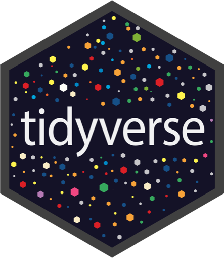
  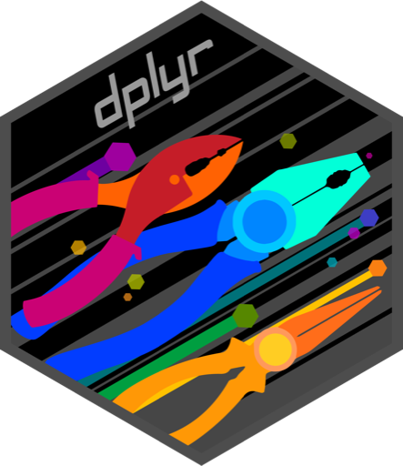
  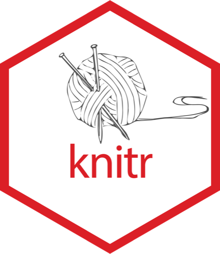
  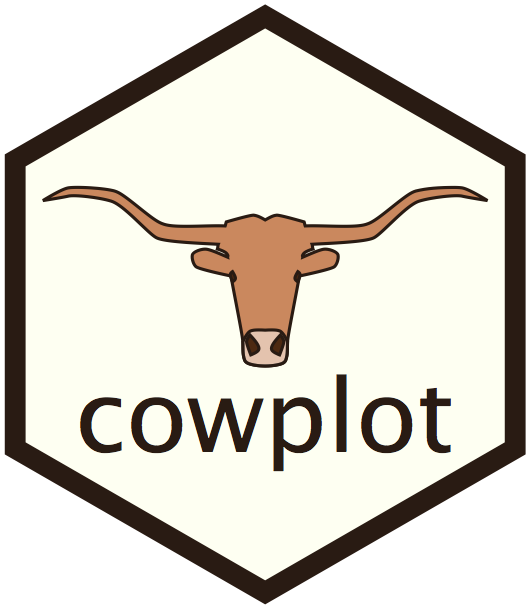
  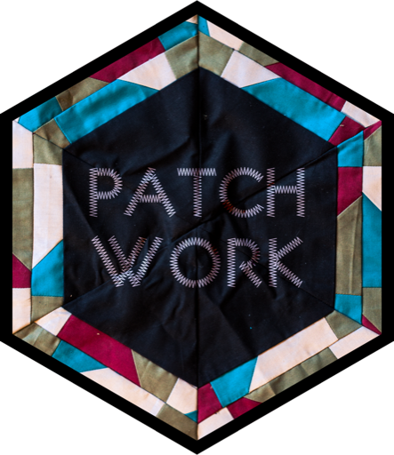
  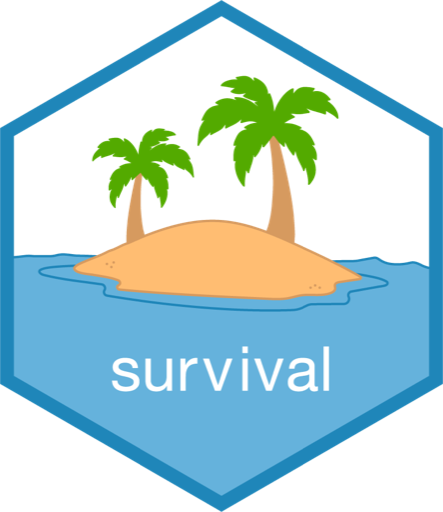
  
  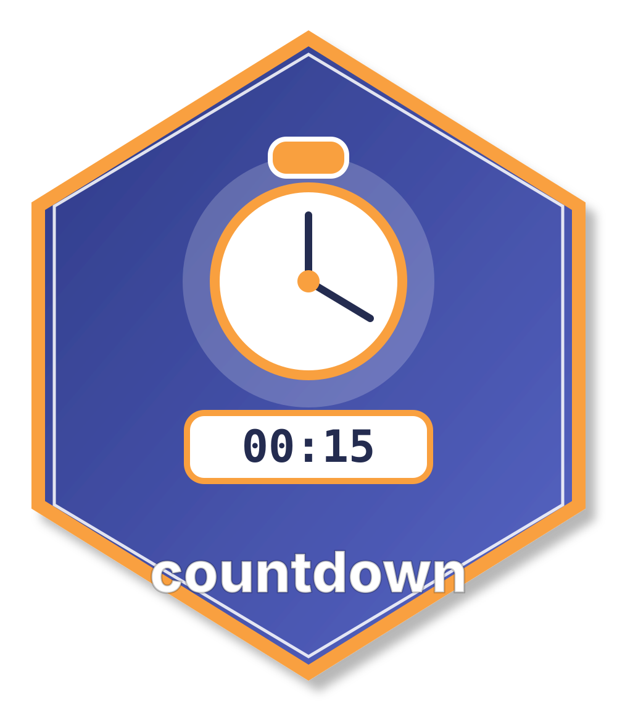
  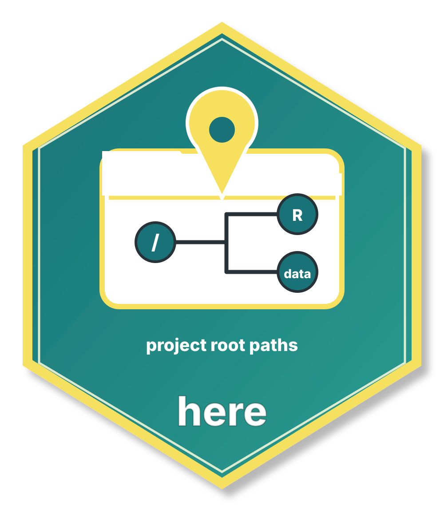
  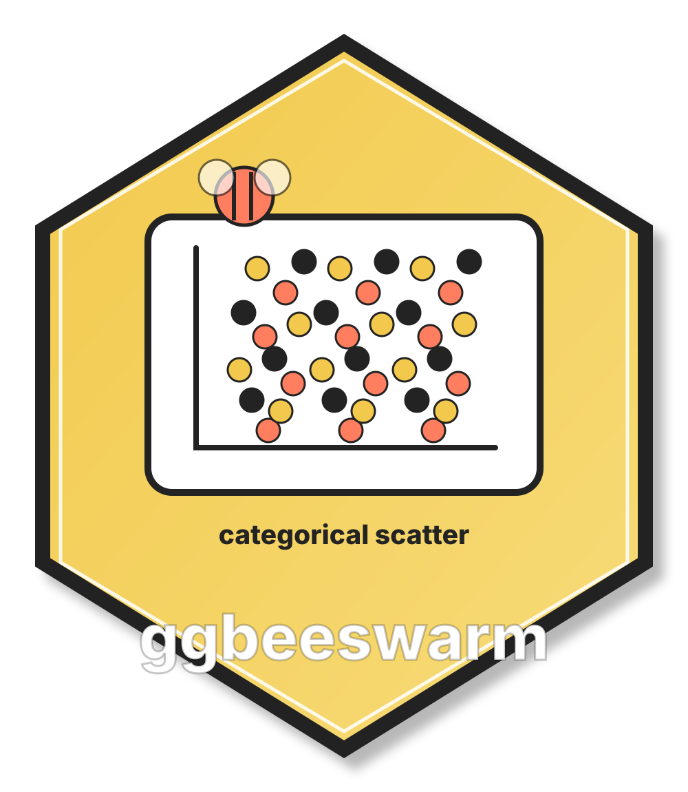
  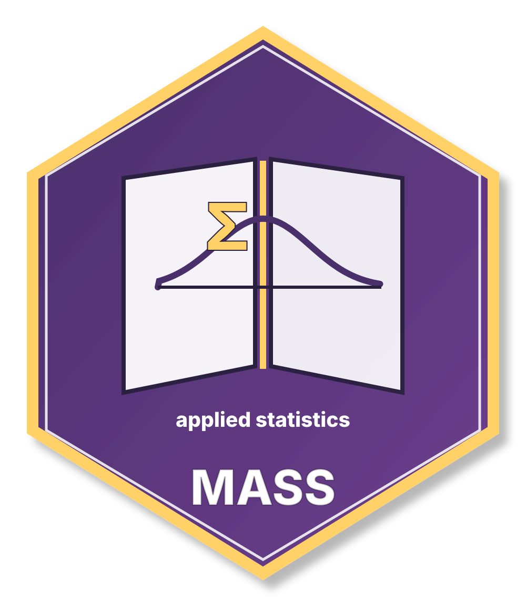
  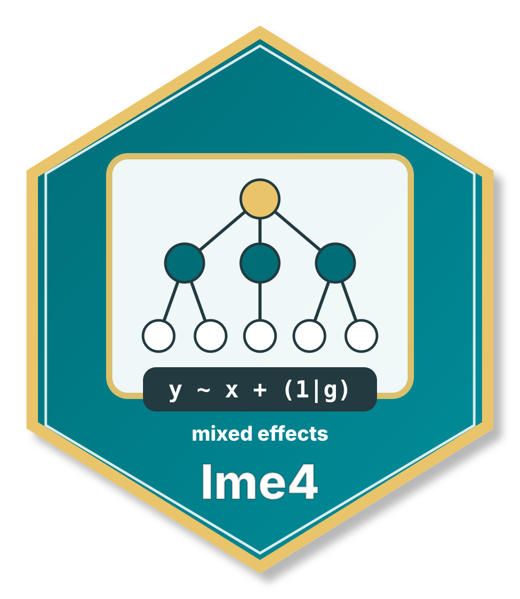
  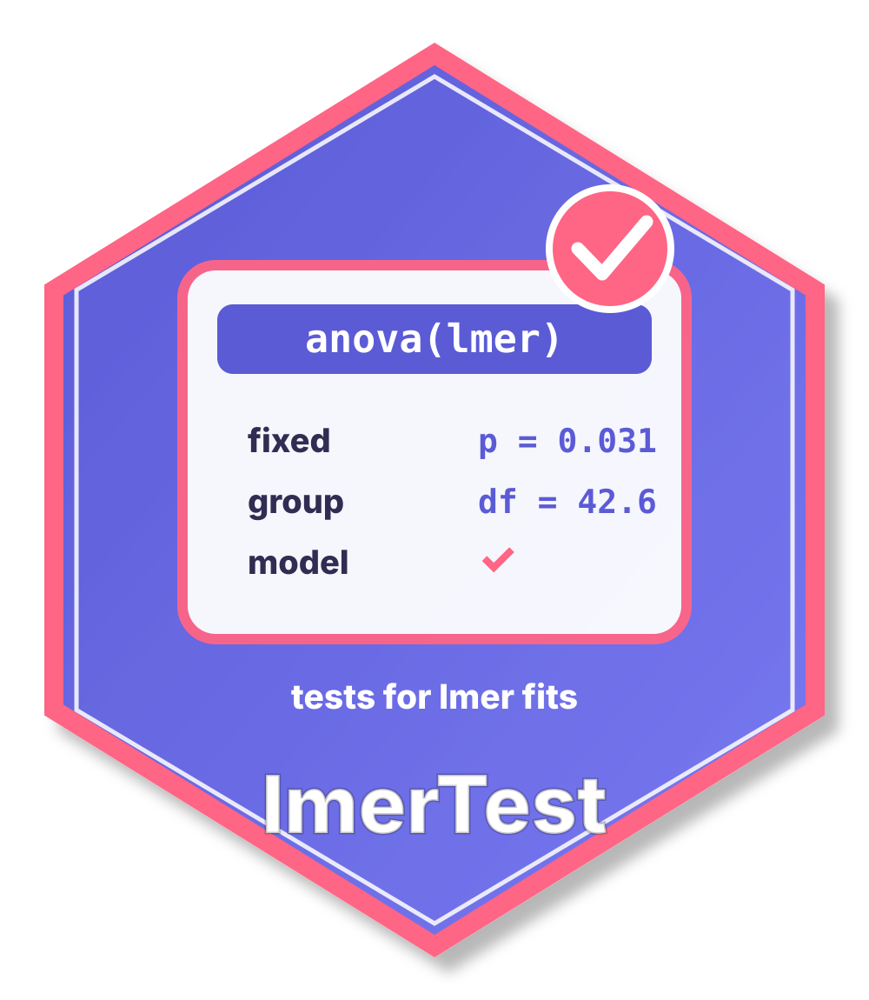
  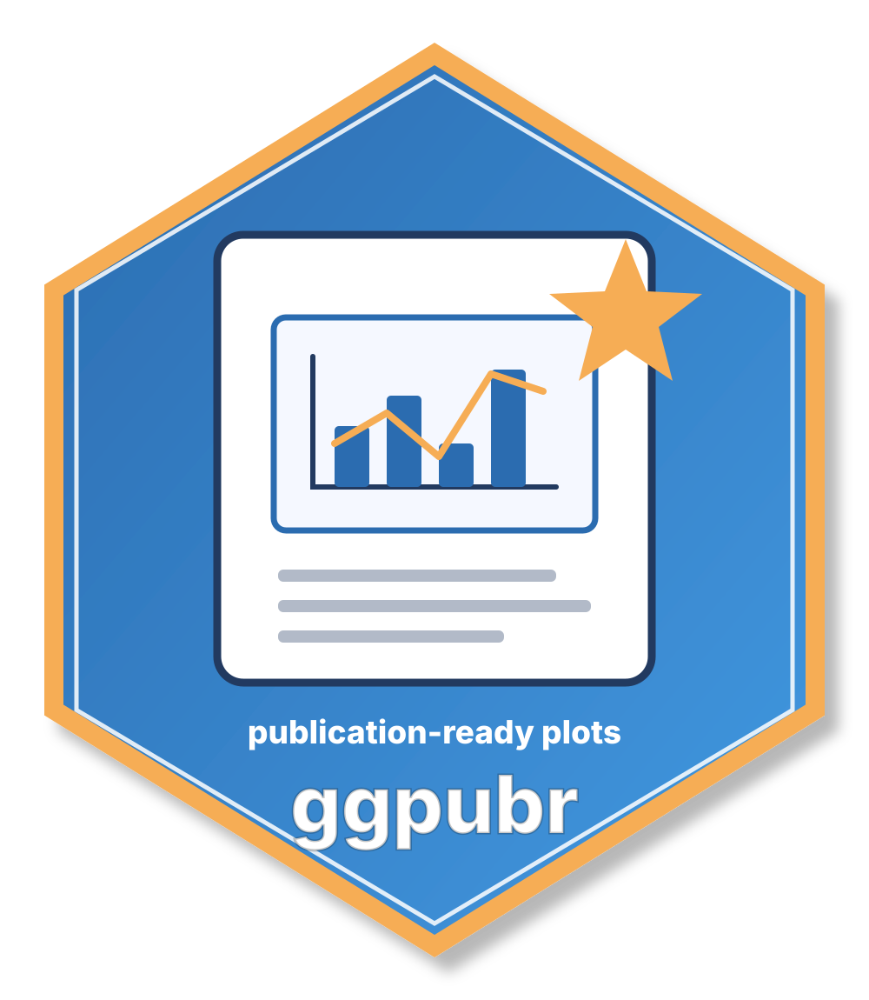
</div>

<main class="package-sheet">
  <div class="sheet-shell">
    <section class="sheet-hero" aria-labelledby="sheet-title">
      <div class="hero-copy">
        <h1 id="sheet-title">Understand Your Packages</h1>
        <p>Workshop 1 package map for the R tools used across the course, the modules where they appear, and the functions learners meet along the way.</p>
        <div class="hero-stats" aria-label="Course package summary">
          <div class="hero-stat" style="--stat-color: #0f766e;">
            <strong>18</strong>
            <span>learning packages</span>
          </div>
          <div class="hero-stat" style="--stat-color: #2563eb;">
            <strong>5</strong>
            <span>course modules</span>
          </div>
          <div class="hero-stat" style="--stat-color: #be123c;">
            <strong>7</strong>
            <span>tidyverse members</span>
          </div>
        </div>
      </div>
    </section>

    <section class="control-row" aria-label="Package controls">
      <div class="search-wrap">
        <svg class="search-icon" viewBox="0 0 24 24" aria-hidden="true">
          <path d="m21 21-4.3-4.3m1.3-5.2a6.5 6.5 0 1 1-13 0 6.5 6.5 0 0 1 13 0Z" fill="none" stroke="currentColor" stroke-width="2" stroke-linecap="round"/>
        </svg>
        <input id="package-search" class="package-search" type="search" placeholder="Search packages, modules, or functions" aria-label="Search packages, modules, or functions">
      </div>
      <div class="filter-controls">
        <div class="scope-tabs" aria-label="Package scope">
          <button type="button" data-scope="learning" aria-pressed="true">Learning</button>
          <button type="button" data-scope="other" aria-pressed="false">Other</button>
          <button type="button" data-scope="all" aria-pressed="false">All</button>
        </div>
        <label class="select-wrap" for="package-order">
          <span>Order</span>
          <select id="package-order" class="package-select" aria-label="Order packages">
            <option value="importance">Importance</option>
            <option value="frequency">Use frequency</option>
            <option value="module">Module</option>
            <option value="task">Task</option>
            <option value="name">A-Z</option>
          </select>
        </label>
        <div id="package-count" class="count-pill"></div>
      </div>
    </section>

    <section id="package-badges" class="package-badges" aria-label="Package badges"></section>

    <div class="detail-grid">
      <div id="package-detail" class="detail-panel" role="region" aria-live="polite"></div>
      <div class="module-panel" role="region" aria-labelledby="module-panel-title">
        <h2 id="module-panel-title">Packages By Module</h2>
        <p>Modules 2-6, participant-facing packages only.</p>
        <div id="module-list" class="module-list"></div>
      </div>
    </div>
  </div>
</main>

<script>
  const packages = [
    {
      id: "tidyverse",
      name: "tidyverse",
      logoId: "logo-tidyverse",
      logoSource: "Official R package hex-sticker bundle: RStudio/Posit hex-stickers repository, CC0.",
      color: "#0f766e",
      category: "Core workflow",
      modules: ["Module 2", "Module 3", "Module 4", "Module 5", "Module 6"],
      role: "The main data science toolkit used across the workshop. It brings together data import, wrangling, reshaping, plotting, and factor helpers.",
      use: "Use it when you want one familiar grammar for reading data, transforming tables, and making ggplot figures.",
      functions: [
        ["read_csv()", "Read CSV files into tibbles."],
        ["filter()", "Keep rows that satisfy a condition."],
        ["select()", "Keep, drop, or rename columns."],
        ["mutate()", "Create or transform columns."],
        ["arrange()", "Sort rows."],
        ["count()", "Count rows by category."],
        ["group_by()", "Define groups before a summary."],
        ["summarise()", "Collapse rows to summary values."],
        ["left_join()", "Attach columns from another table by key."],
        ["pivot_longer()", "Reshape wide data to long data."],
        ["pivot_wider()", "Reshape long data to wide data."],
        ["ggplot()", "Start a plot from a data frame."],
        ["aes()", "Map columns to visual properties."],
        ["geom_point()", "Draw points."],
        ["geom_jitter()", "Draw points with small offsets."],
        ["geom_boxplot()", "Compare distributions by group."],
        ["geom_histogram()", "Bin and count one variable."],
        ["facet_wrap()", "Split one plot into panels."],
        ["fct_relevel()", "Set factor order explicitly."]
      ],
      functionGroups: [
        {
          label: "Import data",
          items: [
            ["read_csv()", "Read CSV files into tibbles."]
          ]
        },
        {
          label: "Choose rows and columns",
          items: [
            ["filter()", "Keep rows that satisfy a condition."],
            ["select()", "Keep, drop, or rename columns."],
            ["arrange()", "Sort rows."]
          ]
        },
        {
          label: "Create and summarize",
          items: [
            ["mutate()", "Create or transform columns."],
            ["count()", "Count rows by category."],
            ["group_by()", "Define groups before a summary."],
            ["summarise()", "Collapse rows to summary values."]
          ]
        },
        {
          label: "Join and reshape",
          items: [
            ["left_join()", "Attach columns from another table by key."],
            ["pivot_longer()", "Reshape wide data to long data."],
            ["pivot_wider()", "Reshape long data to wide data."]
          ]
        },
        {
          label: "Plot data",
          items: [
            ["ggplot()", "Start a plot from a data frame."],
            ["aes()", "Map columns to visual properties."],
            ["geom_point()", "Draw points."],
            ["geom_jitter()", "Draw points with small offsets."],
            ["geom_boxplot()", "Compare distributions by group."],
            ["geom_histogram()", "Bin and count one variable."],
            ["facet_wrap()", "Split one plot into panels."]
          ]
        },
        {
          label: "Control categories",
          items: [
            ["fct_relevel()", "Set factor order explicitly."]
          ]
        }
      ],
      example: "table_02 |> filter(time_point == \"baseline\") |> select(pid, arm, ph) |> ggplot(aes(arm, ph)) + geom_boxplot()",
      watch: "Because `tidyverse` loads several packages at once, a function can feel like it comes from tidyverse even when the underlying package is `dplyr`, `readr`, `tidyr`, `ggplot2`, or `forcats`."
    },
    {
      id: "ggplot2",
      name: "ggplot2",
      mark: "G2",
      color: "#d97706",
      category: "Visualization",
      modules: ["Module 2", "Module 3", "Module 4", "Module 5", "Module 6"],
      role: "The plotting package behind `ggplot()`, `aes()`, geoms, facets, labels, and themes. The course usually loads it through `tidyverse`.",
      use: "Use it whenever you want to turn rows and columns into visual marks such as points, boxes, histograms, lines, or facets.",
      functions: [
        ["ggplot()", "Start a plot from a data frame."],
        ["aes()", "Map columns to visual properties."],
        ["geom_point()", "Draw points."],
        ["geom_jitter()", "Draw points with small offsets."],
        ["geom_boxplot()", "Compare distributions by group."],
        ["geom_histogram()", "Bin and count one variable."],
        ["geom_col()", "Draw bars from already summarized data."],
        ["geom_line()", "Draw connected trends."],
        ["geom_violin()", "Compare smoothed distributions by group."],
        ["facet_wrap()", "Split one plot into panels."],
        ["labs()", "Set plot labels."],
        ["theme()", "Adjust plot theme settings."]
      ],
      functionGroups: [
        {
          label: "Start and map",
          items: [
            ["ggplot()", "Start a plot from a data frame."],
            ["aes()", "Map columns to x, y, color, fill, or group."]
          ]
        },
        {
          label: "Choose marks",
          items: [
            ["geom_point()", "Draw points."],
            ["geom_jitter()", "Draw points with small offsets."],
            ["geom_boxplot()", "Compare distributions by group."],
            ["geom_histogram()", "Bin and count one variable."],
            ["geom_col()", "Draw bars from already summarized data."],
            ["geom_line()", "Draw connected trends."],
            ["geom_violin()", "Compare smoothed distributions by group."]
          ]
        },
        {
          label: "Finish the figure",
          items: [
            ["facet_wrap()", "Split one plot into panels."],
            ["labs()", "Set plot labels."],
            ["theme()", "Adjust plot theme settings."]
          ]
        }
      ],
      example: "ggplot(table_02, aes(ph, nugent_score, color = arm)) + geom_point()",
      watch: "When you write `library(tidyverse)`, `ggplot2` is loaded for you. Listing it separately makes the plotting package visible."
    },
    {
      id: "readr",
      name: "readr",
      mark: "R",
      color: "#2563eb",
      category: "Import data",
      modules: ["Module 2", "Module 3", "Module 4", "Module 5", "Module 6"],
      role: "The tidyverse package used for reading rectangular data files, especially CSV files used throughout the workshop.",
      use: "Use it at the start of an analysis when bringing the instructional datasets into R.",
      functions: [
        ["read_csv()", "Read CSV files into tibbles."],
        ["col_types", "Optionally control how columns are parsed."]
      ],
      example: "read_csv(here(\"datasets/instructional_dataset/02_visit_clinical_measurements_UKZN_workshop_2023.csv\"))",
      watch: "`read_csv()` is often the first place column types are guessed, so check the printed parsing message when a variable looks wrong."
    },
    {
      id: "tidyr",
      name: "tidyr",
      mark: "TY",
      color: "#0f766e",
      category: "Reshaping",
      modules: ["Module 4", "Module 5"],
      role: "The tidyverse package used to reshape data between wide and long formats.",
      use: "Use it when one analysis or plot needs variables arranged differently from the raw table.",
      functions: [
        ["pivot_longer()", "Move columns into rows."],
        ["pivot_wider()", "Spread rows back into columns."]
      ],
      example: "table_02 |> pivot_longer(c(ph, nugent_score, crp_blood), names_to = \"measurement\", values_to = \"value\")",
      watch: "Many faceted plots become easier after `pivot_longer()` because the measurement name becomes a column."
    },
    {
      id: "forcats",
      name: "forcats",
      mark: "FC",
      color: "#be123c",
      category: "Factors",
      modules: ["Module 3", "Module 6"],
      role: "The tidyverse package for working with categorical variables and their display order.",
      use: "Use it when a plot, model table, or comparison should use a deliberate reference or display order.",
      functions: [
        ["fct_relevel()", "Move selected factor levels to the front or to a chosen order."]
      ],
      example: "mutate(time_point = fct_relevel(time_point, \"baseline\", \"week_7\"))",
      watch: "Changing factor order can change what appears first in a plot or table, so make the choice explicit."
    },
    {
      id: "tibble",
      name: "tibble",
      mark: "TB",
      color: "#64748b",
      category: "Data frames",
      modules: ["Module 2", "Module 4", "Module 6"],
      role: "The tidyverse package that provides modern data frames with cleaner printing and stricter column behavior.",
      use: "Use it when building small example tables inside slides or exercises.",
      functions: [
        ["tibble()", "Create a tibble from named vectors."]
      ],
      example: "tibble(id = c(1, 2), arm = c(\"placebo\", \"treatment\"))",
      watch: "Most imported tables from `read_csv()` are already tibbles, so participants may use tibbles before calling `tibble()` directly."
    },
    {
      id: "stringr",
      name: "stringr",
      mark: "SR",
      color: "#7c3aed",
      category: "Text helpers",
      modules: ["Module 2"],
      role: "The tidyverse package for consistent string and text operations.",
      use: "Use it when working with character vectors or text columns.",
      functions: [
        ["str_length()", "Count the number of characters in each string."]
      ],
      example: "str_length(c(\"placebo\", \"treatment\"))",
      watch: "It appears lightly in the introductory R practice, not as a major analysis theme."
    },
    {
      id: "purrr",
      name: "purrr",
      mark: "PR",
      color: "#db2777",
      category: "Other/helper code",
      modules: ["Other/helper code"],
      role: "A tidyverse functional-programming package used in Module 5 helper code, not as a main participant-facing topic.",
      use: "Use it when applying the same operation across several inputs in a compact way.",
      functions: [
        ["map()", "Apply a function to each item in a vector or list."],
        ["set_names()", "Attach names to a vector or list."]
      ],
      example: "map(set_names(cell_types), \\(ct) ct)",
      watch: "This is included for transparency because it appears in helper code, but it belongs in Other unless the workshop chooses to teach iteration explicitly."
    },
    {
      id: "countdown",
      name: "countdown",
      mark: "CD",
      color: "#b45309",
      category: "Other/support",
      modules: ["Other/support"],
      role: "Supports timed activities inside Quarto slides. It is part of the slide machinery, not a package participants need to learn for the data analysis workflow.",
      use: "Use it only when authoring or editing timed workshop slides.",
      functions: [
        ["countdown::countdown()", "Insert a timer into a slide."]
      ],
      example: "countdown::countdown(30)",
      watch: "This package can matter for rendering slides, but it is not a participant-facing analysis tool."
    },
    {
      id: "here",
      name: "here",
      mark: "H",
      color: "#2563eb",
      category: "Paths",
      modules: ["Module 2", "Module 3", "Module 4", "Module 5", "Module 6"],
      role: "Builds file paths from the project root, so code works from notebooks, slides, and terminals.",
      use: "Use it when reading datasets or sourcing helper files from inside the project.",
      functions: [
        ["here()", "Create a path relative to the project root."]
      ],
      example: "read_csv(here(\"datasets/instructional_dataset/02_visit_clinical_measurements_UKZN_workshop_2023.csv\"))",
      watch: "If `here()` points somewhere surprising, check that R is opened from the workshop project."
    },
    {
      id: "knitr",
      name: "knitr",
      logoId: "logo-knitr",
      logoSource: "Official R package hex-sticker bundle: RStudio/Posit hex-stickers repository, CC0.",
      color: "#475569",
      category: "Rendering",
      modules: ["Module 2", "Module 5"],
      role: "Controls parts of the Quarto/R rendering process and can format simple tables.",
      use: "Use it for rendering settings or lightweight display helpers inside Quarto documents.",
      functions: [
        ["knitr::kable()", "Render a small data frame as a simple table."],
        ["knitr::opts_chunk$set()", "Set chunk options for a document."]
      ],
      example: "table_02 |> head(3) |> knitr::kable()",
      watch: "This is not the package used for publication-style statistical tables. That role belongs to `gtsummary` in Module 6."
    },
    {
      id: "dplyr",
      name: "dplyr",
      logoId: "logo-dplyr",
      logoSource: "Official R package hex-sticker bundle: RStudio/Posit hex-stickers repository, CC0.",
      color: "#15803d",
      category: "Wrangling",
      modules: ["Module 2", "Module 3", "Module 4", "Module 5", "Module 6"],
      role: "A table manipulation package used throughout the workshop through `tidyverse`; Module 5 helper code also calls it directly with `dplyr::select()`.",
      use: "Use it for row, column, group, summary, and join operations.",
      functions: [
        ["dplyr::select()", "Select columns explicitly from helper functions."],
        ["filter()", "Keep rows."],
        ["arrange()", "Sort rows."],
        ["mutate()", "Create columns."],
        ["group_by()", "Group rows."],
        ["summarise()", "Calculate grouped summaries."],
        ["left_join()", "Attach matching rows from another table."],
        ["count()", "Count rows by group."]
      ],
      functionGroups: [
        {
          label: "Rows",
          items: [
            ["filter()", "Keep rows."],
            ["arrange()", "Sort rows."]
          ]
        },
        {
          label: "Columns",
          items: [
            ["dplyr::select()", "Select columns explicitly from helper functions."],
            ["mutate()", "Create columns."]
          ]
        },
        {
          label: "Groups and summaries",
          items: [
            ["group_by()", "Group rows."],
            ["summarise()", "Calculate grouped summaries."],
            ["count()", "Count rows by group."]
          ]
        },
        {
          label: "Joins",
          items: [
            ["left_join()", "Attach matching rows from another table."]
          ]
        }
      ],
      example: "flow |> dplyr::select(sample_id, arm)",
      watch: "When `tidyverse` is loaded, you usually call dplyr verbs without the `dplyr::` prefix. The direct `dplyr::select()` form simply makes the package source explicit."
    },
    {
      id: "cowplot",
      name: "cowplot",
      logoId: "logo-cowplot",
      logoSource: "Official R package hex-sticker bundle: official cowplot package source repository.",
      color: "#7c3aed",
      category: "Plot polish",
      modules: ["Module 3"],
      role: "Provides plot themes and helpers for arranging ggplot figures.",
      use: "Use it when you want cleaner figure styling or want to assemble multiple plots.",
      functions: [
        ["theme_cowplot()", "Apply a clean cowplot theme."],
        ["plot_grid()", "Arrange plots in a grid when needed."]
      ],
      example: "ggplot(anscombe) + geom_point(aes(x1, y1)) + theme_cowplot()",
      watch: "It complements `ggplot2`; it does not replace the usual `ggplot() + geom_*()` grammar."
    },
    {
      id: "ggbeeswarm",
      name: "ggbeeswarm",
      mark: "GB",
      color: "#be123c",
      category: "Plot layers",
      modules: ["Module 4"],
      role: "Adds beeswarm-style geoms that show every observation while reducing overplotting.",
      use: "Use it when a boxplot hides too much of the underlying data.",
      functions: [
        ["geom_quasirandom()", "Draw points with density-aware horizontal spreading."]
      ],
      example: "ggplot(table_02, aes(arm, ph)) + geom_quasirandom()",
      watch: "This layer is excellent for showing rows directly, but it can look busy with very large datasets."
    },
    {
      id: "patchwork",
      name: "patchwork",
      logoId: "logo-patchwork",
      logoSource: "Official R package hex-sticker bundle: RStudio/Posit hex-stickers repository, CC0.",
      color: "#0891b2",
      category: "Plot layout",
      modules: ["Module 5", "Module 6"],
      role: "Combines multiple ggplot objects into one figure using simple plot-composition syntax.",
      use: "Use it when separate plots should be viewed as one figure.",
      functions: [
        ["plot_layout()", "Control combined plot layout and guides."],
        ["p1 + p2", "Combine plots side-by-side or according to patchwork rules."],
        ["p1 / p2", "Stack plots vertically."],
        ["& theme_*()", "Apply a theme or setting to all plots in a patchwork."]
      ],
      example: "p1 / p2 + plot_layout(guides = \"collect\")",
      watch: "Patchwork operates on completed ggplot objects, so build each plot first and combine them after."
    },
    {
      id: "MASS",
      name: "MASS",
      mark: "M",
      color: "#854d0e",
      category: "Modeling",
      modules: ["Module 5"],
      role: "Provides established statistical modeling utilities used in the Module 5 notes.",
      use: "Use it when fitting a negative binomial model for overdispersed count outcomes.",
      functions: [
        ["glm.nb()", "Fit a negative binomial generalized linear model."]
      ],
      example: "glm.nb(infected ~ epicenter_distance, data = outbreak_nb)",
      watch: "The updated participant Exercise 1 does not ask learners to fit a negative binomial model; this is still present in Module 5 notes."
    },
    {
      id: "lme4",
      name: "lme4",
      mark: "L4",
      color: "#4f46e5",
      category: "Modeling",
      modules: ["Module 5", "Module 6"],
      role: "Fits mixed-effects models, where observations are clustered within participants, counties, or other groups.",
      use: "Use it when a model needs random effects such as participant-specific or county-specific baselines.",
      functions: [
        ["glmer()", "Fit generalized linear mixed-effects models."],
        ["lmer()", "Fit linear mixed-effects models."]
      ],
      example: "lmer(log(conc) ~ arm + arm:time_point + (1 | pid), data = cytokines)",
      watch: "Random effects are powerful but easy to overuse. The course treats them as a model extension after the response type and fixed effects are clear."
    },
    {
      id: "lmerTest",
      name: "lmerTest",
      mark: "LT",
      color: "#6d28d9",
      category: "Modeling",
      modules: ["Module 5", "Module 6"],
      role: "Adds inference helpers for linear mixed-effects models, especially p-values and tests for `lmer()` fits.",
      use: "Use it alongside `lme4` when you want familiar inferential output for linear mixed models.",
      functions: [
        ["lmer()", "Used after loading `lmerTest`; extends mixed-model inference."],
        ["summary()", "Displays inferential output for fitted mixed models."]
      ],
      example: "fit <- lmer(log(conc) ~ arm + arm:time_point + (1 | pid), data = cytokines)",
      watch: "It is not a separate modeling grammar in the course; it sits on top of the `lme4` workflow."
    },
    {
      id: "survival",
      name: "survival",
      logoId: "logo-survival",
      logoSource: "Official R package hex-sticker bundle: official survival package source repository.",
      color: "#334155",
      category: "Other/notes",
      modules: ["Other/notes"],
      role: "Supports time-to-event examples that are outside the current participant Exercise 1 model-choice workflow.",
      use: "Use it for expanded or instructor-facing notes when the response is not only whether an event happened, but also when it happened.",
      functions: [
        ["Surv()", "Create a survival response from time and event status."],
        ["coxph()", "Fit a Cox proportional hazards model."]
      ],
      example: "coxph(Surv(time, status) ~ treatment, data = surv_data)",
      watch: "Survival models are not part of the updated Exercise 1 questions, so keep this separate from the main participant learning path."
    },
    {
      id: "gtsummary",
      name: "gtsummary",
      logoId: "logo-gtsummary",
      logoSource: "Official R package hex-sticker bundle: official gtsummary package source repository / package site.",
      color: "#0e7490",
      category: "Tables",
      modules: ["Module 6"],
      role: "Creates publication-ready summary and regression tables from data frames and model objects.",
      use: "Use it when moving from analysis output to a readable Table 1, Table 2, or model table.",
      functions: [
        ["tbl_summary()", "Create descriptive summary tables."],
        ["add_p()", "Add hypothesis-test p-values to a summary table."],
        ["tbl_regression()", "Turn model output into a coefficient table."]
      ],
      example: "table_01 |> select(-pid, -sex) |> tbl_summary(by = arm) |> add_p()",
      watch: "`tbl_regression(exponentiate = TRUE)` can report odds ratios or rate ratios directly when a model is fitted on a log or logit scale."
    },
    {
      id: "ggpubr",
      name: "ggpubr",
      mark: "GP",
      color: "#db2777",
      category: "Plot tests",
      modules: ["Module 6"],
      role: "Adds publication-oriented plot helpers and statistical annotation layers.",
      use: "Use it when you want a quick group-comparison plot with a p-value annotation.",
      functions: [
        ["ggboxplot()", "Create a themed boxplot with a compact syntax."],
        ["stat_compare_means()", "Add test results to a ggplot or ggpubr plot."]
      ],
      example: "ggboxplot(data, x = \"arm\", y = \"ph\", fill = \"arm\") + stat_compare_means(method = \"wilcox.test\")",
      watch: "A plotted p-value still needs a sensible study design and comparison. Module 6 highlights this with randomized versus non-randomized group comparisons."
    }
  ];

  const packageMeta = {
    tidyverse: {
      priority: 1,
      task: "Data workflow",
      learningGroup: "Start here",
      audience: "learning"
    },
    ggplot2: {
      priority: 2,
      task: "Visualize data",
      learningGroup: "Tidyverse members",
      audience: "learning"
    },
    dplyr: {
      priority: 3,
      task: "Wrangle data",
      learningGroup: "Tidyverse members",
      audience: "learning"
    },
    readr: {
      priority: 4,
      task: "Import data",
      learningGroup: "Tidyverse members",
      audience: "learning"
    },
    tidyr: {
      priority: 5,
      task: "Reshape data",
      learningGroup: "Tidyverse members",
      audience: "learning"
    },
    here: {
      priority: 6,
      logoId: "logo-here",
      logoSource: "Unofficial substitute sticker bundle: original teaching graphic based on the CRAN package description.",
      logoStatus: "unofficial",
      task: "Project paths",
      learningGroup: "Start here",
      audience: "learning"
    },
    forcats: {
      priority: 7,
      task: "Order categories",
      learningGroup: "Tidyverse members",
      audience: "learning"
    },
    tibble: {
      priority: 8,
      task: "Create small tables",
      learningGroup: "Tidyverse members",
      audience: "learning"
    },
    stringr: {
      priority: 9,
      task: "Work with text",
      learningGroup: "Tidyverse members",
      audience: "learning"
    },
    gtsummary: {
      priority: 10,
      task: "Report results",
      learningGroup: "Tables and reporting",
      audience: "learning"
    },
    patchwork: {
      priority: 11,
      task: "Combine plots",
      learningGroup: "Visualization",
      audience: "learning"
    },
    ggbeeswarm: {
      priority: 12,
      logoId: "logo-ggbeeswarm",
      logoSource: "Unofficial substitute sticker bundle: original teaching graphic based on the CRAN package description.",
      logoStatus: "unofficial",
      task: "Show observations",
      learningGroup: "Visualization",
      audience: "learning"
    },
    cowplot: {
      priority: 13,
      task: "Polish plots",
      learningGroup: "Visualization",
      audience: "learning"
    },
    ggpubr: {
      priority: 14,
      logoId: "logo-ggpubr",
      logoSource: "Unofficial substitute sticker bundle: original teaching graphic based on the CRAN package description.",
      logoStatus: "unofficial",
      task: "Annotate plots",
      learningGroup: "Visualization",
      audience: "learning"
    },
    MASS: {
      priority: 15,
      logoId: "logo-MASS",
      logoSource: "Unofficial substitute sticker bundle: original teaching graphic based on the CRAN package description.",
      logoStatus: "unofficial",
      task: "Model counts",
      learningGroup: "Modeling extensions",
      audience: "learning"
    },
    lme4: {
      priority: 16,
      logoId: "logo-lme4",
      logoSource: "Unofficial substitute sticker bundle: original teaching graphic based on the CRAN package description.",
      logoStatus: "unofficial",
      task: "Model clustered data",
      learningGroup: "Modeling extensions",
      audience: "learning"
    },
    lmerTest: {
      priority: 17,
      logoId: "logo-lmerTest",
      logoSource: "Unofficial substitute sticker bundle: original teaching graphic based on the CRAN package description.",
      logoStatus: "unofficial",
      task: "Mixed-model inference",
      learningGroup: "Modeling extensions",
      audience: "learning"
    },
    knitr: {
      priority: 19,
      task: "Render simple output",
      learningGroup: "Tables and reporting",
      audience: "learning"
    },
    countdown: {
      priority: 90,
      logoId: "logo-countdown",
      logoSource: "Unofficial substitute sticker bundle: original teaching graphic based on the CRAN package description.",
      logoStatus: "unofficial",
      category: "Other/support",
      task: "Slide timing",
      learningGroup: "Other/support",
      audience: "other",
      modules: ["Other/support"],
      role: "Supports timed activities inside Quarto slides. It is part of the slide machinery, not a package participants need to learn for the data analysis workflow.",
      use: "Use it only when authoring or editing timed workshop slides.",
      watch: "This package can matter for rendering slides, but it is not a participant-facing analysis tool."
    },
    purrr: {
      priority: 92,
      category: "Other/helper code",
      task: "Helper iteration",
      learningGroup: "Other/support",
      audience: "other",
      modules: ["Other/helper code"],
      role: "A tidyverse helper used in Module 5 support code, not a package participants are expected to learn directly.",
      use: "Use it when applying the same operation across many inputs.",
      watch: "This is listed for transparency because it appears in helper code."
    },
    survival: {
      priority: 91,
      category: "Other/notes",
      task: "Advanced modeling notes",
      learningGroup: "Other/advanced notes",
      audience: "other",
      modules: ["Other/notes"],
      role: "Supports time-to-event examples that are outside the current participant Exercise 1 model-choice workflow.",
      use: "Use it for expanded or instructor-facing notes when the response is not only whether an event happened, but also when it happened.",
      watch: "Survival models are not part of the updated Exercise 1 questions, so keep this separate from the main participant learning path."
    }
  };

  packages.forEach(pkg => Object.assign(pkg, packageMeta[pkg.id] || {
    priority: 80,
    task: pkg.category,
    learningGroup: "Other/support",
    audience: "other"
  }));

  const moduleMap = [
    ["Module 2", ["dplyr", "ggplot2", "here", "knitr", "readr", "stringr", "tibble", "tidyverse"]],
    ["Module 3", ["cowplot", "dplyr", "forcats", "ggplot2", "here", "readr", "tidyverse"]],
    ["Module 4", ["dplyr", "ggbeeswarm", "ggplot2", "here", "readr", "tibble", "tidyr", "tidyverse"]],
    ["Module 5", ["dplyr", "ggplot2", "here", "knitr", "lme4", "lmerTest", "MASS", "patchwork", "readr", "tidyr", "tidyverse"]],
    ["Module 6", ["dplyr", "forcats", "ggplot2", "ggpubr", "gtsummary", "here", "lme4", "lmerTest", "patchwork", "readr", "tibble", "tidyverse"]]
  ];

  const state = {
    activeId: "tidyverse",
    query: "",
    scope: "learning",
    order: "importance"
  };

  const packageById = Object.fromEntries(packages.map(pkg => [pkg.id, pkg]));
  const badgesEl = document.getElementById("package-badges");
  const detailEl = document.getElementById("package-detail");
  const moduleListEl = document.getElementById("module-list");
  const countEl = document.getElementById("package-count");
  const searchEl = document.getElementById("package-search");
  const orderEl = document.getElementById("package-order");
  const scopeButtons = document.querySelectorAll("[data-scope]");

  function logoSrc(pkg) {
    if (!pkg.logoId) return "";
    const img = document.getElementById(pkg.logoId);
    return img ? img.currentSrc || img.src : "";
  }

  function initials(name) {
    const parts = name.split(/[^A-Za-z0-9]+/).filter(Boolean);
    if (parts.length > 1) return parts.map(part => part[0]).join("").slice(0, 2).toUpperCase();
    const capitals = name.match(/[A-Z]/g);
    if (capitals && capitals.length > 1) return capitals.join("").slice(0, 2);
    return name.slice(0, 2).toUpperCase();
  }

  function logoMarkup(pkg, variant = "badge") {
    const src = logoSrc(pkg);
    const detailClass = variant === "detail" ? " logo-detail" : "";
    if (src) {
      return `<span class="logo-mark${detailClass}"></span>`;
    }
    return `<span class="logo-mark logo-fallback${detailClass}" aria-hidden="true">${pkg.mark || initials(pkg.name)}</span>`;
  }

  function matchesQuery(pkg, query) {
    if (!query) return true;
    const haystack = [
      pkg.name,
      pkg.category,
      pkg.task,
      pkg.learningGroup,
      pkg.audience,
      pkg.role,
      pkg.use,
      pkg.watch,
      pkg.modules.join(" "),
      pkg.functions.map(item => item.join(" ")).join(" "),
      pkg.functionGroups ? pkg.functionGroups.map(group => `${group.label} ${group.items.map(item => item.join(" ")).join(" ")}`).join(" ") : ""
    ].join(" ").toLowerCase();
    return haystack.includes(query.toLowerCase());
  }

  function matchesScope(pkg) {
    if (state.scope === "all") return true;
    return pkg.audience === state.scope;
  }

  function moduleNumbers(pkg) {
    return pkg.modules
      .map(module => {
        const match = module.match(/Module\s+(\d+)/);
        return match ? Number(match[1]) : null;
      })
      .filter(number => number !== null);
  }

  function moduleCount(pkg) {
    return moduleNumbers(pkg).length;
  }

  function primaryModule(pkg) {
    const numbers = moduleNumbers(pkg);
    if (numbers.length === 0) return pkg.audience === "other" ? "Other" : "No module";
    return `Module ${Math.min(...numbers)}`;
  }

  function moduleCountLabel(pkg) {
    const count = moduleCount(pkg);
    if (pkg.audience === "other") return "Other";
    return `${count} ${count === 1 ? "module" : "modules"}`;
  }

  function packageScopeLabel(pkg) {
    return pkg.audience === "other" ? "Other" : "Learning";
  }

  function logoStatusMarkup(pkg) {
    if (pkg.logoStatus === "unofficial") {
      return '<span class="unofficial-chip">Unofficial sticker</span>';
    }
    if (pkg.logoId) {
      return "<span>Official sticker</span>";
    }
    return "";
  }

  function visiblePackages() {
    return packages
      .filter(pkg => matchesScope(pkg))
      .filter(pkg => matchesQuery(pkg, state.query));
  }

  function sortedPackages(list) {
    const collator = new Intl.Collator("en", { sensitivity: "base" });
    const byName = (a, b) => collator.compare(a.name, b.name);
    const byPriority = (a, b) => a.priority - b.priority || byName(a, b);

    if (state.order === "frequency") {
      return [...list].sort((a, b) => moduleCount(b) - moduleCount(a) || byPriority(a, b));
    }

    if (state.order === "module") {
      return [...list].sort((a, b) => {
        const aNumbers = moduleNumbers(a);
        const bNumbers = moduleNumbers(b);
        const aModule = aNumbers.length ? Math.min(...aNumbers) : 99;
        const bModule = bNumbers.length ? Math.min(...bNumbers) : 99;
        return aModule - bModule || byPriority(a, b);
      });
    }

    if (state.order === "task") {
      return [...list].sort((a, b) => collator.compare(a.task, b.task) || byPriority(a, b));
    }

    if (state.order === "name") {
      return [...list].sort(byName);
    }

    return [...list].sort(byPriority);
  }

  function groupPackages(list) {
    const sorted = sortedPackages(list);

    if (state.order === "module") {
      return moduleMap.map(([module]) => [
        module,
        sorted.filter(pkg => primaryModule(pkg) === module)
      ]).filter(([, group]) => group.length > 0)
        .concat(sorted.filter(pkg => !moduleNumbers(pkg).length).length
          ? [["Other", sorted.filter(pkg => !moduleNumbers(pkg).length)]]
          : []);
    }

    if (state.order === "task") {
      return groupByLabel(sorted, pkg => pkg.task);
    }

    if (state.order === "frequency") {
      return [["Most used first", sorted]];
    }

    if (state.order === "name") {
      return [["A-Z", sorted]];
    }

    return groupByLabel(sorted, pkg => pkg.learningGroup);
  }

  function groupByLabel(list, labelFn) {
    const groups = [];
    list.forEach(pkg => {
      const label = labelFn(pkg);
      let group = groups.find(item => item[0] === label);
      if (!group) {
        group = [label, []];
        groups.push(group);
      }
      group[1].push(pkg);
    });
    return groups;
  }

  function renderFunctionItems(items) {
    return items.map(item => `<li><code>${item[0]}</code><span>${item[1]}</span></li>`).join("");
  }

  function renderFunctionContent(pkg) {
    if (pkg.functionGroups && pkg.functionGroups.length) {
      return `
        <div class="function-groups">
          ${pkg.functionGroups.map(group => `
            <section class="function-group">
              <h4>${group.label}</h4>
              <ul class="code-list">
                ${renderFunctionItems(group.items)}
              </ul>
            </section>
          `).join("")}
        </div>
      `;
    }

    return `
      <ul class="code-list">
        ${renderFunctionItems(pkg.functions)}
      </ul>
    `;
  }

  function renderBadges() {
    const filtered = visiblePackages();
    const groups = groupPackages(filtered);
    badgesEl.innerHTML = "";

    if (filtered.length === 0) {
      badgesEl.innerHTML = '<div class="empty-state">No package matched that search.</div>';
      countEl.textContent = "0 packages";
      return;
    }

    if (!filtered.some(pkg => pkg.id === state.activeId)) {
      state.activeId = sortedPackages(filtered)[0].id;
      renderDetail();
      renderModules();
    }

    const scopeText = state.scope === "learning" ? "learning" : state.scope === "other" ? "other" : "total";
    countEl.textContent = `${filtered.length} ${scopeText} package${filtered.length === 1 ? "" : "s"}`;

    groups.forEach(([label, group]) => {
      const section = document.createElement("section");
      section.className = "package-group";
      section.innerHTML = `
        <div class="package-group-head">
          <h2>${label}</h2>
          <span>${group.length} ${group.length === 1 ? "package" : "packages"}</span>
        </div>
        <div class="package-group-grid"></div>
      `;

      const grid = section.querySelector(".package-group-grid");
      group.forEach(pkg => {
        const button = document.createElement("button");
        button.className = "pkg-badge";
        button.type = "button";
        button.style.setProperty("--badge-color", pkg.color);
        button.setAttribute("aria-selected", String(pkg.id === state.activeId));
        button.setAttribute("aria-label", `${pkg.name}, ${pkg.category}`);
        button.dataset.packageId = pkg.id;
        button.innerHTML = `
          <span class="badge-main">
            ${logoMarkup(pkg)}
            <span class="badge-copy">
              <span class="badge-name">${pkg.name}</span>
              <span class="badge-category">${pkg.category}</span>
            </span>
          </span>
          <span class="badge-modules">
            <span class="badge-task">${pkg.task}</span>
            <span>${moduleCountLabel(pkg)}</span>
          </span>
        `;
        button.addEventListener("click", () => selectPackage(pkg.id));
        grid.appendChild(button);
      });
      badgesEl.appendChild(section);
    });
  }

  function selectPackage(id, rerenderBadges = true) {
    state.activeId = id;
    renderDetail();
    if (rerenderBadges) renderBadges();
    renderModules();
  }

  function renderScopeButtons() {
    scopeButtons.forEach(button => {
      button.setAttribute("aria-pressed", String(button.dataset.scope === state.scope));
    });
  }

  function renderDetail() {
    const pkg = packageById[state.activeId] || packages[0];
    detailEl.style.setProperty("--active-color", pkg.color);
    detailEl.innerHTML = `
      <header class="detail-header">
        <div>
          <div class="detail-title-row">
            ${logoMarkup(pkg, "detail")}
            <div>
              <p class="detail-kicker">${pkg.category}</p>
              <h2>${pkg.name}</h2>
            </div>
          </div>
          <p class="detail-role">${pkg.role}</p>
          <div class="detail-meta" aria-label="Package learning metadata">
            <span>${packageScopeLabel(pkg)}</span>
            <span>${pkg.task}</span>
            <span>${moduleCountLabel(pkg)}</span>
            ${logoStatusMarkup(pkg)}
          </div>
          <div class="module-tags">
            ${pkg.modules.map(module => `<span class="module-tag">${module}</span>`).join("")}
          </div>
        </div>
        <div class="function-tags" aria-label="Functions">
          ${pkg.functions.slice(0, 8).map(item => `<span class="function-tag">${item[0]}</span>`).join("")}
          ${pkg.functions.length > 8 ? `<span class="function-tag">+${pkg.functions.length - 8} more</span>` : ""}
        </div>
      </header>
      <div class="detail-body">
        <section class="info-row">
          <h3>When to reach for it</h3>
          <p>${pkg.use}</p>
        </section>
        <section class="info-row">
          <h3>Used functions</h3>
          ${renderFunctionContent(pkg)}
        </section>
        <section class="info-row">
          <h3>Course-style example</h3>
          <pre class="example-code"><code>${pkg.example}</code></pre>
        </section>
        <section class="info-row">
          <h3>Watch for</h3>
          <p>${pkg.watch}</p>
        </section>
      </div>
    `;
  }

  function renderModules() {
    moduleListEl.innerHTML = moduleMap.map(([module, ids]) => {
      const buttons = ids.length
        ? ids.map(id => {
            const pkg = packageById[id];
            return `<button type="button" data-package-id="${id}" aria-current="${id === state.activeId}" style="--mini-color: ${pkg.color};">${pkg.name}</button>`;
          }).join("")
        : '<span class="module-tag">-</span>';

      return `
        <div class="module-card${ids.length > 4 ? " module-card-wide" : ""}">
          <strong>${module}</strong>
          <div class="mini-badges">${buttons}</div>
        </div>
      `;
    }).join("");

    moduleListEl.querySelectorAll("button[data-package-id]").forEach(button => {
      button.addEventListener("click", () => {
        searchEl.value = "";
        state.query = "";
        state.scope = "learning";
        renderScopeButtons();
        selectPackage(button.dataset.packageId);
      });
    });
  }

  searchEl.addEventListener("input", event => {
    state.query = event.target.value.trim();
    renderBadges();
  });

  orderEl.addEventListener("change", event => {
    state.order = event.target.value;
    renderBadges();
  });

  scopeButtons.forEach(button => {
    button.addEventListener("click", () => {
      state.scope = button.dataset.scope;
      renderScopeButtons();
      renderBadges();
      renderDetail();
      renderModules();
    });
  });

  renderScopeButtons();
  renderBadges();
  renderDetail();
  renderModules();
</script>
```
